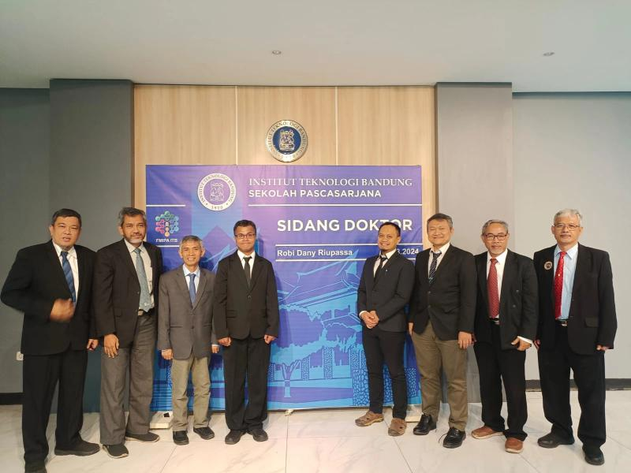

# Education

## Academic Qualifications

### Doctoral Research in Physics
**Bandung Institute of Technology, Indonesia**

- **Program**: Doctoral Program in Physics
- **Institution**: Faculty of Mathematics and Natural Sciences, Bandung Institute of Technology
- **Dissertation**: Optimasi Desain Freeze Valve untuk Sistem Keselamatan Pasif pada Molten Salt Reactor
- **Research Focus**: Passive safety systems for Generation IV Molten Salt Reactors, combining CFD simulation with deep learning for freeze valve design optimization
- **Link**: [ITB Digital Library](https://digilib.itb.ac.id/gdl/view_data/optimasi-desain-freeze-valve-untuk-sistem-keselamatan-pasif-pada-molten-salt-reactor/robi-dany-riupassa)

---

### Master of Science (MSc) in Physics
**Bandung Institute of Technology, Indonesia**

- **Field**: Physics
- **Institution**: Physics Department, Bandung Institute of Technology
- **Country**: Indonesia

Specialized training in theoretical and applied physics with focus on computational methods and scientific computing.

---

## Academic Background

My academic journey in physics has equipped me with:

- Strong analytical and problem-solving skills
- Deep understanding of mathematical modeling
- Experience with scientific computing and simulations
- Research methodology and experimental design
- Data analysis and interpretation

These skills have proven invaluable in my transition to AI and machine learning, where physical intuition and mathematical rigor combine to tackle complex problems in data science and artificial intelligence.

---

## Continuing Education

I continuously update my knowledge through:

- Online courses in AI/ML technologies
- Research paper reviews
- Conferences and workshops
- Hands-on project development
- Collaboration with peers in the AI community

---

!!! note "Research to Practice"
    My academic background in physics provides a unique perspective on AI development, bringing rigorous scientific methodology to practical machine learning applications.
