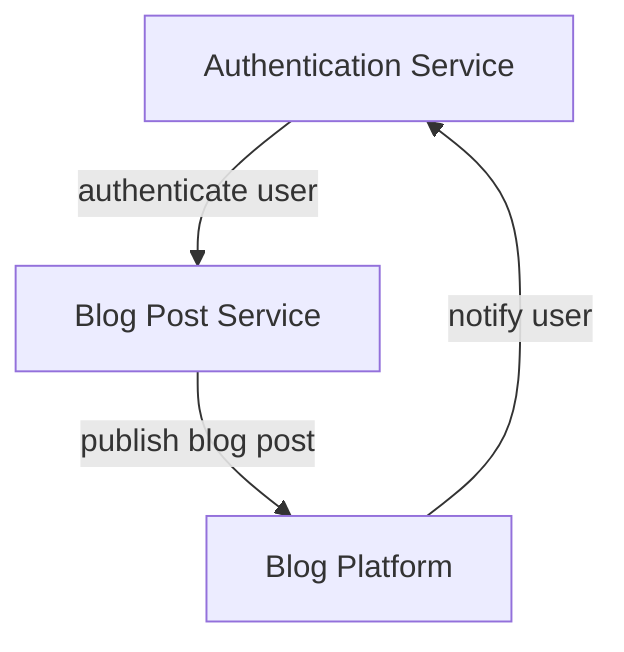

Implementing a Secure and Configurable Blog Agent

## Introduction
The development of a blog agent requires careful consideration of several key factors, including security, configuration, and feature implementation. A blog agent is a software system designed to automate the process of publishing blog posts, and its implementation involves a range of technical challenges. This article provides an overview of the technical concepts involved in building a secure and configurable blog agent, and discusses the approach and implementation patterns used to address these challenges.

## Technical Concepts
The implementation of a blog agent involves several technical concepts, including security, configuration, and feature implementation. Security is a critical concern, as the blog agent will have access to sensitive information such as user credentials and blog content. Configuration is also important, as the blog agent must be able to adapt to different environments and settings. Feature implementation is the process of adding new functionality to the blog agent, such as support for multiple blog platforms and social media integration.

### Security Considerations
The security of a blog agent is critical, as it will have access to sensitive information such as user credentials and blog content. To address this concern, the implementation of the blog agent includes several security features, such as encryption and secure authentication. The blog agent uses a secure authentication mechanism to verify the identity of users and ensure that only authorized users can access the system. The blog agent also uses encryption to protect sensitive information, such as user credentials and blog content, both in transit and at rest.

### Configuration and Feature Implementation
The configuration of a blog agent is also important, as it must be able to adapt to different environments and settings. The implementation of the blog agent includes a flexible configuration mechanism that allows users to customize the system to meet their needs. The blog agent also includes a range of features, such as support for multiple blog platforms and social media integration. These features are implemented using a modular architecture, which allows new features to be added easily and without disrupting the existing functionality of the system.

## Approach and Implementation Patterns
The implementation of the blog agent uses a range of technical approaches and patterns, including a microservices architecture and a modular design. The microservices architecture allows the blog agent to be broken down into smaller, independent components, each of which can be developed and deployed separately. The modular design allows new features to be added easily and without disrupting the existing functionality of the system.

### Microservices Architecture
The blog agent is implemented using a microservices architecture, which allows the system to be broken down into smaller, independent components. Each component is responsible for a specific function, such as authentication or blog post publication. The components communicate with each other using APIs, which allows them to be developed and deployed separately.



### Modular Design
The blog agent is also implemented using a modular design, which allows new features to be added easily and without disrupting the existing functionality of the system. The modular design includes a range of modules, each of which is responsible for a specific function, such as support for multiple blog platforms or social media integration.

## Key Takeaways
The implementation of a secure and configurable blog agent requires careful consideration of several key factors, including security, configuration, and feature implementation. The use of a microservices architecture and a modular design allows the system to be broken down into smaller, independent components, each of which can be developed and deployed separately. The implementation of security features, such as encryption and secure authentication, is critical to protecting sensitive information. The use of a flexible configuration mechanism allows users to customize the system to meet their needs.

## Conclusion
The development of a blog agent is a complex task that requires careful consideration of several key factors, including security, configuration, and feature implementation. The use of a microservices architecture and a modular design allows the system to be broken down into smaller, independent components, each of which can be developed and deployed separately. The implementation of security features, such as encryption and secure authentication, is critical to protecting sensitive information. By following the approach and implementation patterns outlined in this article, developers can create a secure and configurable blog agent that meets the needs of users and provides a range of features and functionality. 

Example code for the modular design can be seen below:
```python
class BlogAgent:
    def __init__(self, config):
        self.config = config
        self.modules = []

    def add_module(self, module):
        self.modules.append(module)

    def publish_blog_post(self, blog_post):
        for module in self.modules:
            module.publish_blog_post(blog_post)

class AuthenticationModule:
    def publish_blog_post(self, blog_post):
        # authenticate user
        pass

class BlogPostModule:
    def publish_blog_post(self, blog_post):
        # publish blog post
        pass

# create blog agent
blog_agent = BlogAgent({"config": "config"})

# add modules
blog_agent.add_module(AuthenticationModule())
blog_agent.add_module(BlogPostModule())

# publish blog post
blog_agent.publish_blog_post({"title": "title", "content": "content"})
```