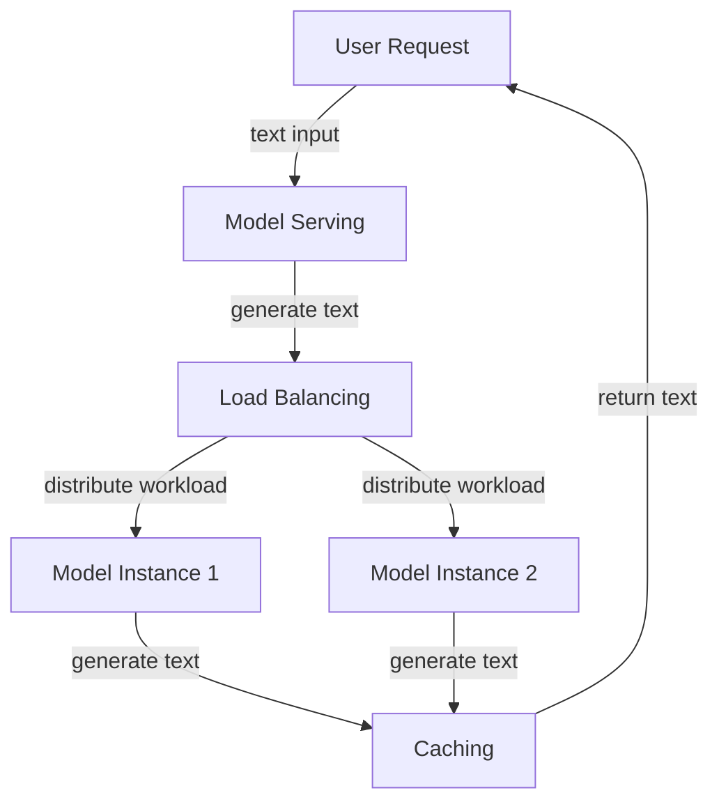

Implementing Efficient Large Language Models for Content Generation

## Introduction
The increasing demand for high-quality content has led to the development of large language models (LLMs) that can generate human-like text. However, deploying these models can be challenging due to their computational requirements and costs. This article discusses the technical concepts involved in implementing LLMs for content generation, focusing on the approach and implementation patterns used to achieve efficient and scalable solutions.

## Technical Concepts and Implementation
### Overview of Large Language Models
LLMs are a type of machine learning model designed to process and generate human-like language. These models are trained on vast amounts of text data and can learn to predict the next word in a sequence, given the context of the previous words. The training process involves optimizing the model's parameters to minimize the difference between the predicted and actual words.

### Configuration and Feature Implementation
To implement an LLM for content generation, several configuration options and features must be considered. These include the choice of model architecture, the size of the model, and the computational resources required for deployment. In this case, a model with 70 billion parameters was chosen, which offers a good balance between accuracy and computational requirements.

### Authentication and Authorization
To ensure secure access to the LLM, authentication and authorization mechanisms must be implemented. This involves verifying the identity of users and controlling their access to the model's functionality. Common authentication protocols include OAuth and JWT, which provide secure token-based authentication.

### Implementation Patterns
The implementation of an LLM for content generation involves several patterns and techniques. These include:

* **Model serving**: The model is deployed as a service, allowing users to send requests and receive generated text in response.
* **Load balancing**: To handle multiple requests concurrently, load balancing techniques are used to distribute the workload across multiple instances of the model.
* **Caching**: To improve performance, caching mechanisms are used to store frequently accessed data, reducing the need for redundant computations.



### Code Examples
To illustrate the implementation patterns discussed above, consider the following example code in Python:
```python
import requests

# Define the model serving endpoint
endpoint = "https://example.com/model"

# Define the load balancing function
def load_balance(request):
    # Distribute the workload across multiple instances
    instances = ["instance1", "instance2"]
    instance = random.choice(instances)
    return instance

# Define the caching function
def cache_result(result):
    # Store the result in a cache
    cache = {}
    cache[result] = True
    return cache

# Define the model serving function
def model_serve(request):
    # Generate text using the LLM
    text = generate_text(request)
    # Cache the result
    cache_result(text)
    return text

# Define the main function
def main():
    # Receive user requests
    request = requests.get(endpoint)
    # Load balance the request
    instance = load_balance(request)
    # Serve the model
    text = model_serve(request)
    # Return the generated text
    return text
```

## Key Takeaways
The main learnings from this article are:

* LLMs can be implemented for content generation using a combination of model serving, load balancing, and caching techniques.
* Authentication and authorization mechanisms are essential for secure access to the LLM.
* The choice of model architecture and size depends on the specific use case and computational requirements.
* Implementation patterns such as model serving, load balancing, and caching can improve the performance and scalability of LLM deployments.

## Conclusion
Implementing efficient LLMs for content generation requires a deep understanding of the technical concepts involved, including model architecture, configuration, and implementation patterns. By applying these concepts and techniques, developers can build scalable and secure solutions that meet the growing demand for high-quality content. As the field of natural language processing continues to evolve, the importance of efficient LLM implementations will only continue to grow, enabling new applications and use cases that transform the way we interact with language and generate content.