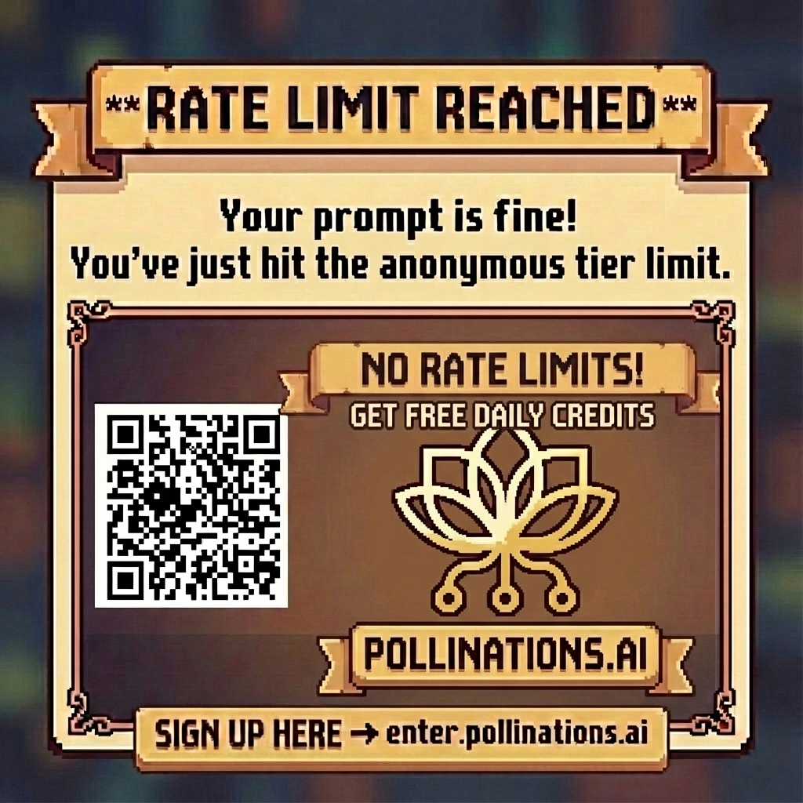
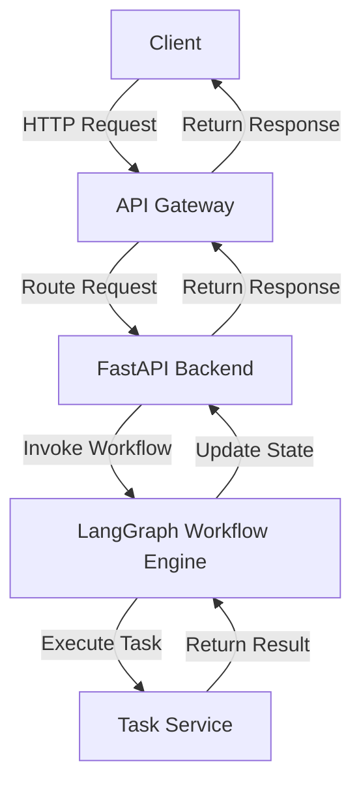

Implementing Orchestration and Workflow Management in Modern Web Applications

## Introduction
The development of modern web applications often requires the integration of multiple technologies and services to provide a seamless user experience. One of the key challenges in building such applications is the implementation of orchestration and workflow management, which enables the coordination of various tasks and services to achieve a specific goal. This article will discuss the technical concepts involved in implementing orchestration and workflow management in a web application, using a combination of JavaScript, Python, and TypeScript.

## Technical Concepts and Approach
The implementation of orchestration and workflow management in a web application involves several technical concepts, including the use of state machines, workflow engines, and API gateways. A state machine is a mathematical model that can be used to manage the state of a system, while a workflow engine is a software component that manages the execution of a workflow. An API gateway is a software component that acts as an entry point for API requests, routing them to the appropriate backend services.

In the context of the implementation described in this article, the LangGraph orchestration system was used to manage the workflow of the application. LangGraph is a state machine-based workflow engine that allows for the definition of complex workflows using a graphical interface. The workflow engine was integrated with a FastAPI backend, which provided a RESTful API for interacting with the workflow engine.

### Architecture Overview
The architecture of the application can be represented using the following Mermaid diagram:

This diagram shows the high-level architecture of the application, including the client, API gateway, FastAPI backend, LangGraph workflow engine, and task service.

### Implementation Patterns
The implementation of the application used several patterns, including the use of a state machine to manage the workflow, and the use of an API gateway to route requests to the appropriate backend services. The state machine was used to define the different states of the workflow, and to manage the transitions between these states.

The API gateway was used to provide a single entry point for API requests, and to route these requests to the appropriate backend services. This approach allows for the decoupling of the client and server components, and makes it easier to add new services or modify existing ones.

### Code Examples
The implementation of the application involved the use of several programming languages, including JavaScript, Python, and TypeScript. The following code example shows an example of how to define a workflow using the LangGraph workflow engine:
```python
from langgraph import Workflow, State, Transition

# Define the workflow
workflow = Workflow("example_workflow")

# Define the states
state1 = State("state1")
state2 = State("state2")

# Define the transitions
transition1 = Transition(state1, state2, "transition1")

# Add the states and transitions to the workflow
workflow.add_state(state1)
workflow.add_state(state2)
workflow.add_transition(transition1)
```
This code example shows how to define a simple workflow using the LangGraph workflow engine, including the definition of states and transitions.

## Key Takeaways
The implementation of orchestration and workflow management in a web application requires the use of several technical concepts, including state machines, workflow engines, and API gateways. The LangGraph workflow engine provides a powerful tool for defining and managing complex workflows, and can be integrated with a FastAPI backend to provide a RESTful API for interacting with the workflow engine. The use of an API gateway allows for the decoupling of the client and server components, and makes it easier to add new services or modify existing ones.

## Conclusion
The implementation of orchestration and workflow management in a web application is a complex task that requires the use of several technical concepts and tools. The use of a state machine-based workflow engine, such as LangGraph, provides a powerful tool for defining and managing complex workflows, and can be integrated with a FastAPI backend to provide a RESTful API for interacting with the workflow engine. By following the patterns and approaches described in this article, developers can build scalable and maintainable web applications that provide a seamless user experience.