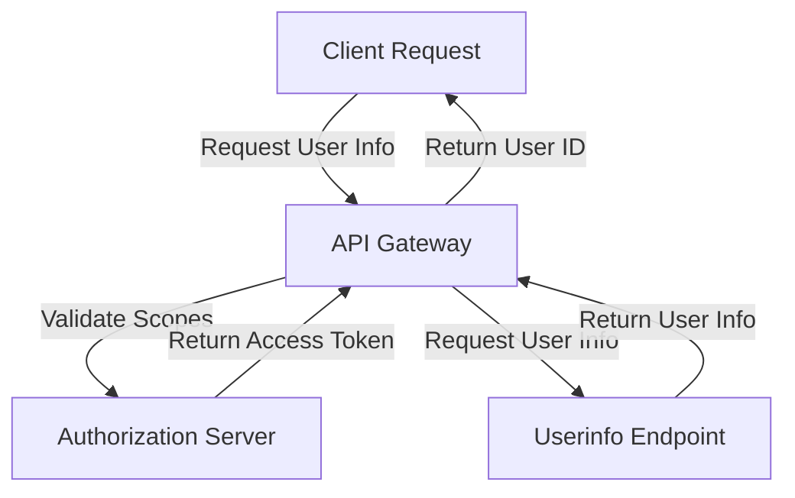

Optimizing API Endpoints for User Information Retrieval

## Introduction
When developing applications that integrate with external APIs, it is crucial to ensure that the chosen endpoints are optimized for the required use case. In the context of user information retrieval, selecting the correct endpoint can significantly impact the application's performance, security, and maintainability. This article discusses the technical considerations involved in updating an API to use the userinfo endpoint, highlighting the benefits and implementation patterns associated with this approach.

## Technical Concepts and Background
The userinfo endpoint is a standardized API endpoint designed to provide user information, such as user IDs, names, and email addresses. This endpoint typically requires specific scopes, which are permissions that the application must request to access the user's information. In contrast to other endpoints, such as the "me" endpoint, the userinfo endpoint offers more flexibility and control over the retrieved information.

### API Endpoint Selection
When choosing an API endpoint for user information retrieval, developers should consider the following factors:
- The type of information required: Different endpoints may provide varying levels of detail about the user.
- The scopes required: Ensure that the application has the necessary permissions to access the desired information.
- The endpoint's compatibility: Verify that the chosen endpoint is compatible with the target API version and platform.

## Approach and Implementation Patterns
To update an existing API to use the userinfo endpoint, the following steps can be taken:
1. **Update API Endpoint**: Replace the existing endpoint (e.g., /v2/me) with the userinfo endpoint (e.g., /v2/userinfo).
2. **Modify Scopes**: Update the application's scopes to include the necessary permissions for accessing the userinfo endpoint.
3. **Extract User ID**: Extract the user ID from the 'sub' field in the response, as this field typically contains the unique identifier for the user.

### Example Flowchart

In this example flowchart, the client requests user information, which is then validated by the authorization server. If the scopes are valid, the userinfo endpoint is called, and the user ID is extracted and returned to the client.

## Generalized Code Example
To demonstrate the implementation of the userinfo endpoint, consider the following example:
```python
import requests

def get_user_info(access_token):
    # Define the userinfo endpoint URL
    url = "https://api.example.com/v2/userinfo"
    
    # Set the Authorization header with the access token
    headers = {"Authorization": f"Bearer {access_token}"}
    
    # Send a GET request to the userinfo endpoint
    response = requests.get(url, headers=headers)
    
    # Check if the response was successful
    if response.status_code == 200:
        # Extract the user ID from the 'sub' field
        user_id = response.json()["sub"]
        return user_id
    else:
        # Handle errors or invalid responses
        return None
```
In this example, the `get_user_info` function takes an access token as input and uses it to request user information from the userinfo endpoint. The function then extracts the user ID from the response and returns it.

## Key Takeaways
The key learnings from this article can be summarized as follows:
- The userinfo endpoint provides a standardized way to retrieve user information, offering more flexibility and control over the retrieved data.
- Updating an API to use the userinfo endpoint requires modifying the scopes and extracting the user ID from the 'sub' field.
- A well-designed API endpoint selection process is crucial for ensuring the application's performance, security, and maintainability.

## Conclusion
In conclusion, optimizing API endpoints for user information retrieval is essential for building scalable and maintainable applications. By understanding the technical concepts involved and implementing best practices, developers can create more efficient and secure APIs. The userinfo endpoint offers a standardized solution for retrieving user information, and its adoption can significantly improve the overall quality of the application. As the software engineering community continues to evolve, it is essential to prioritize API design and development, ensuring that applications are built to meet the demands of a rapidly changing technological landscape.