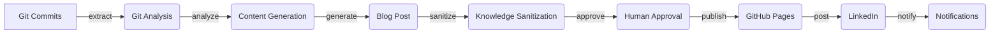

Porto Agent - AI-Powered Content Generation

Porto Agent is an innovative AI-powered blog and LinkedIn post generator that extracts knowledge from git commits, orchestrated with LangGraph. This project leverages advanced technologies to automate content creation, making it an invaluable tool for developers and content creators alike. By harnessing the power of artificial intelligence and machine learning, Porto Agent streamlines the content generation process, saving time and increasing productivity.

### Key Features
* LangGraph Orchestration: State machine workflow with human-in-the-loop approval
* Git Analysis: Extracts knowledge topics from commits
* Content Generation: Professional blog posts using Cerebras/Groq LLMs
* Image Generation: Content-aware header images via Pollinations.ai
* Knowledge Sanitization: Removes company-specific information automatically
* Dashboard UI: Next.js web interface for workflow management
* Publishing: GitHub Pages blog + LinkedIn posts

### Tech Stack
#### Backend
* FastAPI
* Flask
* Groq
* LangGraph
* Python
#### Dependencies
* google-auth
* google-auth-oauthlib
* google-api-python-client
* google-generativeai
* twilio
* requests-oauthlib
* uvicorn
* jinja2
* python-dotenv
* pyyaml
* rich
* click
* gitpython
* requests
* langchain-core

### Architecture

The architecture of Porto Agent is designed to facilitate a seamless content generation workflow. The system begins by analyzing git commits, extracting relevant knowledge topics, and generating high-quality blog posts. The posts are then sanitized to remove company-specific information and presented to a human approver for review. Once approved, the posts are published to GitHub Pages and LinkedIn.

### How It Works
The workflow of Porto Agent is orchestrated by LangGraph, which manages the state machine workflow and facilitates human-in-the-loop approval. The system consists of several key components, including git analysis, content generation, knowledge sanitization, and publishing. The dashboard UI, built with Next.js, provides a user-friendly interface for managing the workflow and approving posts.

1. **Git Analysis**: The system begins by analyzing git commits, extracting knowledge topics and relevant information.
2. **Content Generation**: The extracted information is used to generate high-quality blog posts using Cerebras/Groq LLMs.
3. **Knowledge Sanitization**: The generated posts are then sanitized to remove company-specific information, ensuring that sensitive data is protected.
4. **Human Approval**: The sanitized posts are presented to a human approver for review, allowing for manual oversight and quality control.
5. **Publishing**: Once approved, the posts are published to GitHub Pages and LinkedIn, making them available to a wider audience.

### Getting Started
To get started with Porto Agent, follow these steps:
1. Clone the repository: `git clone https://github.com/robiriu/porto-agent.git`
2. Create a virtual environment: `python3 -m venv venv`
3. Activate the virtual environment: `source venv/bin/activate`
4. Install dependencies: `pip install -r requirements.txt`
5. Configure the system: Update the `config.yaml` file with your API keys and settings.

### Links
* Repository URL: https://github.com/robiriu/porto-agent

By leveraging the power of artificial intelligence and machine learning, Porto Agent revolutionizes the content generation process, making it faster, easier, and more efficient. With its advanced features and user-friendly interface, Porto Agent is an invaluable tool for developers and content creators alike.