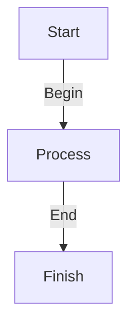

Preventing Arrow Errors in Diagrams with Mermaid Syntax Guidance

## Introduction
The use of diagrams in technical documentation has become increasingly popular due to their ability to effectively communicate complex concepts and ideas. One popular tool for creating these diagrams is Mermaid, which allows users to create a variety of diagram types, including flowcharts, sequence diagrams, and architecture diagrams, using a simple and intuitive syntax. However, one common issue that users may encounter when creating diagrams with Mermaid is the occurrence of arrow errors, which can disrupt the flow and readability of the diagram. In this article, we will explore the technical concepts involved in preventing arrow errors in Mermaid diagrams and discuss the approach and implementation patterns used to address this issue.

## Technical Concepts
Mermaid is a powerful tool for creating diagrams, and its syntax is based on a simple and intuitive language that allows users to define the structure and content of their diagrams. One of the key features of Mermaid is its ability to create arrows and connections between different elements in the diagram. However, when creating these arrows, users must be careful to use the correct syntax and formatting to avoid errors. The Mermaid syntax for creating arrows is based on the use of the `-->` symbol, which is used to indicate the direction of the arrow. For example, the syntax `A -->|label| B` would create an arrow from element A to element B with the label "label".

### Mermaid Syntax
To illustrate the correct use of Mermaid syntax for creating arrows, consider the following example:

In this example, we define a simple flowchart with three elements: Start, Process, and Finish. The arrows between these elements are defined using the `-->` symbol, and the labels for each arrow are specified using the `|label|` syntax.

## Approach and Implementation
To prevent arrow errors in Mermaid diagrams, it is essential to follow best practices and guidelines for using the Mermaid syntax. One approach to achieving this is to use a consistent and standardized syntax for creating arrows and connections between elements. This can be achieved by defining a set of rules and guidelines for using the Mermaid syntax, such as always using the `-->` symbol to indicate the direction of the arrow, and specifying labels for each arrow using the `|label|` syntax.

### Error Handling
In addition to following best practices and guidelines, it is also essential to implement error handling mechanisms to detect and prevent arrow errors in Mermaid diagrams. This can be achieved by using tools and software that can parse and validate the Mermaid syntax, and provide feedback and warnings when errors are detected. For example, the following code snippet illustrates how to use a Python function to validate the Mermaid syntax and detect arrow errors:
```python
import re

def validate_mermaid_syntax(syntax):
    # Define a regular expression pattern to match the Mermaid syntax
    pattern = r'^graph TB.*$'
    
    # Use the regular expression to match the syntax
    match = re.match(pattern, syntax)
    
    # If the syntax does not match the pattern, return an error message
    if not match:
        return "Error: Invalid Mermaid syntax"
    
    # If the syntax matches the pattern, return a success message
    return "Success: Valid Mermaid syntax"

# Test the function with a sample Mermaid syntax
syntax = """
graph TB
    A[Start] -->|Begin| B[Process]
    B -->|End| C[Finish]
"""

print(validate_mermaid_syntax(syntax))
```
In this example, we define a Python function `validate_mermaid_syntax` that takes a Mermaid syntax string as input and returns a success or error message based on whether the syntax is valid or not. The function uses a regular expression pattern to match the Mermaid syntax, and provides feedback and warnings when errors are detected.

## Key Takeaways
The key takeaways from this article are:

* Mermaid is a powerful tool for creating diagrams, and its syntax is based on a simple and intuitive language that allows users to define the structure and content of their diagrams.
* To prevent arrow errors in Mermaid diagrams, it is essential to follow best practices and guidelines for using the Mermaid syntax, such as always using the `-->` symbol to indicate the direction of the arrow, and specifying labels for each arrow using the `|label|` syntax.
* Error handling mechanisms can be implemented to detect and prevent arrow errors in Mermaid diagrams, such as using tools and software that can parse and validate the Mermaid syntax, and provide feedback and warnings when errors are detected.

## Conclusion
In conclusion, preventing arrow errors in Mermaid diagrams requires a combination of following best practices and guidelines for using the Mermaid syntax, and implementing error handling mechanisms to detect and prevent errors. By using the correct syntax and formatting for creating arrows and connections between elements, and by validating and parsing the Mermaid syntax to detect errors, users can create high-quality and error-free diagrams that effectively communicate complex concepts and ideas. As the use of diagrams in technical documentation continues to grow and evolve, the importance of preventing arrow errors and ensuring the accuracy and quality of diagrams will only continue to increase.