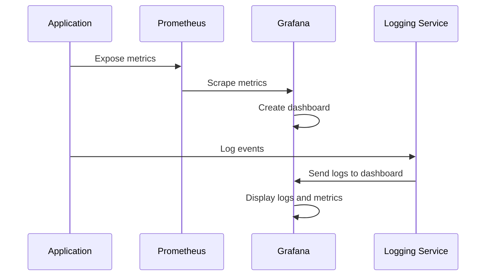

## Creating a Scalable Production Infrastructure for Machine Learning Recommendation Systems
### Introduction
The increasing demand for personalized experiences has led to a surge in the adoption of machine learning (ML) recommendation systems. These systems rely on complex algorithms and large datasets to provide accurate recommendations. However, deploying and maintaining such systems in production environments can be challenging. This article discusses the technical concepts and implementation patterns involved in creating a scalable production infrastructure for ML recommendation systems.

## Technical Concepts and Implementation Patterns
The implementation of a production-ready ML recommendation system involves several technical concepts, including containerization, orchestration, continuous integration and continuous deployment (CI/CD), monitoring, and logging. 

### Containerization and Orchestration
Containerization using Docker provides a lightweight and portable way to deploy applications. Kubernetes, a container orchestration system, is used to manage and scale containerized applications. The following Mermaid diagram illustrates the architecture of a containerized ML recommendation system:
```mermaid
graph LR
    A[Docker Container] -->|Contains|> B[ML Recommendation Service]
    B -->|Communicates with|> C[Milvus Vector Database]
    C -->|Stores|> D[Vector Embeddings]
    A -->|Orchestrated by|> E[Kubernetes]
    E -->|Manages|> F[Container Deployment]
    F -->|Provides|> G[Scalability and High Availability]
```
In this architecture, the ML recommendation service is containerized using Docker and orchestrated using Kubernetes. The service communicates with a Milvus vector database to retrieve and store vector embeddings.

### Continuous Integration and Continuous Deployment (CI/CD)
CI/CD pipelines are essential for automating the testing, building, and deployment of applications. The following code snippet illustrates a basic GitHub Actions workflow for building and deploying a Docker image:
```yml
name: Build and Deploy

on:
  push:
    branches:
      - main

jobs:
  build-and-deploy:
    runs-on: ubuntu-latest
    steps:
      - name: Checkout code
        uses: actions/checkout@v2
      - name: Login to DockerHub
        uses: docker/login-action@v1
        with:
          username: ${{ secrets.DOCKER_USERNAME }}
          password: ${{ secrets.DOCKER_PASSWORD }}
      - name: Build and push image
        run: |
          docker build -t my-repo/my-image .
          docker push my-repo/my-image
      - name: Deploy to Kubernetes
        uses: kubernetes/deploy-action@v1
        with:
          kubeconfig: ${{ secrets.KUBECONFIG }}
          deployment: my-deployment
```
This workflow builds and pushes a Docker image to a registry and then deploys it to a Kubernetes cluster.

### Monitoring and Logging
Monitoring and logging are critical components of a production infrastructure. Prometheus and Grafana can be used to monitor application metrics and create dashboards for visualization. The following Mermaid sequence diagram illustrates the monitoring and logging workflow:

In this workflow, the application exposes metrics to Prometheus, which scrapes the metrics and sends them to Grafana. The application also logs events to a logging service, which sends the logs to Grafana for display.

## Key Takeaways
The key takeaways from this article are:

* Containerization and orchestration using Docker and Kubernetes provide a scalable and portable way to deploy ML recommendation systems.
* CI/CD pipelines using GitHub Actions can automate the testing, building, and deployment of applications.
* Monitoring and logging using Prometheus, Grafana, and logging services provide visibility into application performance and metrics.

## Conclusion
Creating a scalable production infrastructure for ML recommendation systems involves several technical concepts and implementation patterns. By using containerization, orchestration, CI/CD pipelines, monitoring, and logging, developers can build and deploy reliable and efficient ML recommendation systems. The use of Kubernetes, Docker, Prometheus, and Grafana provides a robust and scalable infrastructure for supporting complex ML workloads. As the demand for personalized experiences continues to grow, the importance of building scalable and efficient ML recommendation systems will only continue to increase.