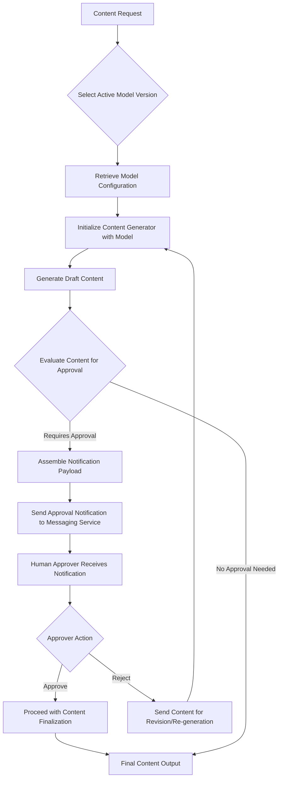

Maintaining AI Model Versions and Integrating Human-in-the-Loop Approval Workflows

## Introduction

The development and deployment of systems that incorporate artificial intelligence (AI) models necessitate rigorous version control and a robust operational framework. As AI models evolve, particularly large language models (LLMs), updates become frequent, introducing new capabilities or deprecating older ones. Concurrently, integrating human oversight into automated workflows—a practice often referred to as "human-in-the-loop" (HITL)—is crucial for quality assurance and compliance, especially when AI-generated outputs require validation prior to finalization. This post examines the technical considerations and implementation patterns involved in managing AI model updates and integrating external approval notifications into automated content generation processes.

## AI Model Lifecycle Management

The lifecycle of an AI model, especially a sophisticated language model, involves continuous evaluation, refinement, and versioning. Models are subject to updates for several reasons: improved performance metrics, expanded feature sets, addressing identified biases or limitations, or changes in the underlying model architecture or training data. From an operational perspective, utilizing a deprecated model version carries several risks, including reduced accuracy, lack of support, and potential incompatibility with current infrastructure or APIs.

### Model Versioning and Selection

Effective model management requires a clear strategy for versioning. Each iteration of a model should be identifiable, allowing systems to explicitly select and utilize a specific version. This prevents unexpected behavior arising from automatic updates to a default or unversioned model. When a new model version becomes available, a deliberate migration process is initiated. This process typically includes:

-   **Evaluation:** Assessing the new model's performance, latency, and cost implications against established benchmarks.
-   **Configuration Update:** Modifying system configurations to point to the new model identifier.
-   **Rollout Strategy:** Implementing a phased rollout or A/B testing approach to minimize risk and validate performance in a production environment.

Consider a content generation system where the underlying language model is a critical component. A change from a "llama-3.1-70b-versatile" equivalent to a "llama-3.3-70b-versatile" equivalent signifies an intentional upgrade to a more current and potentially more capable iteration of the model family. Such updates are not merely cosmetic; they often reflect advancements in the model's capabilities, such as enhanced coherence, factual accuracy, or instruction following.

A generalized approach to managing model selection within an application could involve a configuration file or environment variables, allowing for dynamic updates without code redeployment.

```python
# content_generator.py

class AIModelService:
    def __init__(self, model_identifier: str):
        """
        Initializes the service with a specific AI model version.
        """
        self.model_identifier = model_identifier
        # In a real system, this would involve loading or connecting to the actual model
        print(f"Initializing with model: {self.model_identifier}")

    def generate_content(self, prompt: str) -> str:
        """
        Generates content using the configured AI model.
        """
        # Placeholder for actual model inference logic
        generated_text = f"Content generated by {self.model_identifier} for prompt: '{prompt}'"
        return generated_text

# In main.py or a configuration module:
# Define available models and the currently selected one
MODEL_CONFIG = {
    "V1": "llama-3.1-70b-versatile-equivalent",
    "V2": "llama-3.3-70b-versatile-equivalent",
    "CURRENT": "V2" # Reference to the active model version
}

# Example of how the model service might be instantiated
def get_current_model_service():
    active_model_key = MODEL_CONFIG["CURRENT"]
    model_name = MODEL_CONFIG[active_model_key]
    return AIModelService(model_name)

# Usage example:
# service = get_current_model_service()
# output = service.generate_content("Describe the process of photosynthesis.")
# print(output)
```

This structural pattern allows for the clear definition of available model versions and a mechanism to specify which version is active, thereby facilitating updates without deep code alterations.

## Integrating Human-in-the-Loop Approval Workflows

In automated systems, particularly those involving content generation or critical decision-making, direct human intervention often remains a necessary step. This human-in-the-loop (HITL) approach ensures quality, adherence to guidelines, and prevents the propagation of erroneous or undesirable outputs. A common pattern for HITL integration involves sending notifications to designated personnel for approval or review at specific points in a workflow.

### Notification Systems for Workflow Approval

When an automated process requires human input, a notification mechanism is essential to alert the relevant stakeholders. The choice of notification channel depends on factors such as urgency, ubiquity of the channel, and the required interaction model. Common channels include email, internal messaging platforms, or dedicated notification services. For processes requiring timely review, real-time messaging services are frequently employed due to their immediate delivery capabilities and often interactive features.

The integration of such a notification system typically follows these steps:

1.  **Trigger Condition:** Define the specific event or state that necessitates human approval (e.g., content generated, high-risk decision made).
2.  **Information Assembly:** Collect all pertinent data required for the approver to make an informed decision (e.g., generated content, relevant context, associated metadata).
3.  **Notification Dispatch:** Send a message containing the assembled information and an actionable link or mechanism for approval/rejection.
4.  **Workflow Pausing/Resumption:** The automated workflow pauses pending the approval, and proceeds or takes an alternative path based on the human's decision.

### Architectural Flow for Content Generation with Approval

The following Mermaid diagram illustrates a common data flow for a content generation system that incorporates both AI model selection and a human approval step via a notification system.



In this architecture:

-   A content request initiates the process.
-   The system dynamically selects the configured AI model version.
-   Draft content is generated.
-   A crucial evaluation step determines if human approval is required. This could be based on confidence scores, content sensitivity, or pre-defined rules.
-   If approval is needed, a notification is dispatched, pausing the automated workflow.
-   The human approver interacts with the notification (e.g., via a messaging application), making a decision.
-   The workflow resumes based on the approval action, either finalizing the content or returning it for revision.

### Generalised Code Example for Notification Dispatch

Implementing a notification system typically involves an abstraction layer to interact with various messaging services. This allows the core application logic to remain decoupled from the specifics of any particular messaging platform.

```python
# notification_service.py

import json

class NotificationService:
    def __init__(self, api_endpoint: str, api_key: str):
        """
        Initializes the notification service client.
        In a production system, this might involve robust HTTP client setup.
        """
        self.api_endpoint = api_endpoint
        self.api_key = api_key
        print(f"Notification service initialized for endpoint: {self.api_endpoint}")

    def send_approval_notification(self, recipient_id: str, content_id: str, draft_text_summary: str) -> bool:
        """
        Sends an approval notification to a specified recipient.
        Returns True if successful, False otherwise.
        """
        message_payload = {
            "recipient": recipient_id,
            "type": "approval_request",
            "content_id": content_id,
            "summary": draft_text_summary,
            "approval_link": f"https://your-internal-system.com/approve/{content_id}"
        }

        # Placeholder for actual API call
        print(f"Sending approval notification to {recipient_id} for content {content_id}.")
        print(f"Payload: {json.dumps(message_payload, indent=2)}")
        
        # In a real scenario, this would involve an HTTP POST request
        # try:
        #     response = requests.post(self.api_endpoint, json=message_payload, headers={'Authorization': f'Bearer {self.api_key}'})
        #     response.raise_for_status() # Raise an exception for HTTP errors
        #     print("Notification sent successfully.")
        #     return True
        # except requests.exceptions.RequestException as e:
        #     print(f"Failed to send notification: {e}")
        #     return False
        return True # Simulate success

# In main.py or content processing module:
# Example of how the notification might be triggered
def process_generated_content(generated_content: str, content_unique_id: str):
    # Determine if approval is needed (e.g., based on content sensitivity, user request)
    requires_approval = True # Or some logic to determine this

    if requires_approval:
        # Configuration for the notification service
        NOTIF_API_ENDPOINT = "https://generic-notification-api.com/send"
        NOTIF_API_KEY = "your_secure_api_key_here" # Use environment variables in production
        APPROVER_GROUP_ID = "content_moderators_group"

        notification_client = NotificationService(NOTIF_API_ENDPOINT, NOTIF_API_KEY)
        
        # Summarize content for notification to keep messages concise
        summary = generated_content[:150] + "..." if len(generated_content) > 150 else generated_content
        
        success = notification_client.send_approval_notification(
            recipient_id=APPROVER_GROUP_ID,
            content_id=content_unique_id,
            draft_text_summary=summary
        )
        if success:
            print("Approval process initiated.")
        else:
            print("Failed to initiate approval process. Manual intervention may be required.")
    else:
        print("Content processed without requiring approval.")

# Example usage:
# content_id = "unique-content-id-123"
# generated_output = "This is a sample of AI-generated content that needs review."
# process_generated_content(generated_output, content_id)
```

This pattern encapsulates the notification logic, making it reusable and easier to adapt to different messaging platforms by changing the `NotificationService` implementation. Best practices dictate that sensitive information like API keys should be managed securely, often through environment variables or dedicated secret management systems, rather than being hardcoded.

## Key Takeaways

-   **Proactive Model Management:** Regularly update AI models to benefit from performance improvements, security fixes, and new features, while mitigating risks associated with deprecated versions. Implement clear versioning and a structured update process.
-   **Configuration-Driven Model Selection:** Decouple model version selection from application code through configuration mechanisms, facilitating dynamic updates and reducing deployment overhead.
-   **Strategic HITL Integration:** Incorporate human-in-the-loop steps into automated workflows where validation, quality assurance, or compliance is critical.
-   **Reliable Notification Systems:** Utilize robust notification services to alert stakeholders promptly when human intervention is required, enabling timely decisions and ensuring workflow continuity.
-   **Modular Design:** Design system components, such as content generators and notification dispatchers, as modular units to promote reusability, maintainability, and adaptability to evolving requirements or technologies.

## Conclusion

The evolution of AI models and the increasing complexity of automated workflows necessitate diligent attention to both model lifecycle management and operational integration patterns. By strategically updating AI model versions and carefully embedding human approval steps via sophisticated notification systems, engineering teams can construct more reliable, accountable, and high-quality solutions. These practices are fundamental to maintaining system integrity and ensuring that AI-driven applications continue to serve their intended purpose effectively within various operational contexts.