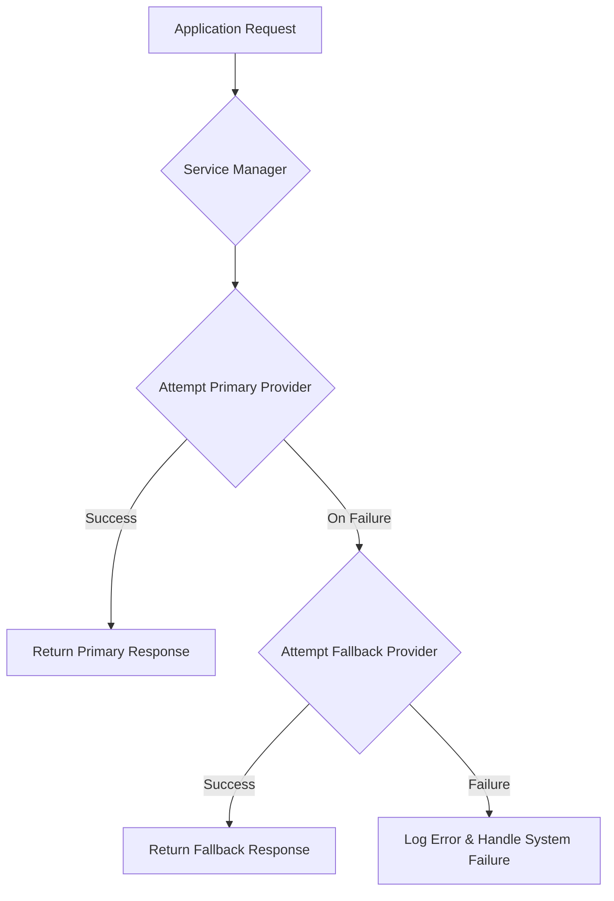

Strategic Integration of Multiple Large Language Model Providers for System Resiliency

## Introduction

Modern software applications increasingly incorporate Large Language Models (LLMs) to facilitate advanced functionalities such as content generation, summarization, and complex reasoning. The reliance on external LLM services, however, introduces several operational considerations, including service availability, response latency, rate limits, and cost implications. A monolithic dependency on a single external provider can compromise system resilience and performance. This document details an architectural approach for integrating multiple LLM providers, establishing mechanisms for provider selection, configuration management, and failover, thereby enhancing system stability and optimizing operational expenditures.

## Core Concepts in Multi-Provider LLM Integration

The effective integration of external LLM services requires a structured approach to manage dependencies and optimize resource utilization.

### Large Language Models (LLMs)
LLMs are a class of artificial intelligence models trained on vast datasets of text and code, capable of generating human-like text, translating languages, writing different kinds of creative content, and answering questions in an informative way. Applications interact with these models through Application Programming Interfaces (APIs) exposed by service providers.

### External Service Dependency Management
When an application relies on an external service, several challenges must be addressed:

-   **Availability:** External services may experience outages or degradation, impacting application functionality.
-   **Latency:** Network overhead and provider-specific processing times can introduce delays in responses.
-   **Rate Limiting:** Providers often impose restrictions on the number of requests within a given timeframe, requiring applications to manage request velocity.
-   **Cost:** Different providers offer varying pricing models, including free tiers, pay-per-token, or subscription-based access, necessitating cost-aware selection.

### Multi-Provider Strategy
A multi-provider strategy involves configuring an application to interact with more than one external service offering similar functionality. This approach typically designates a primary provider and one or more fallback providers. The primary provider is selected based on criteria such as performance characteristics, cost efficiency, or feature set. Fallback providers are utilized when the primary provider experiences issues or when specific operational thresholds are met.

## Architectural Approach and Implementation Patterns

The implementation of a multi-provider LLM strategy necessitates careful design across configuration, service abstraction, and operational logic.

### Configuration Management
Effective management of external service parameters is fundamental. These parameters typically include API endpoints, authentication credentials (e.g., API keys), and identifiers for specific models offered by each provider. Storing this information in a centralized, version-controlled configuration system, such as a YAML file, promotes separation of concerns and facilitates environment-specific deployments. This allows for modifications to provider details without altering core application code, enhancing maintainability and agility.

A generalized configuration structure might appear as follows:

```yaml
llm_providers:
  primary:
    name: "PrimaryLLMProvider"
    api_key_env: "PRIMARY_LLM_API_KEY" # Environment variable for API key
    endpoint: "https://api.primaryprovider.com/v1/generate"
    model_id: "model_id_A"
    rate_limit:
      requests_per_minute: 60
      tokens_per_minute: 1000000
    performance_priority: 1 # Lower value indicates higher priority for performance
    cost_priority: 1 # Lower value indicates higher priority for cost
  fallback:
    name: "FallbackLLMProvider"
    api_key_env: "FALLBACK_LLM_API_KEY"
    endpoint: "https://api.fallbackprovider.com/v1/generate"
    model_id: "model_id_B"
    rate_limit:
      requests_per_minute: 30
      tokens_per_minute: 500000
    performance_priority: 2
    cost_priority: 2
```

### Provider Abstraction Layer
To ensure that the application logic remains decoupled from specific provider APIs, an abstraction layer is implemented. This layer defines a common interface for LLM operations (e.g., `generate_text(prompt, config)`). Each provider-specific client then implements this interface, translating generic requests into the provider's native API calls and handling its specific response formats. This pattern allows for the addition, removal, or modification of providers with minimal impact on the application's core logic.

### Selection and Failover Mechanism
The application incorporates logic to determine which provider to use for a given request. This logic typically prioritizes the primary provider. If the primary provider becomes unavailable, exceeds its rate limits, or responds with a specific error code, the system can automatically switch to a configured fallback provider. This failover mechanism is critical for maintaining service continuity and user experience.

Conditions triggering a failover might include:

-   **Connection Errors:** Network issues or service unavailability.
-   **HTTP Status Codes:** Specific error codes (e.g., 5xx series indicating server errors, 429 indicating rate limits).
-   **Response Latency:** If the primary provider's response time exceeds a predefined threshold.
-   **Explicit Configuration:** Manual override or scheduled shifts between providers.

The selection process is often managed by a dedicated service component, which encapsulates the provider configuration and decision logic.

```python
import os
import yaml

class LLMProviderInterface:
    """Abstract interface for an LLM provider."""
    def generate_content(self, prompt: str, model_id: str, max_tokens: int) -> str:
        raise NotImplementedError

class PrimaryLLMClient(LLMProviderInterface):
    """Specific client for the primary LLM provider."""
    def __init__(self, config: dict):
        self.api_key = os.getenv(config['api_key_env'])
        self.endpoint = config['endpoint']
        self.model_id = config['model_id']
        # Initialize HTTP client with config

    def generate_content(self, prompt: str, model_id: str, max_tokens: int) -> str:
        # Simulate API call to primary provider
        # Example: response = http_client.post(self.endpoint, json={...})
        # Handle potential errors, rate limits
        if prompt == "fail_primary":
            raise ConnectionError("Primary provider unavailable")
        return f"Content from PrimaryProvider using {model_id} for: {prompt[:20]}..."

class FallbackLLMClient(LLMProviderInterface):
    """Specific client for the fallback LLM provider."""
    def __init__(self, config: dict):
        self.api_key = os.getenv(config['api_key_env'])
        self.endpoint = config['endpoint']
        self.model_id = config['model_id']
        # Initialize HTTP client with config

    def generate_content(self, prompt: str, model_id: str, max_tokens: int) -> str:
        # Simulate API call to fallback provider
        return f"Content from FallbackProvider using {model_id} for: {prompt[:20]}..."

class LLMServiceManager:
    """Manages selection and failover between LLM providers."""
    def __init__(self, config_path: str = 'config/config.yaml'):
        with open(config_path, 'r') as f:
            self.config = yaml.safe_load(f)['llm_providers']
        
        self.primary_provider = PrimaryLLMClient(self.config['primary'])
        self.fallback_provider = FallbackLLMClient(self.config['fallback'])

    def get_content(self, prompt: str, max_tokens: int = 500) -> str:
        try:
            # Attempt to use primary provider
            print("Attempting primary provider...")
            content = self.primary_provider.generate_content(
                prompt, self.config['primary']['model_id'], max_tokens
            )
            print("Primary provider successful.")
            return content
        except (ConnectionError, Exception) as e:
            print(f"Primary provider failed ({e}). Falling back to secondary...")
            # Fallback to secondary provider
            content = self.fallback_provider.generate_content(
                prompt, self.config['fallback']['model_id'], max_tokens
            )
            print("Fallback provider successful.")
            return content

# Example usage (assuming API keys are set as environment variables)
# os.environ['PRIMARY_LLM_API_KEY'] = 'sk-primarykey'
# os.environ['FALLBACK_LLM_API_KEY'] = 'sk-fallbackkey'

# manager = LLMServiceManager()
# generated_text = manager.get_content("Describe the process of photosynthesis.")
# print(generated_text)

# generated_text_fail = manager.get_content("fail_primary to trigger fallback.")
# print(generated_text_fail)
```

### Performance Considerations
The selection of a primary provider is often driven by performance metrics. For instance, certain hardware architectures can provide significantly reduced inference latency compared to traditional GPU-based methods. Prioritizing providers that offer higher inference speeds can improve the responsiveness of applications, particularly those requiring real-time content generation. This optimization contributes directly to an enhanced user experience and allows for higher request throughput.

### Cost Optimization
Cost is a critical factor in selecting and managing LLM providers. Many providers offer various pricing structures, including free tiers with daily token allowances. By establishing a primary provider that offers substantial daily token allowances without charge, an application can achieve cost efficiency for initial deployments or specific usage patterns. The fallback provider can then be configured with a different cost model, serving as a reliable alternative while incurring costs only when necessary. This tiered cost strategy ensures operational continuity without incurring excessive expenses during normal operation.

The following Mermaid diagram illustrates the conceptual flow for LLM provider selection and failover.



## Key Takeaways

The adoption of a multi-provider strategy for LLM integration yields several distinct advantages:

-   **Enhanced Reliability:** By providing redundant pathways for LLM access, the system becomes more resilient to individual provider outages or performance degradations.
-   **Optimized Performance:** The ability to select a primary provider based on specific performance characteristics, such as inference speed, can lead to overall application responsiveness improvements.
-   **Improved Cost Efficiency:** Strategic utilization of free tiers or cost-effective primary providers, coupled with higher-cost but reliable fallback options, allows for optimized operational expenditures.
-   **Increased Flexibility:** The abstraction layer and configuration-driven approach facilitate easier switching between providers or the addition of new ones, supporting adaptability to evolving service offerings.

## Conclusion

The strategic integration of multiple Large Language Model providers is a valuable architectural pattern for applications that depend on external AI capabilities. By implementing robust configuration management, a clear abstraction layer, and intelligent failover mechanisms, systems can achieve higher levels of reliability, performance, and cost efficiency. This approach represents a best practice in designing resilient and maintainable software systems within the dynamic landscape of AI service offerings, ensuring uninterrupted functionality and responsible resource utilization.