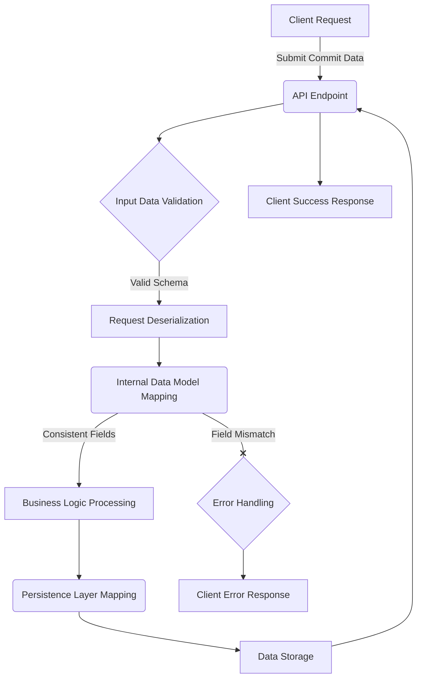

Maintaining Data Model Consistency Across API Boundaries

## Introduction
The integrity of data models is fundamental to the reliability and maintainability of distributed systems. Within an application programming interface (API), data structures serve as critical contracts between various components and external consumers. Discrepancies in field names, data types, or structural definitions across these contracts can lead to system failures, data corruption, and significant operational overhead. This discussion explores the principles and practical considerations for ensuring consistent data model definitions throughout the lifecycle of an API-driven system, drawing insights from scenarios where field name mismatches can impede functionality.

## Technical Concepts
### Data Models and API Contracts
A data model defines the logical structure of data elements and their relationships. In the context of an API, these models dictate the format of data exchanged between a client and a server, forming the API contract. This contract specifies expected inputs (request payloads) and promised outputs (response payloads), including the precise names of fields, their data types, and any constraints. For instance, a data model representing an analytical artifact might include fields such as `commit_hash` (a string identifier for a code commit) and `commit_message` (a string detailing the commit's purpose).

### Serialization and Deserialization
When data is transmitted across a network or stored persistently, it often undergoes serialization—the process of converting a data structure or object into a format that can be stored or transmitted (e.g., JSON, XML, Protocol Buffers). Conversely, deserialization is the process of reconstructing the original data structure from its serialized form. During these operations, the system relies on accurate mapping between the serialized representation and the internal data model. A mismatch in field names between the serialized data and the expected internal data model will result in deserialization failures, leading to unhandled exceptions or partial data processing.

### Schema Validation
Schema validation is the process of verifying that data conforms to a predefined structure and set of rules. This is typically performed at various points in an API's data flow:

- **Input Validation**: Upon receiving an incoming request, the API gateway or server validates the payload against the expected input schema. This ensures that only well-formed data enters the system.
- **Internal Model Validation**: As data moves between different internal services or layers, it may be transformed or re-validated against specific internal data models relevant to each component's domain.
- **Output Validation**: Before sending a response, the API may validate the outgoing data against the defined output schema to ensure compliance with the API contract.

Consistent field naming is a critical aspect of effective schema validation. If an internal data structure expects a field named `commit_hash` but the incoming request provides `commitHash`, validation will fail unless explicit mapping rules are in place.

## Approach and Implementation Patterns
Maintaining data model consistency involves a systematic approach to defining, validating, and transforming data throughout a system's architecture.

### Centralised Schema Definitions
A beneficial practice is to define data schemas in a single, authoritative location. This could be achieved using:

-   **Schema Definition Languages (SDLs)**: Tools like OpenAPI Specification (for RESTful APIs) or GraphQL Schema Definition Language allow for language-agnostic, human-readable definitions of API contracts. These definitions can then be used to generate client libraries, server stubs, and documentation, ensuring all components adhere to the same contract.
-   **Shared Libraries**: In a multi-service environment, a common library containing data model definitions (e.g., Pydantic models in Python, Java classes with annotations, Go structs) can be shared across services. This centralisation helps prevent deviations in field names and types.

### Data Flow and Validation Enforcement
Consider a scenario where an API receives data related to a "commit analysis" and stores it. The data flow requires the `commit_hash` and `commit_message` fields to be consistent from ingestion to persistence.


The diagram illustrates how data flows through an API, emphasising the validation and mapping stages. A `Field Mismatch` at the `Internal Data Model Mapping` stage, for example, due to an incorrect field name like `commitHash` instead of `commit_hash`, would divert the process to `Error Handling`, preventing incorrect data from proceeding.

### Generalised Code Example: Data Model Definition and Validation
In a Python application utilising an API framework, data models are frequently defined using classes that provide both structure and validation capabilities.

```python
from pydantic import BaseModel, Field

# Define the data model for a CommitAnalysis entry
class CommitAnalysisData(BaseModel):
    """
    Represents the data structure for a commit analysis record.
    Ensures consistent field naming for 'commit_hash' and 'commit_message'.
    """
    commit_hash: str = Field(..., description="The unique identifier for the commit.")
    commit_message: str = Field(..., description="The descriptive message associated with the commit.")
    analysis_timestamp: int = Field(..., description="Timestamp of when the analysis was performed (Unix epoch).")

# Example of an API endpoint handler
def process_commit_analysis(raw_data: dict) -> dict:
    """
    Processes incoming raw data, validates it against the CommitAnalysisData model,
    and returns a processed representation.
    """
    try:
        # Attempt to deserialize and validate the raw input data
        validated_data = CommitAnalysisData(**raw_data)
        
        # At this point, validated_data is an instance with guaranteed
        # correct field names (commit_hash, commit_message) and types.
        print(f"Validated Commit Hash: {validated_data.commit_hash}")
        print(f"Validated Commit Message: {validated_data.commit_message}")
        
        # Further business logic can operate on validated_data
        # For demonstration, we just return a dictionary representation
        return validated_data.model_dump()
    except Exception as e:
        # Handle validation errors, e.g., incorrect field names or types
        print(f"Data validation failed: {e}")
        raise ValueError("Invalid commit analysis data provided.")

# --- Example Usage ---
# Correct data demonstrating proper field names
correct_payload = {
    "commit_hash": "a1b2c3d4e5f67890",
    "commit_message": "feat: implement initial data processing",
    "analysis_timestamp": 1678886400
}
process_commit_analysis(correct_payload)

# Incorrect data demonstrating a field name mismatch
incorrect_payload = {
    "commitHash": "x1y2z3a4b5c6d7e8", # Incorrect field name
    "commit_message": "fix: resolve data mapping issue",
    "analysis_timestamp": 1678887000
}
try:
    process_commit_analysis(incorrect_payload)
except ValueError as e:
    print(f"Caught expected error: {e}")

```
This example illustrates how `CommitAnalysisData` acts as a schema, enforcing that incoming dictionary keys must precisely match `commit_hash` and `commit_message`. If `commitHash` is supplied instead of `commit_hash`, the `Pydantic` model will raise a validation error, preventing the malformed data from being processed further. This explicit definition and validation mechanism is a standard practice for maintaining data integrity.

### Data Transformation and Migration
Over time, data models may evolve. When field names or structures need to change, a strategy for data transformation and migration is required. This typically involves:

-   **Versioned APIs**: Introducing new API versions (e.g., `/v1/commit_analysis`, `/v2/commit_analysis`) to support older clients while new clients adopt updated data models.
-   **Transformation Layers**: Implementing specific components responsible for mapping data between different versions of a schema or between external and internal representations. This ensures that legacy data can be consumed by new services, and vice versa, without requiring immediate system-wide updates.
-   **Database Schema Migration Tools**: Utilising tools that manage changes to the persistent storage schema, ensuring that database field names align with the application's data models.

## Key Takeaways
-   **Consistency is Paramount**: Maintaining identical field names and data types across API contracts, internal data models, and persistence layers is essential for system correctness and operability.
-   **Schema Validation Prevents Errors**: Implementing rigorous schema validation at API boundaries and internal processing stages helps detect and prevent data model discrepancies early in the data flow.
-   **Centralised Definitions Improve Governance**: Defining data schemas in a single, accessible location or through shared libraries enhances consistency and simplifies maintenance across multiple services and teams.
-   **Strategic Evolution Requires Planning**: Data model changes must be managed carefully, potentially through API versioning and explicit transformation layers, to ensure backward compatibility and smooth transitions.

## Conclusion
The careful management of data model definitions, particularly concerning field names, forms a cornerstone of reliable software engineering. Discrepancies, even minor ones like an incorrect casing for a field name, can lead to cascading failures throughout a system. By adopting practices such as centralised schema definitions, comprehensive validation, and planned data model evolution, organisations can significantly enhance the stability, security, and maintainability of their API-driven applications. Adhering to these principles ensures that data flows correctly and predictably, supporting the long-term operational integrity of complex systems.