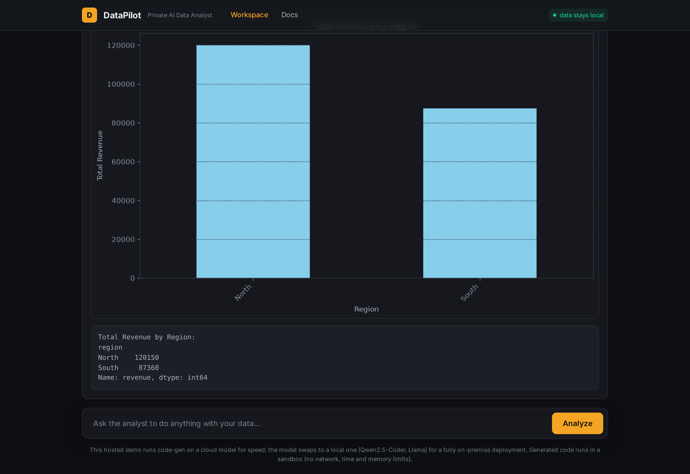

A privacy-first "code interpreter" for data analysis - an experiment in keeping data on the machine.

## What I was exploring

The teams that would benefit most from an AI data analyst often can't send their data to a cloud AI. So: can the analysis be trustworthy and private at the same time?

## How it works

You describe what you want and upload a CSV. DataPilot writes the Python (streamed live), runs it in a sandbox with no network and strict time/memory limits, self-corrects from its own tracebacks, and returns a report - chart, output and the exact code. The model only ever sees the schema and a 5-row sample; the code runs locally against the real data; and the model can be a small local one (Qwen2.5-Coder via Ollama), so the whole thing is air-gappable.

## What was interesting

Every number comes from executed code rather than the model's opinion - that auditability was the point of the experiment.

An MVP; ships as a one-command Docker image. Feedback welcome.

Live demo: https://datapilot.robiriu-dev.my.id

Project page: https://robiriu.github.io/projects/datapilot/