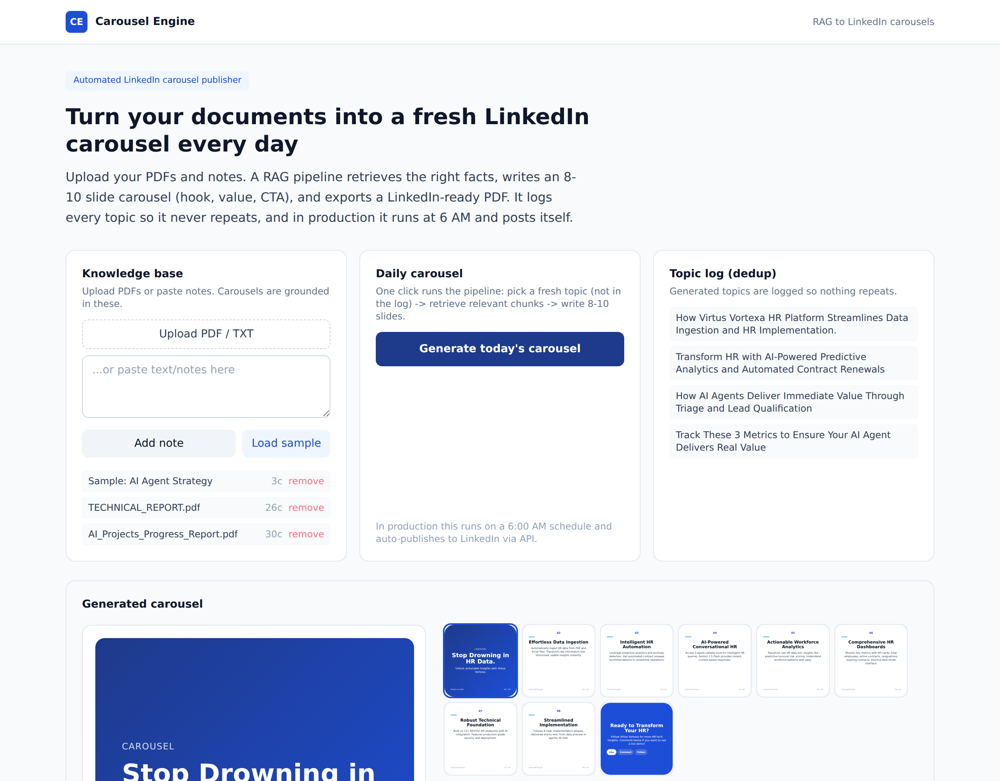

An end-to-end retrieval-augmented generation experiment that turns a document knowledge base into a fresh LinkedIn carousel.

## What I was exploring

Could a content pipeline stay genuinely grounded in source material - and avoid repeating itself - while producing something publish-ready every day?

## How it works

- Upload PDFs or paste notes; the content is embedded into a vector store.
- It picks a fresh topic, skipping anything already in a dedup log.
- It retrieves the most relevant chunks and writes an 8-10 slide carousel (hook, value slides, CTA) grounded in the source.
- The slides render as branded squares and export as a LinkedIn-ready PDF or per-slide PNGs.
- In production it runs on a 6 AM schedule and auto-publishes.

## What was interesting

The dedup-against-history step and keeping every slide traceable to a source chunk were the parts worth the effort.

An MVP - feedback welcome.

Live demo: https://linkedin.robiriu-dev.my.id

Project page: https://robiriu.github.io/projects/linkedin-carousel-rag/