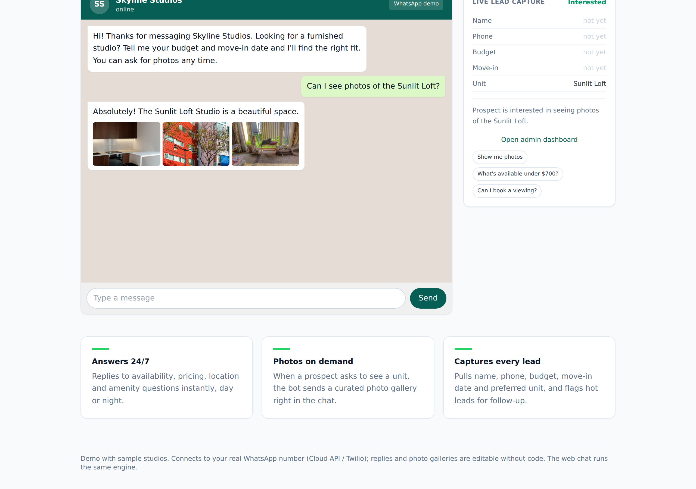

An always-on WhatsApp assistant for a studio-rental business - an experiment in making a text bot feel visual and human.

## What I was exploring

Real-estate conversations are visual. I wanted to see if a WhatsApp bot could send the right property photos at the right moment, not just answer in text.

## What it does

It holds a natural conversation about availability, pricing, location and amenities, and sends a property photo gallery the moment a prospect asks to see a unit. It captures every lead (name, phone, budget, move-in date, preferred unit), classifies the status, books viewings, and exposes a dashboard where replies and galleries are editable without code. The web chat runs the same engine that connects to the client's WhatsApp number.

## What was interesting

Deciding when to fire the photo gallery - reading intent rather than waiting for a keyword - was the fun part.

An MVP; feedback welcome.

Live demo: https://studiobot.robiriu-dev.my.id

Project page: https://robiriu.github.io/projects/whatsapp-realestate-bot/