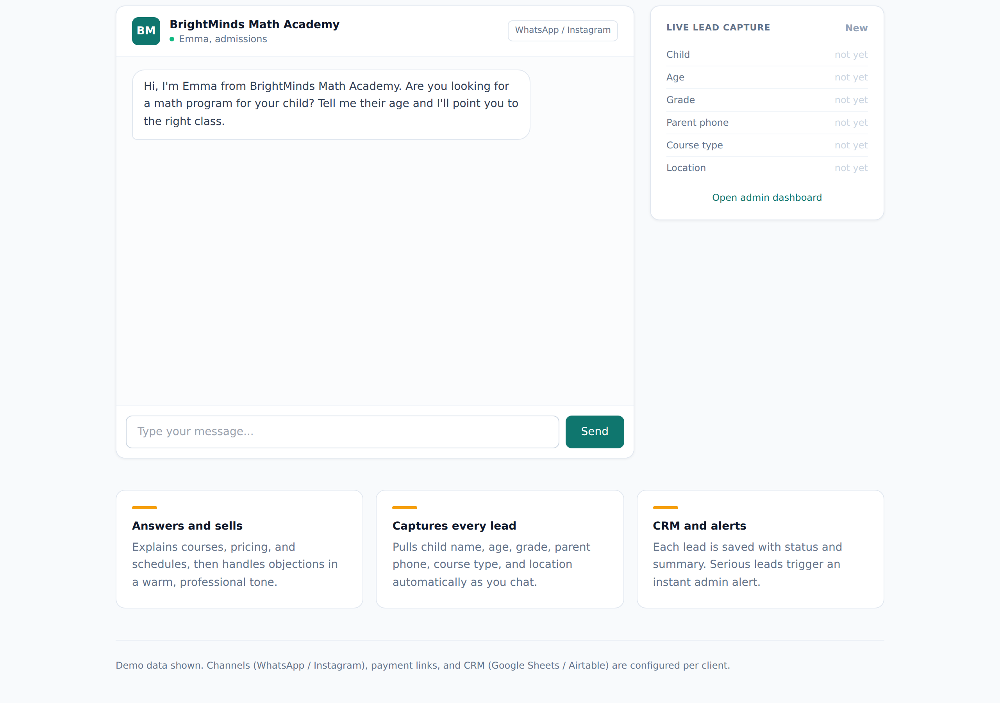

A small experiment in how much of a sales conversation a single LLM can actually own.

## What I was exploring

Most "sales chatbots" are glorified FAQs. I wanted to see if one could also handle objections, extract the lead details from a free-form conversation, and decide how hot the lead is - without a rigid form.

## What it does

The demo is a 24/7 assistant for a children's mental-math academy. It answers course, pricing and schedule questions in a warm tone, captures every lead (name, intent, contact) from the chat, classifies the status, and pushes hot-lead alerts to an admin dashboard. The web chat runs the same engine that connects to WhatsApp Business and Instagram DM.

## What was interesting

Pulling clean, structured lead data out of messy free text - and not nagging for a form - was the part that made it feel less like a bot.

It's an MVP and I'd love feedback.

Live demo: https://mathbot.robiriu-dev.my.id

Project page: https://robiriu.github.io/projects/ai-sales-chatbot/