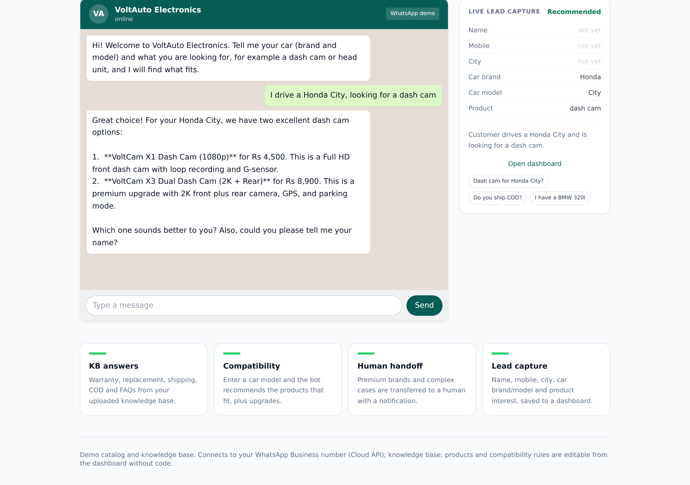

A WhatsApp AI chatbot for an automotive-electronics business - an experiment in compatibility reasoning.

## What I was exploring

Answering FAQs is easy; the harder, more useful question in this domain is "does this part fit my car?". I wanted the bot to reason over compatibility rules, not just retrieve text.

## What it does

It answers product, warranty, replacement, shipping, COD and FAQ questions from a knowledge base, checks product compatibility by car model and recommends the right product with an upgrade suggestion, transfers premium brands to a human agent, and captures every lead into a dashboard. The knowledge base and compatibility rules are editable without code.

## What was interesting

The compatibility-by-car-model matching, and knowing when to escalate to a human, were the parts worth building.

An MVP - thoughts welcome.

Live demo: https://autobot.robiriu-dev.my.id

Project page: https://robiriu.github.io/projects/automotive-chatbot/