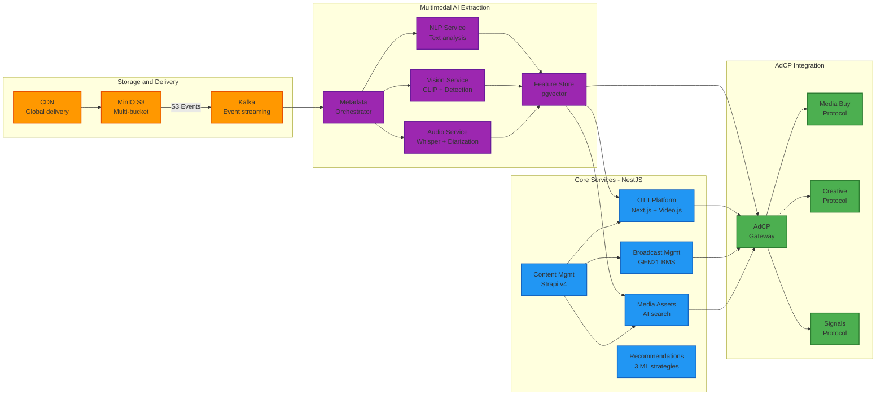
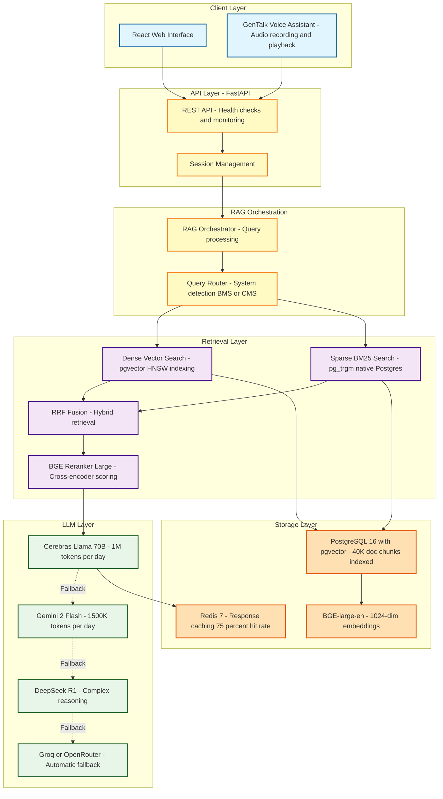
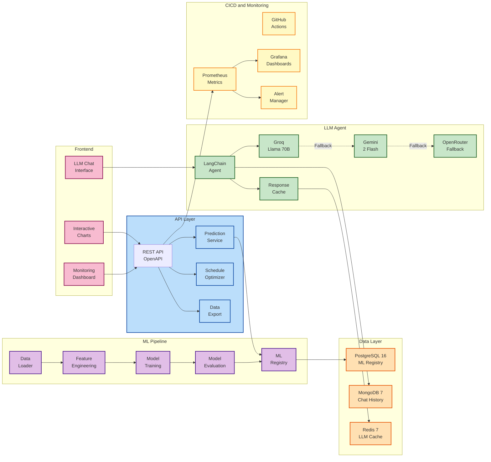
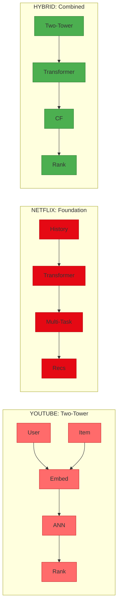

# Production-Ready AI & Software Engineer

!!! tip "What's New"
    **Recommendation Systems Research** - A comprehensive research project comparing YouTube Two-Tower, Netflix Foundation, and Hybrid recommendation architectures with Grid Search optimization.
    [Read more →](projects/recommendation-systems-research.md)

---

## Overview

I am **Robi Dany Riupassa**, a software engineer and AI specialist with proven expertise in building and deploying **production-grade systems** with comprehensive documentation, scalable infrastructure, and advanced AI/ML capabilities.

My work demonstrates:

- Production deployment expertise (Docker, Kubernetes, CI/CD)
- Multimodal AI capabilities (text, audio, video, image processing)
- Infrastructure orchestration (MinIO, Kafka, PostgreSQL, Redis, MongoDB)
- Comprehensive system documentation with architectural diagrams
- MLOps pipelines and automated model deployment
- Event-driven architectures and real-time data processing

---

## Enterprise Production Systems

### Media Platform - Advertising Context Protocol (AdCP)

A **production-ready** comprehensive media platform with AdCP integration for OTT streaming, broadcast management, content management, media asset management, and out-of-home advertising systems.

**Production Capabilities:**

**Technology Stack:**

| Category | Technologies |
|----------|-------------|
| **Backend Services** | NestJS microservices, TypeScript, Node.js 22 |
| **Frontend** | Next.js 14, React 18, Video.js player, Server-Side Rendering |
| **Databases** | PostgreSQL 16 + pgvector, Redis 7 |
| **Content Management** | Strapi v4 (headless CMS) - single source of truth |
| **Event Streaming** | Apache Kafka + Kafka UI |
| **Storage & CDN** | MinIO S3-compatible storage, Cloudflare R2 / BunnyCDN |
| **AI/ML - Multimodal** | **NLP:** spaCy, Hugging Face Transformers **Vision:** CLIP embeddings, scene detection, object recognition **Audio:** Whisper transcription, speaker diarization **Vector Search:** pgvector for semantic similarity |
| **Media Processing** | FFmpeg (video frame extraction, audio extraction, metadata) |
| **Containerization** | Docker Compose, multi-stage builds |
| **Orchestration** | Kubernetes manifests (deployments, services, ingress) |
| **IaC** | Terraform configurations |
| **CI/CD** | GitHub Actions workflows |
| **Monitoring** | Prometheus + Grafana |

**Key Features:**

- **Event-Driven Architecture:** S3 events trigger automatic metadata extraction pipeline via Kafka
- **Multimodal AI Enrichment:** Every uploaded content automatically enriched with NLP, vision, and audio features
- **Feature Store:** Centralized repository with pgvector for semantic similarity search across all content
- **Semantic Search:** AI-powered content discovery using vector embeddings
- **Real-time Streaming:** OTT platform with adaptive bitrate streaming
- **Scalable Infrastructure:** Microservices architecture with independent scaling
- **Production Deployment:** Complete Docker Compose setup, Kubernetes-ready

**Documentation:**

- Comprehensive architecture documentation (95KB+)
- Detailed service specifications for all 8 modules
- Mermaid architectural diagrams
- API specifications (OpenAPI 3.0)
- Deployment guides and infrastructure setup
- Technology decision documents

---

### AI-Powered Help & QnA System

A **production-ready** enterprise-grade RAG (Retrieval-Augmented Generation) system with free-tier LLM APIs, comprehensive hybrid retrieval, and voice assistant capabilities.

**Production Architecture:**

**Technology Stack:**

| Category | Technologies |
|----------|-------------|
| **Backend** | FastAPI, Python 3.11+, Uvicorn, Pydantic |
| **Frontend** | React 18, Vite, Axios |
| **Database** | PostgreSQL 16 + pgvector extension |
| **Caching** | Redis 7 (75%+ cache hit rate) |
| **Embeddings** | BGE-large-en-v1.5 (1024-dim, MIT license) |
| **Reranking** | BGE-reranker-large (cross-encoder) |
| **LLM Providers** | Cerebras (Llama 70B), Google Gemini 2.0 Flash, DeepSeek R1, Groq, OpenRouter |
| **RAG Framework** | Custom RAG orchestrator with hybrid retrieval |
| **Voice Processing** | GenTalk voice assistant with audio recording |
| **Containerization** | Docker Compose |
| **Orchestration** | Kubernetes manifests (StatefulSet, ConfigMap, Secrets) |
| **Testing** | Pytest with coverage reporting |
| **Observability** | Health checks, cache stats, token usage tracking |

**Key Features:**

- **Hybrid Retrieval:** Dense vector search (pgvector) + Sparse BM25 (pg_trgm) with RRF fusion
- **Multi-Provider LLM Fallback:** Automatic failover across 5 free-tier providers
- **Voice Assistant:** GenTalk with audio recording and playback capabilities
- **System Detection:** Automatic BMS/CMS detection with manual override
- **Real-time Citations:** Transparent source attribution for all answers
- **Production-Grade Caching:** Redis-based response caching (75%+ cost reduction)
- **Comprehensive Documentation:** 40K+ lines of real documentation indexed
- **Quality Metrics:** Accuracy ≥75%, Citation coverage ≥90%, Hallucination rate ≤5%

**Performance Benchmarks:**

- API Health Check: <50ms
- Embedding Generation: 100-200ms
- Vector Search: 50-100ms
- End-to-end RAG: 2-5s
- Cache Hit Rate: 35-50%

---

### Broadcast Analytics System - MLOps Platform

A **production-grade** enterprise MLOps platform for broadcast analytics with AI-powered insights, predictive modeling, schedule optimization, and intelligent LLM chat interface.

**Production MLOps Pipeline:**

**Technology Stack:**

| Category | Technologies |
|----------|-------------|
| **Backend** | FastAPI, Python 3.12+, SQLAlchemy, Motor (async MongoDB) |
| **Frontend** | React 18, Chart.js, Axios, GEN21 theme |
| **Databases** | PostgreSQL 16 (ML registry), MongoDB 7.0 (sessions), Redis 7.0 (caching) |
| **ML Frameworks** | Scikit-learn, XGBoost, CatBoost, Gradient Boosting, MLP, ElasticNet |
| **LLM Framework** | LangChain agents with 7 specialized tools |
| **LLM Providers** | Groq (Llama 70B), Google Gemini 2.0 Flash, OpenRouter |
| **Optimization** | Genetic Algorithm-based schedule optimizer |
| **Containerization** | Docker Compose, multi-stage Dockerfile |
| **Orchestration** | Kubernetes (deployments, services, ingress, secrets) |
| **CI/CD** | GitHub Actions (testing, build, deployment) |
| **Monitoring** | Prometheus 2.48.0 + Grafana 10.2.2 + Alertmanager |
| **Logging** | Loki + Promtail for log aggregation |
| **Testing** | Pytest with coverage reporting |

**Key Features:**

- **Automated ML Pipeline:** 24 trained models (6 algorithms × 4 target variables) with auto-selection based on R² > 0.7
- **Model Registry:** Database-backed versioned model storage with automated deployment
- **LLM-Powered Analytics:** Natural language query system with multi-provider support and automatic fallback
- **Response Caching:** Redis-based LLM response cache achieving 75%+ cost reduction
- **Schedule Optimization:** Genetic Algorithm-based optimizer with custom constraints and real-time predictions
- **Comprehensive Monitoring:** Industrial-grade stack with Prometheus, Grafana dashboards, and automated alerting
- **Multi-Database Architecture:** PostgreSQL for structured data, MongoDB for sessions, Redis for caching
- **CI/CD Automation:** GitHub Actions for automated testing, building, and deployment
- **Professional Documentation:** Complete guides for development, production deployment, and MLOps practices

**Performance Metrics:**

- API Latency: 200-500ms average, <2s at P95
- Database Queries: <100ms
- Cache Access: <10ms
- Model Inference: 50-100ms single prediction
- Schedule Optimization: 2-5 seconds

---

### Recommendation Systems Research & Exploration

A **comprehensive research project** implementing and comparing YouTube Two-Tower, Netflix Foundation, and Hybrid recommendation architectures. Features interactive exploration apps and systematic Grid Search optimization.

**System Architectures Compared:**

**Grid Search Optimization Results:**

| System | Combined Score | Precision | Diversity | Best Configuration |
|--------|---------------|-----------|-----------|-------------------|
| **YouTube** | **0.744** | 0.860 | 0.655 | Emb: 128, Candidates: 100, K: 5 |
| Hybrid | 0.688 | 0.524 | **1.000** | Candidates: 50, K: 5, CF: 0.2 |
| Netflix | 0.625 | 0.542 | 0.738 | Emb: 64, K: 5, Foundation: 0.3 |

**Technology Stack:**

| Category | Technologies |
|----------|-------------|
| **Deep Learning** | PyTorch, Transformers, Two-Tower Networks |
| **Vector Search** | FAISS (Approximate Nearest Neighbor) |
| **Embeddings** | Sentence Transformers, Custom Embeddings |
| **Interactive UI** | Gradio Web Applications |
| **Data Processing** | Pandas, NumPy, Scikit-learn |

**Key Achievements:**

- **108 Hyperparameter Configurations** tested via systematic Grid Search
- **3 Complete Recommendation Systems** built from scratch (YouTube, Netflix, Hybrid)
- **Perfect Diversity Score (1.000)** achieved with Hybrid system at K=5
- **Enterprise-Grade Data Models** with 50,000+ synthetic interactions
- **Interactive Exploration Apps** on ports 7860, 7861, 7862

**Key Research Findings:**

- K=5 consistently outperforms K=10 and K=20 across all systems
- Candidate pool size (50 vs 200) has minimal impact on results
- 128-dim embeddings provide best precision/diversity balance
- Hybrid approach achieves maximum diversity through combined architecture

[Learn More →](projects/recommendation-systems-research.md)

---

## Core Competencies

### Infrastructure & DevOps

- **Container Orchestration:** Docker Compose, Kubernetes (StatefulSets, Deployments, Services, Ingress)
- **Event Streaming:** Apache Kafka for event-driven architectures
- **Storage Solutions:** MinIO S3-compatible storage, CDN integration
- **Monitoring & Observability:** Prometheus, Grafana, Alertmanager, Loki + Promtail
- **CI/CD Pipelines:** GitHub Actions workflows for automated testing and deployment
- **Infrastructure as Code:** Terraform configurations

### AI & Machine Learning

- **Multimodal AI Processing:**
  - **Text/NLP:** spaCy, Hugging Face Transformers, entity extraction, topic modeling
  - **Computer Vision:** CLIP embeddings, scene detection, object recognition, video frame analysis
  - **Audio Processing:** Whisper transcription, speaker diarization, audio feature extraction
  - **Vector Search:** pgvector for semantic similarity search across modalities

- **MLOps & Model Management:**
  - Automated ML pipeline orchestration
  - Model registry with versioning
  - Performance monitoring and drift detection
  - Automated retraining workflows

- **Retrieval-Augmented Generation (RAG):**
  - Hybrid retrieval (dense vector + sparse BM25)
  - Cross-encoder reranking
  - Multi-provider LLM fallback chains
  - Production caching strategies

### Database Architecture

- **Relational:** PostgreSQL 16 with pgvector extension for vector similarity search
- **NoSQL:** MongoDB 7.0 for flexible document storage
- **Caching:** Redis 7+ for high-performance caching
- **Database Optimization:** Indexing strategies, query optimization, connection pooling

### Backend Development

- **Frameworks:** NestJS (microservices), FastAPI (API development)
- **Languages:** TypeScript, Python 3.11+
- **API Design:** RESTful APIs, OpenAPI 3.0 specifications
- **Architecture Patterns:** Microservices, event-driven architecture, CQRS

### Frontend Development

- **Frameworks:** Next.js 14 (SSR, SSG), React 18
- **Build Tools:** Vite, Webpack
- **State Management:** Context API, server components
- **Streaming:** Video.js player integration, adaptive bitrate streaming

---

## Professional Experience

### Software Developer & AI Specialist

**A Leading ICT Solutions Provider** | Current Position

Working at a leading ICT solutions provider specializing in:
- Media convergence technologies for Media & Broadcast Industry
- E-commerce solutions and enterprise applications
- AI-powered systems for enhanced enterprise efficiency

**Key Achievements:**

- Architected and deployed production-grade media platform with comprehensive AdCP integration
- Implemented multimodal AI extraction layer processing 40K+ documents with NLP, vision, and audio analysis
- Built enterprise RAG system with 75%+ cost reduction through intelligent caching
- Deployed MLOps platform with automated model training, registry, and CI/CD pipelines
- Created comprehensive documentation (350+ pages) with architectural diagrams and deployment guides

[View Full Experience →](about/experience.md)

---

## Education & Research

**Master of Science (MSc) in Physics**
Bandung Institute of Technology, Indonesia

[Learn more about my education →](about/education.md)

---

## Research Interests

- Artificial Intelligence & Machine Learning
- Computer Vision & Multimodal AI
- Natural Language Processing
- Medical Image Analysis
- Deep Learning Applications
- IoT & Microcontroller Systems
- MLOps & Production AI Systems

---

## Personal & Research Projects

In addition to enterprise projects, I maintain a portfolio of personal and research projects:

- **NEW** [Recommendation Systems Research](projects/recommendation-systems-research.md) - YouTube, Netflix & Hybrid architectures with Grid Search optimization
- [Palm Tree Detection Web App](projects/palm-tree-detection.md) - Computer vision for agricultural monitoring
- [ForceX AI Chat](projects/forcex-ai-chat.md) - Chatbot using Mistral 7B
- [Pneumonia Detection System](projects/pneumonia-detection.md) - Medical image analysis
- [getSensData](projects/getsensdata.md) - Real-time health monitoring
- [OCR IT-09](projects/ocr-it09.md) - Automated data reading

[Browse all projects →](projects/index.md)

---

## Publications

My research has been published in various scientific journals and conferences.

- [Google Scholar Profile](https://scholar.google.com/citations?user=3EyaaoUAAAAJ&sortby=pubdate)
- [Scopus Profile](https://www.scopus.com/authid/detail.uri?authorId=57190936273)

[Learn more about my publications →](about/publications.md)

---

## Contact

Feel free to reach out for collaborations, consultations, or inquiries about AI, machine learning, and technology solutions.

- **Email:** [robiriu@gmail.com](mailto:robiriu@gmail.com)
- **GitHub:** [github.com/robiriu](https://github.com/robiriu) and other private company repositories
- **LinkedIn:** [LinkedIn Profile](https://www.linkedin.com/in/robi-dany-riupassa-48946086/)

[More contact information →](contact.md)
