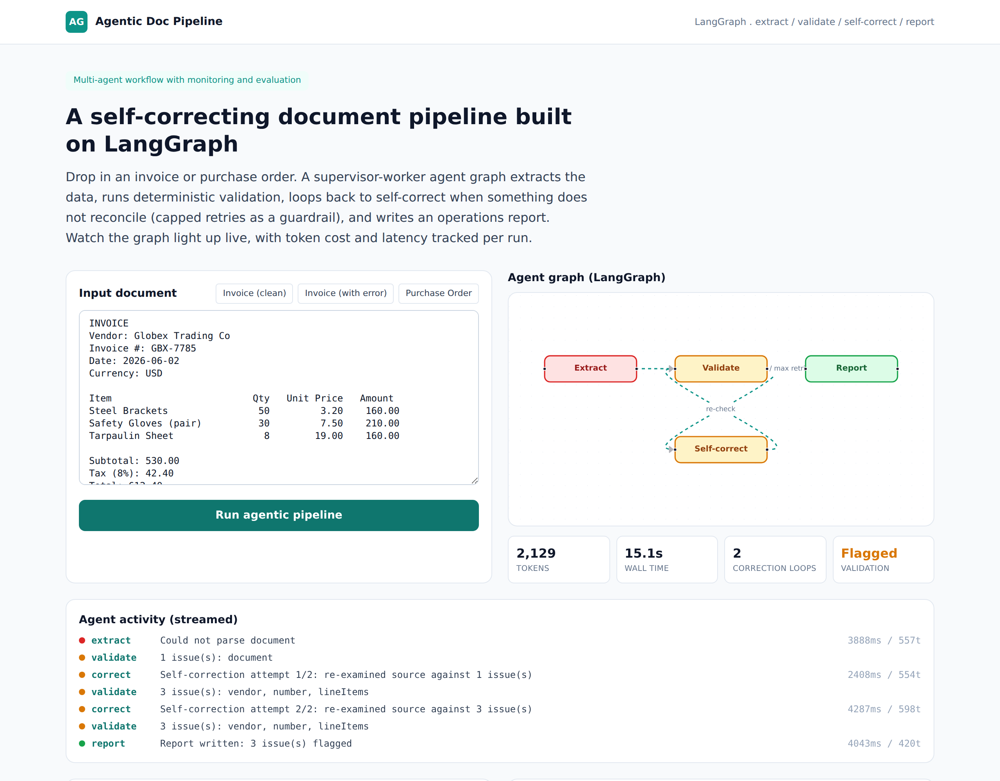

# Self-Correcting Document Pipeline (LangGraph)

**Status:** Live demo
**Demo:** [agentic.robiriu-dev.my.id](https://agentic.robiriu-dev.my.id)



## Executive Summary

A multi-agent document-processing pipeline built on a real **LangGraph** state machine. Drop in an invoice or purchase order and a supervisor-worker graph extracts the structured data, validates the arithmetic deterministically, loops back to self-correct when something does not reconcile (with a capped-retry guardrail), and writes an operations report. The agent graph renders live, every step is streamed to the UI, and an evaluation panel tracks token cost, latency, correction loops, and validation outcome per run.

The design goal was to show genuine agentic behaviour — autonomous routing and self-correction with guardrails and monitoring — rather than a single LLM call dressed up as an "agent".

## How It Works

```
        ┌──────────────── Supervisor routing ────────────────┐
        │                       │                             │
   Extract (LLM)  ──▶   Validate (deterministic)  ──fail──▶  Self-correct (LLM)
        │                       │ pass                         │
        └───────────────▶   Report (LLM)  ──▶  END   ◀─────────┘ (retry, capped)
```

1. **Extract** — Gemini reads the raw document and returns a strict JSON schema (vendor, line items, subtotal, tax, total), instructed to copy values verbatim and never recalculate.
2. **Validate** — A deterministic checker reconciles the arithmetic: each line `qty x unitPrice == amount`, line items sum to the subtotal, and `subtotal + tax == total`, plus required-field and date checks. This is real math, not an LLM guess.
3. **Self-correct** — If validation finds issues, a correction agent re-examines the source against the specific issues. The conditional edge loops back to validation, capped at two retries as a guardrail.
4. **Report** — A reporting agent writes a concise operations report stating whether the document is clean or flagged, listing each discrepancy, and recommending an action.

## Key Features

- **Real LangGraph `StateGraph`** with typed channels, conditional edges, and a self-correction loop (not a hand-rolled pipeline).
- **Deterministic validation layer** so the guardrail logic is trustworthy and auditable, with the LLM handling extraction and narration.
- **Live graph visualisation** (React Flow) that colours each node by status as the run progresses.
- **Server-Sent Events** stream every agent step (node, status, detail, tokens, latency) to the UI in real time.
- **Evaluation panel** per run: total tokens, wall-clock latency, number of correction loops, and pass/flagged validation — the monitoring and evaluation an MLOps-minded client expects.
- Two demonstrated behaviours: a clean invoice takes the happy path with no loop; an invoice with arithmetic errors fires the self-correction loop, hits the retry cap, and reports the flagged discrepancies.

## Technology Stack

| Layer | Technology |
|-------|-----------|
| **Agent framework** | LangGraph (`@langchain/langgraph`), `@langchain/core` |
| **LLM** | Gemini 2.5 Flash via Vertex AI (swappable to GPT / LLaMA) |
| **Graph state** | Annotation channels with reducers (log concat, token sum) |
| **Frontend** | Next.js 15 (App Router), TypeScript, Tailwind CSS, React Flow |
| **Streaming** | Server-Sent Events over a `ReadableStream` |
| **Validation** | Deterministic TypeScript reconciliation (no LLM) |
| **Deployment** | Docker-free Node runtime, pm2 + nginx, Let's Encrypt SSL on a VPS |

## Engineering Notes

- A LangGraph node name cannot collide with a state-channel name; the report node is named `reporter` while the channel stays `report`.
- The supervisor is expressed as a `addConditionalEdges` router that returns `correct` while issues remain and retries are available, otherwise `report`.
- Token and latency accounting is captured inside each node and summed via channel reducers, so the eval panel reflects the true cost of a run including every retry.

## Skills Demonstrated

- Agentic workflow design with LangGraph (supervisor-worker, conditional self-correction loop, guardrails)
- Combining deterministic logic with LLM reasoning for trustworthy automation
- Real-time agent observability (SSE step streaming, live graph, per-run evaluation)
- Structured LLM output with strict JSON schemas
- Production-style deployment (pm2, nginx, automatic HTTPS)

[← Back to Projects](index.md)
