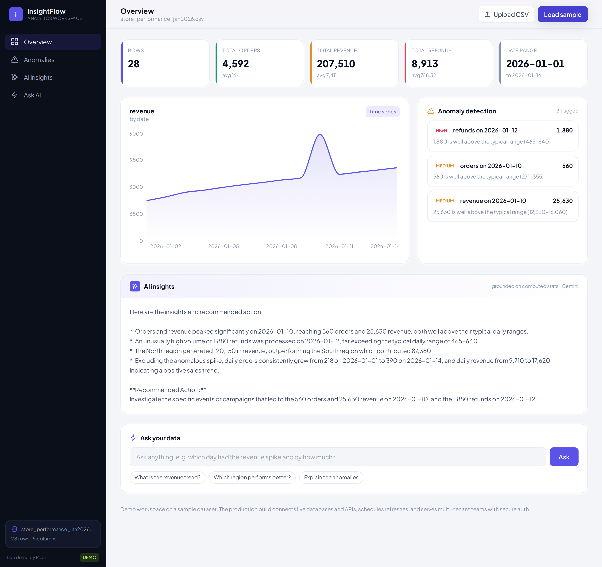

# InsightFlow -- AI Analytics Workspace

**Status:** Live demo
**Demo:** [analytics.robiriu-dev.my.id](https://analytics.robiriu-dev.my.id)



## Executive Summary

An analytics workspace that turns a raw dataset into decisions. Upload a CSV and
it builds the dashboard automatically: headline KPIs, a trend chart, anomalies
flagged across every metric, AI-written insights, and a natural-language layer
that answers questions about the numbers in plain English. It is designed as a
real BI product (sidebar workspace, dataset panel, designed cards), and the core
is the same one that scales to live database and API connections in production.

## How It Works

```
Upload CSV ──▶ parse + type-infer ──▶ deterministic analysis (code)
                                          ├─ KPIs (totals, averages, date range)
                                          ├─ anomaly detection (IQR, every numeric column)
                                          └─ chart series (time series or category breakdown)
                                                   │
                        compact "data facts" context ──┬─▶ AI insights (Gemini)
                                                        └─▶ Ask-your-data (grounded Q&A)
```

The split is deliberate: every number (KPIs, aggregates, outliers) is computed
in TypeScript so the figures are exact and auditable. The LLM only writes the
narrative and answers questions, and it is grounded strictly on the computed
facts, so the analysis never hallucinates a statistic.

## Key Features

- **Automated dashboard** - drop in a CSV and KPIs, a trend chart, and insights
  appear with no manual configuration; column types are inferred automatically.
- **Anomaly detection** - IQR-based outlier detection runs on every numeric
  column (aggregated per day when a date column exists), each flagged with a
  severity. On the sample it catches an orders spike, a revenue spike, and a
  large refund outlier.
- **Relationships (scatter + correlation)** - pick any two numeric parameters
  and the workspace plots their scatter chart with the Pearson correlation
  (r value and strength); it auto-selects the most-correlated pair. Works on
  domain data such as engine-calibration logs (rpm, load, temperature,
  pressure, fuel consumption).
- **AI insights** - specific, number-citing insight bullets plus a recommended
  action, grounded only on the computed statistics.
- **Ask your data** - a chat layer answers questions like "what is the revenue
  trend?" or "which region performs better?" from the real aggregates.
- **Resilient parsing** - PapaParse handles messy headers and mixed types; the
  headline metric is auto-selected (prefers revenue/sales-like columns).

## Technology Stack

| Layer | Technology |
|-------|-----------|
| **Analysis** | TypeScript (type inference, KPIs, IQR anomaly detection, aggregation) -- deterministic, no LLM |
| **LLM** | Gemini 2.5 Flash via Vertex AI (insights + grounded natural-language Q&A) |
| **Frontend** | Next.js 15 (App Router), TypeScript, Tailwind CSS, Plus Jakarta Sans |
| **Charts** | Recharts (area / bar) |
| **CSV** | PapaParse |
| **Deployment** | pm2 + nginx, Let's Encrypt SSL on a VPS |

## From MVP to the full platform

This MVP is the analytics core. The production build adds data ingestion from
internal databases, third-party APIs, and live user-generated data (scheduled
refresh) in place of CSV upload; a model layer with classical ML for forecasting
and anomaly at scale; and a multi-tenant web app with secure auth and per-tenant
isolation, deployed to the client's cloud.

## Skills Demonstrated

- Combining deterministic analytics with LLM narration for trustworthy figures
- Anomaly detection (IQR), correlation analysis, and automatic dashboard generation
- Grounded LLM Q&A over computed statistics (no hallucinated numbers)
- Data-product UX design (workspace shell, charts, designed components)
- Vertex AI integration via a GCP service account

[← Back to Projects](index.md)
