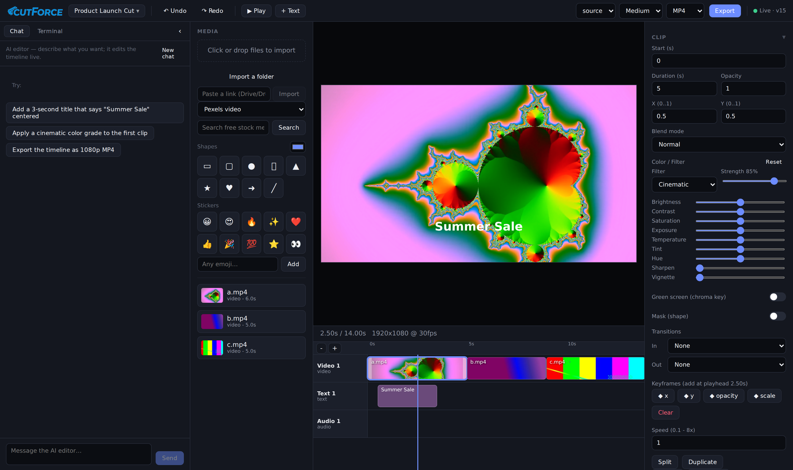
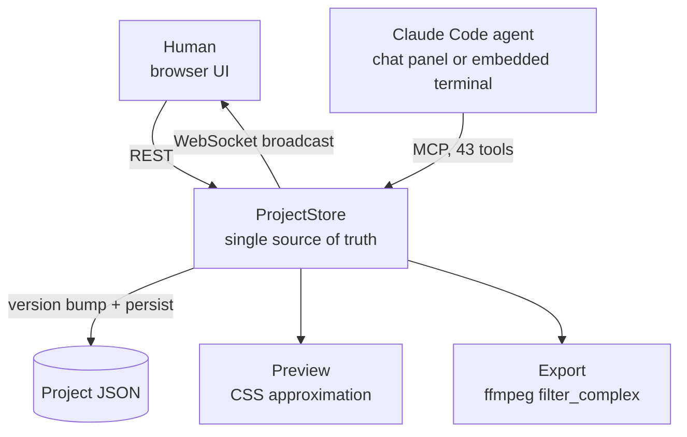

# CutForce - AI-Native Video Editor

**Status:** Ongoing | Deployed and token-gated at cutforce.forcex-ai.com

## Executive Summary

A browser-based video editor where a human and an AI agent edit **the same timeline at the same time**. The human drags clips in the UI; the agent edits through an MCP server with 43 tools; both mutate one shared project state that is broadcast over WebSocket, so every change appears instantly on the other side.

It also ships an **embedded terminal** running inside the editor, pre-wired to the editor's own MCP endpoint, so Claude Code can be launched right next to the timeline it is editing.

The renderer is a real ffmpeg pipeline, not a toy: keyframe animation compiled into ffmpeg expressions, colour grading, chroma keying, shape masks, blend modes, audio effects, transitions, and speed changes, all resolved into a single `filter_complex` graph.

*The running editor: AI chat panel on the left, media bin, live preview showing a rendered title over a graded clip, a three-track timeline with filmstrip thumbnails, and the clip inspector showing the Cinematic grade at 85% strength with its nine underlying colour controls.*

---

## Key Results

| Metric | Value |
|--------|-------|
| MCP tools | 43 |
| Agent skills | 7 authored editing workflows |
| Codebase | ~7,600 lines of TypeScript across 3 workspaces |
| Colour grade presets | 12, each expressed as the same parameters a human can hand-tune |
| Undo history | 50 snapshots, with redo |
| AI generation providers | 3 (Google Gemini, Google Vertex, fal.ai) |
| Stock media providers | 3 (Pexels, Pixabay, Jamendo) |
| Platform | Runs anywhere Node and ffmpeg run, versus the macOS-only project that inspired it |
| Deployment | Live, token-gated, Docker + nginx + TLS |

---

## The Core Idea: one state, two editors

Most "AI video editing" is a one-way pipeline: describe what you want, get a file back, start over if it is wrong. CutForce is built the other way round. The AI is a **second cursor on a live document**.

Every mutation, whether it came from a mouse or a tool call, goes through one `commit` path that applies the change, bumps a version number, recomputes the project duration, pushes an undo snapshot, persists, and notifies every subscriber. The browser REST routes and the MCP tools are deliberately two faces of the same store rather than two code paths.

That single funnel is what makes the collaboration coherent: **undo works across both editors**, because the agent's edits are ordinary entries in the same history stack the human's edits go into.

---

## The 43 MCP Tools

| Group | Tools |
|---|---|
| Read | `get_timeline`, `list_media`, `get_frame`, `measure_loudness` |
| Projects | `list_projects`, `new_project`, `open_project`, `rename_project`, `duplicate_project`, `delete_project` |
| Media | `search_media`, `search_stock`, `import_media` |
| Build | `add_track`, `add_clip`, `add_text_overlay`, `add_shape`, `add_sticker` |
| Cut | `move_clip`, `trim_clip`, `split_clip`, `delete_clip`, `ripple_delete_clip`, `duplicate_clip` |
| Style | `set_clip_properties`, `set_clip_color`, `set_chroma_key`, `set_clip_audio`, `set_clip_mask`, `set_blend_mode`, `set_clip_speed` |
| Motion | `add_keyframe`, `clear_keyframes`, `add_transition` |
| Generate | `generate_video`, `generate_image`, `render_animation` |
| Project | `set_project_settings`, `detach_audio` |
| History | `undo`, `redo` |
| Deliver | `export_video`, `get_export_status` |

`get_frame` matters more than it looks: it lets the agent **see the current frame** rather than reasoning blind about a timeline it can only read as JSON. `measure_loudness` gives it the same for audio.

---

## The Export Engine

The export path compiles a whole timeline into a single ffmpeg invocation, and this is where most of the real engineering sits.

**Keyframes become ffmpeg expressions.** A list of `{t, value}` keyframes on x, y, opacity, volume, scale, or rotation is compiled into a nested piecewise-linear `if(lt(...))` expression in the filter's own time variable, offset so that local clip time maps onto timeline time. Values hold before the first keyframe and after the last.

**Speed changes chain correctly.** ffmpeg's `atempo` only accepts 0.5 to 2.0, so an arbitrary speed is decomposed into a chain of in-range stages that multiply out to the requested rate.

**One grade, two renderers.** A "filter" is not a separate code path; it is a named set of the same `ColorAdjust` deltas a user can set by hand. Preview applies them approximately via CSS for interactivity, export applies them accurately via ffmpeg, and both derive from **the same merged numbers**, with intensity scaling the preset. So `Cinematic` at 85% means one thing, and what you see is what renders.

The graph also handles a background colour canvas, video and image overlays with trim, scale, position, opacity and time gating, `drawtext` titles, alpha-expression shape masks, transition reveals, per-clip audio effects and fades, and the final audio mix.

**It degrades honestly.** At startup the server probes ffmpeg's capabilities, and if the binary lacks `drawtext` it logs that text overlays will be skipped on export rather than failing silently or crashing mid-render.

---

## Agent Design: sandboxed by the operating system, not by the toolset

This is the decision that most distinguishes CutForce from my other agent work, and it is a deliberate inversion.

The chat agent runs the **full** Claude Code toolset, including Bash, file access, and web tools, plus the CutForce MCP server, with `--dangerously-skip-permissions`. That is intentional: a video editor genuinely benefits from an agent that can drop to a shell and run a custom ffmpeg command or a batch operation the 43 tools do not cover.

Since the toolset is not the boundary, the boundary is elsewhere:

- The agent runs as a **non-root `coder` user** in a **container**, in an **ephemeral workspace directory**, never as root. Claude Code refuses `--dangerously-skip-permissions` as root, and rather than working around that, the design leans into it.
- The workspace is **re-seeded from the image on every boot** with a `CLAUDE.md` operating manual and a skills library, so the agent's brain ships with the deployment and cannot drift.
- `ANTHROPIC_API_KEY` is stripped from the child environment so a subscription login can never silently fall back to metered API billing.
- Session continuity uses `--resume` with a captured session id, so one conversation persists across turns without re-sending history.

Compare that with [TransForce](transforce.md), where the same underlying `claude -p` pattern is locked down to MCP tools only via a blocklist, and with my ERP automation work, where the agent gets **zero** tools and is pure reasoning. Three projects, three different answers, each driven by what the blast radius of a wrong action actually is: a bad shell command in a disposable editor container is recoverable, a bad write to a live financial system is not.

### Streaming the agent's work into a chat UI

The raw `claude -p --output-format stream-json` event stream is parsed line by line and turned into a friendly UI: text deltas stream in as they arrive, and each tool call is surfaced as a readable activity label, with `mcp__cutforce__add_text_overlay` rendered as "Add text overlay". Errors are translated too, so a missing login becomes "Open the Terminal and run `claude` then `/login` once" rather than a stack trace.

The system prompt injected on every turn also enforces house style, no em dashes and no emoji, which is the same writing standard I hold my own work to.

### Seven authored skills

The agent ships with editing workflows rather than just tools: `captions`, `color-grade`, `audio-mix`, `b-roll` (sourcing licence-clear footage and music from Pexels, Pixabay, and Jamendo, and cutting to the beat), `titles-motion`, `social-repurpose` (turning a 16:9 edit into a 9:16 or 1:1 cut with a strong hook), and `export-delivery` (per-platform settings with a pre-flight check).

The distinction matters. A tool is `set_clip_color`. A skill is knowing what "cinematic" means, which clips to apply it to, and how subtle to keep the finish.

---

## Generative Media as Timeline Elements

Generated clips are first-class media assets, not a separate mode. Three providers sit behind one interface: **Google Gemini** (Veo 3, Veo 3 Fast, Veo 2 for video; Imagen 3 for stills), **Google Vertex AI** for the same models under service-account credentials, and **fal.ai** (Kling for video, FLUX for images).

Because paid generation costs real money per call, the UI carries a **budget module** that shows an estimated cost before the call, visible as the cost estimate in the screenshot above, alongside an AI safety and budget panel. An editor should not be able to spend money by accident.

Free paths exist alongside the paid ones: stock search across three providers, plus a local animation renderer for titles and motion graphics that costs nothing.

---

## Technology Stack

| Layer | Technology |
|-------|-----------|
| Server | TypeScript, Express, `ws`, npm workspaces |
| Agent | Claude Code headless CLI on subscription, `@modelcontextprotocol/sdk`, node-pty |
| Client | React, Vite, zustand, xterm.js |
| Media | ffmpeg (`filter_complex` compilation), ffprobe, yt-dlp |
| Generation | Google Gemini (Veo, Imagen), Google Vertex AI, fal.ai (Kling, FLUX) |
| Stock | Pexels, Pixabay, Jamendo |
| Shared | One typed data model consumed by server, MCP tools, and client |
| Infrastructure | Docker, nginx, certbot, token gate with HttpOnly cookie |

---

## Current Status and Direction

**Working:** the full edit loop (import, cut, trim, split, ripple delete, transitions, keyframes, grading, chroma key, masks, blend modes, speed, audio effects); multi-project management; undo and redo across both editors; the AI chat panel; the embedded terminal; generation across three providers with cost estimation; stock search; export with progress polling; deployed and gated.

**In progress:** closing the remaining gaps against a mainstream consumer editor's feature set, tracked as an explicit parity list in the repository.

*Private repository, GPL-3.0, inspired by the macOS-only Palmier Pro. Screenshot is from the running application.*
