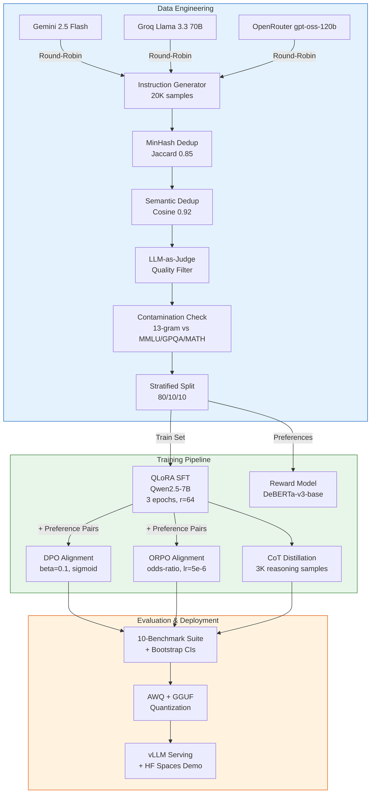
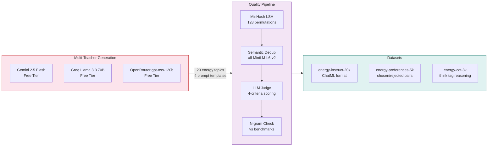
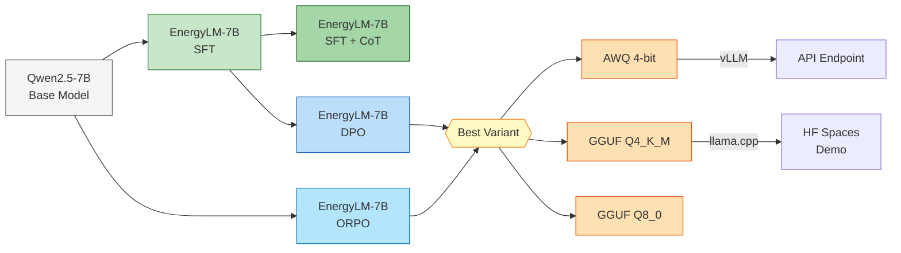
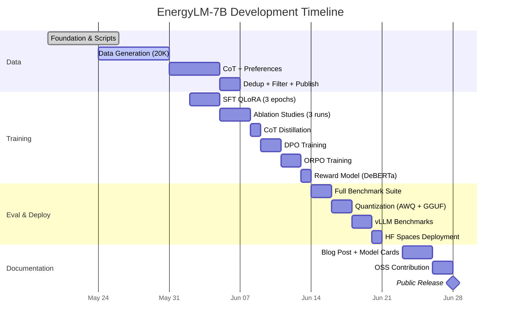

# EnergyLM-7B — LLM Fine-Tuning & Alignment Pipeline

**Status:** In Progress (Week 1 Complete)
**Organization:** [ForceX-AI on HuggingFace](https://huggingface.co/ForceX-AI)
**Budget:** $0 — 100% free-tier compute

## Executive Summary

End-to-end LLM training, alignment, and serving pipeline for **EnergyLM-7B** — a domain-adapted language model for energy systems and scientific reasoning. Fine-tunes Qwen2.5-7B using QLoRA SFT on 20K synthetic instruction samples, aligns with both DPO and ORPO for a controlled comparison, and benchmarks across 10 evaluation dimensions including domain-specific physics calculations, safety, and bilingual (Indonesian) capability.

The entire project runs on **$0 budget** — Kaggle T4 for training, free-tier LLM APIs for data generation, and HuggingFace Spaces for deployment.

## Key Capabilities

| Capability | Implementation |
|------------|---------------|
| **LLM Fine-Tuning** | QLoRA SFT on Qwen2.5-7B (4-bit NF4, LoRA r=64) |
| **Alignment Methods** | DPO vs ORPO controlled comparison study |
| **Chain-of-Thought** | CoT distillation with `<think>` tag reasoning |
| **Reward Modeling** | DeBERTa-v3-base binary classifier on preference pairs |
| **Synthetic Data** | 20K+ samples via multi-teacher round-robin (Gemini, Groq, OpenRouter) |
| **Data Quality** | MinHash + semantic dedup, LLM-as-judge filtering, n-gram contamination check |
| **Evaluation** | 10-benchmark suite: MMLU, GPQA, MATH, MBPP, IFEval + 4 custom domain evals |
| **Quantization** | AWQ 4-bit + GGUF (Q3/Q4/Q5/Q8) with quality retention benchmarks |
| **Serving** | vLLM inference benchmarking, HuggingFace Spaces deployment |
| **Cost** | $0 — Kaggle T4, Colab Free, free API tiers only |

## Pipeline Architecture



## Training Configuration

### QLoRA SFT Setup

```
Base Model:      Qwen/Qwen2.5-7B
Quantization:    4-bit NF4 (double quantization)
LoRA Rank:       64 (alpha=128)
Target Modules:  q_proj, k_proj, v_proj, o_proj, gate_proj, up_proj, down_proj
Effective Batch: 16 (4 x 4 gradient accumulation)
Learning Rate:   2e-4 (cosine schedule)
Max Seq Length:  2048
Compute:         Kaggle T4 (16GB VRAM, free)
```

### Alignment Comparison

| Parameter | DPO | ORPO |
|-----------|-----|------|
| **Loss Function** | Sigmoid | Odds-Ratio |
| **Learning Rate** | 5e-5 | 5e-6 |
| **Beta** | 0.1 | 0.1 |
| **LoRA Rank** | 32 | 32 |
| **Starting Point** | SFT model | Base model |
| **Reference Model** | Implicit (PEFT) | Not needed |

## Data Engineering Pipeline



**20 Domain Topics:** Geothermal systems, nuclear reactor physics, solar PV engineering, wind turbine aerodynamics, reservoir engineering, thermodynamics, fluid dynamics, heat transfer, reactor safety, grid integration, molten salt reactors, well drilling, power plant optimization, energy storage, carbon capture, hydrogen fuel cells, thermal hydraulics, radiation shielding, seismic analysis, CFD for energy.

## Evaluation Framework

10-benchmark evaluation with bootstrap confidence intervals:

| Benchmark | Type | Metric | Purpose |
|-----------|------|--------|---------|
| **Energy QA** | Custom | Accuracy | Domain knowledge |
| **Physics Calculations** | Custom | Numerical tolerance (5%) | Quantitative reasoning |
| **Indonesian Energy** | Custom | BLEU + Accuracy | Bilingual capability |
| **Safety Prompts** | Custom | Refusal rate | Safety alignment |
| **MMLU (STEM)** | Standard | 5-shot accuracy | General knowledge |
| **GPQA Diamond** | Standard | 0-shot accuracy | Hard science reasoning |
| **MATH** | Standard | 4-shot accuracy | Mathematical reasoning |
| **MBPP** | Standard | pass@1 | Code generation |
| **IFEval** | Standard | Strict accuracy | Instruction following |
| **LLM-as-Judge** | Gemini | 4-criteria (1-5) | Overall quality |

## Model Variants



## Free Compute Strategy

| Resource | Purpose | Quota |
|----------|---------|-------|
| **Kaggle T4** | SFT, DPO, ORPO training | 30 GPU-hrs/week |
| **Colab Free T4** | Reward model, eval runs | ~4 hrs/session |
| **Gemini Free** | Data generation, quality judge | 1500 req/day |
| **Groq Free** | Data generation (Llama 3.3 70B) | 30 req/min |
| **OpenRouter Free** | Data generation (gpt-oss-120b) | 10 req/min |
| **HuggingFace Spaces** | Model demo deployment | Free CPU/GPU |

## Project Timeline



## Planned HuggingFace Artifacts

All published under the [ForceX-AI](https://huggingface.co/ForceX-AI) organization:

| Artifact | Type | Description |
|----------|------|-------------|
| `ForceX-AI/energy-instruct-20k` | Dataset | 20K energy-domain instruction pairs (ChatML) |
| `ForceX-AI/energy-preferences-5k` | Dataset | 5K chosen/rejected preference pairs for DPO |
| `ForceX-AI/EnergyLM-7B-SFT` | Model | QLoRA SFT adapter + merged model |
| `ForceX-AI/EnergyLM-7B-DPO` | Model | DPO-aligned variant |
| `ForceX-AI/EnergyLM-7B-ORPO` | Model | ORPO-aligned variant |
| `ForceX-AI/EnergyLM-7B-GGUF` | Model | Quantized GGUF files (Q3/Q4/Q5/Q8) |
| `ForceX-AI/EnergyLM-RewardModel` | Model | DeBERTa-v3-base reward classifier |

## Technology Stack

| Layer | Technologies |
|-------|-------------|
| **Base Model** | Qwen/Qwen2.5-7B |
| **Training** | PyTorch, Transformers, TRL, PEFT, bitsandbytes |
| **Data** | datasketch, sentence-transformers, Gemini/Groq/OpenRouter APIs |
| **Evaluation** | lm-evaluation-harness, custom benchmarks, Gemini judge |
| **Quantization** | AutoAWQ, llama.cpp (GGUF) |
| **Serving** | vLLM, Gradio, HuggingFace Spaces |
| **Tracking** | Weights & Biases, HuggingFace Hub |
| **CI/CD** | GitHub Actions (lint, test, data-validate) |
| **Compute** | Kaggle T4, Colab Free, free LLM API tiers |

## Current Status

**Week 1: COMPLETE** — All foundation code, scripts, notebooks, eval framework, and infrastructure configured. Data generation running across 3 free-tier API backends.

Next: Complete data generation, run quality pipeline, begin SFT training on Kaggle T4.
