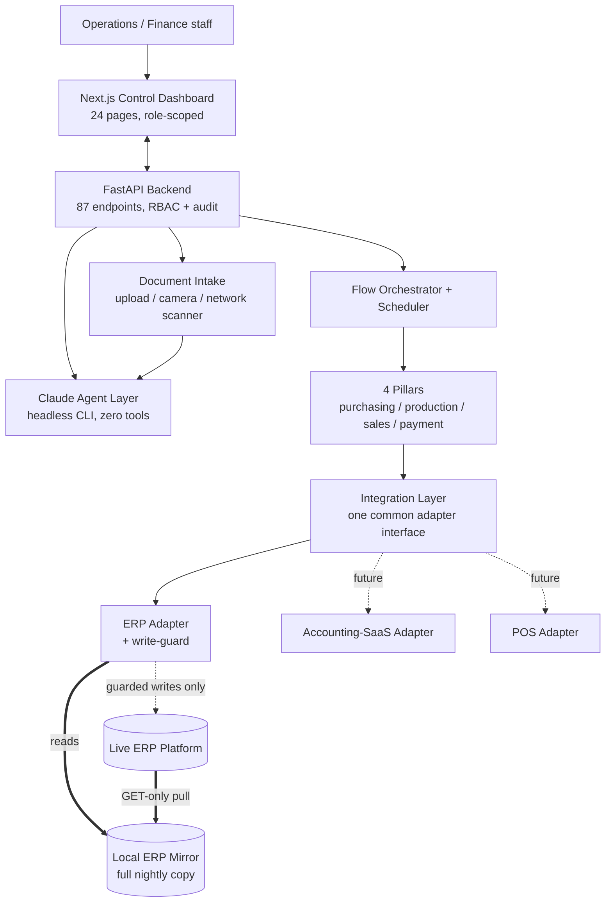
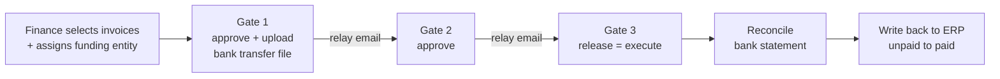

# Agentic ERP Automation Platform

**Status:** Ongoing | Live in production, moving real money and writing to a live ERP

## Executive Summary

An agentic automation platform that sits on top of a commercial cloud **ERP platform** rented by a multi-entity food manufacturing and hospitality group, and takes over the back-office work that a team of people previously did by hand across spreadsheets, email, and manual ERP data entry.

The system automates one continuous supply chain, not four disconnected tools: **buy** raw materials from vendors, **make** finished goods, **sell** them to the group's subsidiaries, and **pay** the vendor invoices, with funding tracked per subsidiary. Every pillar reads from a single mirrored copy of the ERP, and every write back into the ERP passes through the same guarded, idempotent, read-back-verified safety stack.

The hard engineering problem is not the AI. It is doing this **against a live production ERP with no sandbox, no test tenant, and real company money on the other side of every POST**. That constraint shaped the entire architecture.

**What is live today:** automated purchase orders, AI-extracted vendor invoices matched to their goods receipts, purchase invoices created in the ERP, a three-gate payment approval flow that executes real bank transfers, bank statement reconciliation, and payment write-back that flips invoices from unpaid to paid in the ERP.

---

## Key Results

| Metric | Value |
|--------|-------|
| Operational pillars | 4 (purchasing, production, sales, budget/payment) |
| Backend | ~33,600 lines of Python (FastAPI) |
| Frontend | ~19,300 lines of TypeScript (Next.js) |
| REST endpoints | 87 |
| Database tables / migrations | 34 tables, 60 Alembic migrations |
| Dashboard pages | 24 |
| Containerized services | 15 (app, ERP mirror, 6 scheduled sidecars, backups, monitors) |
| Read-only AI data tools | 43 (MCP) |
| ERP write capabilities | 5 document types, each behind its own flag |
| Independent write gates | 7 capability flags + global master switch + dry-run mode |
| Commits | 736 since June 2026, single engineer |
| Production status | Live, executing real vendor payments |

---

## The Problem

The company runs a Central Kitchen that supplies several subsidiary restaurant and cloud-kitchen entities. Its back office ran on a rented cloud ERP plus a sprawl of hand-maintained Google Sheets workbooks. Every day, people were:

- Re-keying vendor invoices into the ERP by hand, field by field, line by line
- Deciding what to reorder by eyeballing stock against buffer levels kept in a spreadsheet
- Assembling payment batches in a workbook, emailing them around for approval, then re-typing them into the bank's corporate transfer portal
- Reconciling the bank statement against the payment list manually, if at all

Two failure modes dominated: **transcription errors** (an invoice typed wrong is a wrong payment) and **no audit trail** (nobody could reconstruct who approved what, when, or whether a transfer actually cleared).

---

## System Architecture



### The three design principles that everything follows

1. **The ERP is the system of record. The platform orchestrates and writes back only where it is provably safe.** Reads never hit the live ERP in a request path. Writes are guarded, idempotent, pre-checked, and read-back verified.
2. **Human-in-the-loop wherever money moves or stock truth is uncertain.** The AI proposes. A person commits. There is no path in the codebase where a model's output causes a payment.
3. **Spreadsheets are a one-time source, never a runtime dependency.** The team's workbooks were read once, read-only, to extract both the data and the business logic. The logic was then reimplemented natively and the data re-homed into the platform's own database with in-app editors. At runtime the system talks only to the ERP mirror and its own database.

---

## ERP Integration: the part that was genuinely hard

The ERP is a rented multi-tenant SaaS. There was no sandbox tenant, no staging instance, and no way to test a write without testing it on the company's real books. Everything below exists because of that.

### 1. A read/write split with a local mirror

Reading the live ERP on every dashboard render was never an option. The API is rate limited hard enough that a full data pull costs roughly 600 authentication round-trips, and the login endpoint starts returning 429 well before that.

So the platform runs a **GET-only mirror service**: a scheduled sidecar that pulls every resource the ERP tenant exposes (masters, purchasing, sales, manufacturing, finance, inventory, plus a ~203k-row journal) into a local store at a fixed quiet hour, then projects it into Postgres. The mirror is GET-only *by construction*: the only non-GET call it can make is the login itself.

```
Live ERP  --(GET-only, nightly + on demand)-->  Local mirror  -->  Postgres  -->  Dashboard
   ^                                                                                  |
   +------------------ guarded, idempotent, single-document writes -------------------+
```

Reads come from the mirror. Writes go directly to the live ERP through a separate, explicitly configured production target. Splitting the two means a misconfigured read path can never become a write, and a write outage never blacks out the dashboard.

Every mirrored resource syncs in isolation, so a single quirky endpoint cannot break the whole run, and each sync atomically replaces its rows while preserving locally-created test documents.

### 2. A seven-layer write-guard

Any write into the live ERP has to survive all of these, in order:

| Layer | What it does |
|-------|--------------|
| 1. Host guard | The HTTP client refuses any POST/PUT/DELETE to a known production host unless a global master switch is explicitly on. GET is always allowed. |
| 2. Mirror-target refusal | A write that would land on the read mirror is refused outright. The mirror must never be mutated. |
| 3. Per-capability flag | Each writable document type (payment, purchase order, purchase invoice, goods receipt, vendor master, order cancellation) has its **own** independent flag, so each capability can be canaried and enabled alone. |
| 4. Dry-run shadow mode | Builds the full payload and runs the pre-check read, but never POSTs. Default on. This was the substitute for the sandbox that did not exist. |
| 5. Idempotency claim | Every document carries a deterministic client-generated code. The ERP rejects a repeat of the same code, so a retried request physically cannot double-pay or double-order. A duplicate error is treated as success. |
| 6. Pre-check and sanity caps | Read-before-write to confirm the target document is still in the expected state, plus a per-transaction value ceiling that refuses anything above it. |
| 7. Read-back verification | After the write, read the document back from the ERP and confirm it landed as intended. Per-row commit, so a partial batch failure never leaves an inconsistent local state. |

Every write capability was rolled out the same way: dry-run, then a `--limit 1` canary against a single real document, verified in the ERP's own UI by a human, then enabled. Purchase orders, goods receipts, and purchase invoices were each canary-proven separately before going live.

### 3. Discovering what the API actually does, not what the docs say

The vendor documentation was incomplete and in places wrong. Findings that changed the design:

- **The API and the ERP's own stock report disagree** on roughly 23% of item/warehouse pairs. Since the team trusts what they see in the ERP UI, on-hand stock is now read from the report path, not the API, so the platform matches what a human sees.
- **The reorder buffer field is report-only.** It cannot be read live or written back through the API at all. That forced the buffer engine to be re-homed into the platform's own tables, which turned out better anyway: buffers are now derived automatically from actual consumption history, with manual per-item overrides.
- **Production orders are GET-only.** There is no create endpoint. So the platform drafts the production order and a human enters it, and the design documents that constraint rather than pretending around it.
- **Two different authentication dialects** between the mirror source and the write target, one persistent header token and one single-use query token, handled by an auth-mode switch in the client.

### 4. Statistical grounding before writing any code

Before building the invoice-to-ERP path, the mirrored history was analysed to find out how documents actually flow in practice, not in theory:

- 90.6% of purchase invoices are created **from a goods receipt**, not from a purchase order and not standalone
- Order to receipt is one-to-one 97.4% of the time
- The invoice total matches the order total only 48% of the time, and vendor plus total uniquely identifies an order only 23% of the time

That last pair killed the obvious design. Amount matching is not a reliable key, so matching is **proposed** by the system with ranked candidates and confidence reasons, and **confirmed** by a human. And because the goods receipt is authoritative for item codes and quantities while the invoice is authoritative for prices, the created invoice is built from the receipt lines and enriched with invoice prices. That single decision removed the entire item-code mapping risk and made stock double-counting structurally impossible.

---

## End-to-End: how a purchase becomes a paid invoice

```mermaid
flowchart LR
    A["Stock below buffer<br/>+ production demand"] --> B["Reorder proposal<br/>vendor + qty + price"]
    B --> C{"Human review"}
    C --> D["Purchase Order<br/>written to ERP"]
    D --> E["PO document<br/>emailed to team"]
    E --> F["Goods received<br/>receipt in ERP"]
    F --> G["Vendor invoice arrives<br/>photo / PDF / scan"]
    G --> H["AI vision extraction<br/>structured JSON"]
    H --> I["Auto-matched to<br/>its goods receipt"]
    I --> J{"Human confirms<br/>match + prices"}
    J --> K["Purchase Invoice<br/>created in ERP"]
    K --> L["Payment batch<br/>3 gates, 3 people"]
    L --> M["Bank transfer executed"]
    M --> N["Bank statement<br/>reconciled"]
    N --> O["Payment written back<br/>ERP: unpaid to paid"]
```



### Stage 1: Reorder proposal

The reorder dashboard fuses two demand signals into one number per item: the **buffer shortfall** (what stock is missing against its reorder level) and the **production demand** (raw materials the planned production run will consume, exploded recursively through recipes derived from historical production orders). The formula is `max(0, buffer + planned_consumption - on_hand)`.

Buffers themselves are computed from actual consumption (a rolling average over 60 days scaled to a cover period), with manual per-item overrides winning when set, and a global settings panel for the policy. Vendor suggestions come from the cheapest price observed within the last 12 months, not the cheapest price ever, so a stale quote from two years ago cannot drive a purchase.

The team picks vendor, quantity, price, and reason. The purchase order is then written to the live ERP, with the raising employee mapped onto the ERP's document-owner field so the generated PDF shows who actually raised it. An admin can one-click cancel a platform-created order, which required discovering that a completed order must be reverted before it can be deleted.

### Stage 2: Invoice intake and AI vision extraction

Three ways in, all feeding one pipeline: **upload files**, **photograph the invoice** with a phone or tablet directly from the dashboard, or **one-click scan** on the office network scanner over eSCL/AirScan. Selecting several files or capturing several camera frames groups them as the *pages of one document*, so a long bill or a front-and-back invoice is extracted as a single unit.

Extraction is Claude vision, prompted to mirror exactly the fields a human would otherwise type into the ERP's purchase invoice form: vendor, invoice number and reference, dates, payment term, line items with item/quantity/unit/price/discount/tax, subtotal, tax, other charges, grand total, and the vendor bank details if printed. The field schema was learned **read-only from the ERP's API reference**, never by touching live data.

The intake request returns instantly and archives the file, while extraction runs in a background worker (1 to 3 minutes for a detailed line-item read, longer for handwriting or multi-page). Extractions stranded by a backend restart are automatically requeued at startup. A document moves `processing` to `extracted` to `verified` to `paid`, with `rejected` and `error` as terminal states. A human reviews the original image side by side with editable fields and the raw JSON. Only a **verified** invoice with both a resolved vendor and an amount becomes a payment candidate. A freshly extracted invoice is never automatically payable.

### Stage 3: Matching and purchase invoice creation

The matcher resolves the extracted vendor against the ERP vendor master, then finds candidate goods receipts: first via the purchase order number if the invoice printed one, otherwise by listing that vendor's open un-invoiced receipts within a date window around the invoice date. Candidates come back ranked, each with the reasons behind its confidence, so the reviewer can see *why* a match was proposed rather than being asked to trust a score.

The draft builder then merges receipt lines with invoice prices, computes totals, and flags every discrepancy. Quantity and price differences between what was received and what was invoiced surface on a dedicated variance screen driven by a daily line-level snapshot of roughly 42,000 rows.

A human confirms the match and the draft. Only then is the purchase invoice created in the ERP, through the full seven-layer guard, landing as a draft for a person to post.

### Stage 4: Three-gate payment with enforced separation of duties

This is where real money moves, so the flow is deliberately slow and deliberately human.



- **Three distinct gates, three distinct people.** Separation of duties is enforced in code, not policy. The person who confirms a transfer must differ from both gate deciders on that batch, so a releaser can never also confirm a transfer nobody made.
- **Sequential relay email, not broadcast.** Each gate emails only the next approver, with magic-link approval that confirms back on the platform.
- **Funding is tracked per subsidiary.** Each invoice carries which entity's budget pays for it, which ties the buy side to the pay side, and the payment file is split one per funding entity.
- **`released` stays distinct from `paid`.** The platform does not claim an invoice is paid because someone clicked a button. It waits for the bank's own record.
- **Partial payments** return the remainder to the pool and require both gates again.
- **Budget per entity** is maintained in-app by approvers and shown live against the current selection, so a batch that would breach budget is visible before it is submitted.

The bank transfer file is generated as a multi-bank spreadsheet in the format the corporate cash-management portal expects, with globally unique per-prefix transaction identifiers to eliminate a collision class discovered in testing.

### Stage 5: Reconciliation and write-back

The bank statement CSV is uploaded and parsed. Debit lines auto-match to released payments on exact amount when the candidate is unique. A human queue resolves the rest: ambiguous amounts, bank fees (ignored), and partial payments (matched manually). Re-uploads deduplicate. Every match and every ignore is audit-logged.

The page also surfaces the **inverse exception**, which is the one that actually catches problems: invoices marked paid that no bank statement has confirmed, flagged overdue past a configurable age. That is how a failed transfer gets noticed instead of silently sitting as "paid" forever.

When reconciliation confirms the bank's own debit line, and only then, the platform posts the payment back to the ERP so the invoice flips from unpaid to paid there too, with no human double-entry. Each payment posts with a deterministic code, so a retry cannot double-pay.

---

## The AI Layer

Three distinct uses of AI, each scoped tightly to what it is allowed to touch.

### 1. A decision agent with zero tools

The agent runs as a **headless CLI on a subscription**, not through an API key, with the API key environment variable deliberately unset so it can never silently fall back to metered billing.

More importantly, **every tool is disallowed**. The agent cannot read files, cannot run commands, cannot reach the network, and cannot touch the ERP. It receives context assembled by Python and returns structured reasoning. Python stays in control of every side effect.

That is the core safety argument of the whole system: *the model proposes, the execution layer disposes*, and the execution layer is where the approval queue, idempotency, append-only audit log, and read-back verification live. Command-execution escape hatches are blocklisted explicitly, not just the obvious shell tool, because a blocklist that misses one of them is not a boundary.

For document extraction the agent is granted exactly one capability, reading the single uploaded file, scoped to that file's directory. Nothing else.

### 2. A read-only conversational data layer

**43 MCP tools**, every one of them read-only, spanning the full operational surface: payables and debt analysis, invoice and item lookup, payment history, approval status, budget, purchase tracking, price anomaly detection, savings opportunities, stock, receipt matching, production plans, material requirements, open orders, vendor search, and data-source provenance.

The chat panel is available on **every page**, pinned as an edge tab that slides in *beside* the content rather than covering it, and stays mounted across navigation so a conversation survives moving between pages. Each question carries the active page context, including the current selection, so "this batch" resolves without the user retyping anything.

It can also **drive the UI**: an allowlisted navigation intent lets it open a dashboard page with filters already applied. Allowlisted on both server and client, view control only, never actions.

The design constraint that makes it trustworthy is simple. It can query everything and change nothing. A dedicated provenance tool means it can always answer "where did this number come from", and tools are scoped by the asking user's department.

### 3. Vision extraction

Covered above. The point worth repeating is that the extraction schema was reverse-engineered from the ERP's *API reference documentation*, read-only, rather than by probing live company data.

---

## Vendor Communication

Purchase order documents are generated as both PDF and PNG and delivered by email through a self-hosted send-only relay with DKIM, SPF, DMARC, and a matching reverse DNS record, on the company's own domain.

**On WhatsApp:** the messaging path is architected and stubbed but deliberately **dormant**. There is a provider interface and message templates behind a feature flag, waiting on a WhatsApp Business API subscription that has not been procured. Until then the working path is a deliberate manual relay: the platform emails the purchase order to the purchasing team, including a PNG rendering specifically sized for forwarding into a chat, and the team forwards it to the vendor.

This was a conscious call rather than an oversight. Building the abstraction now means the eventual swap is a flag flip and a provider implementation, not a redesign. Shipping the manual relay meant the purchasing loop closed weeks earlier than a paid API procurement cycle would have allowed. The interface is designed so a WhatsApp group broadcast, an individual vendor message, or another channel entirely all land on the same seam.

---

## Reliability, Security, and Operations

- **Append-only audit log** across all pillars. Every approval, release, match, ignore, and ERP write records who, when, and what.
- **Role-based access control** with a department plus tier model, so purchasing users and finance users see different surfaces, plus an in-app user administration page.
- **Idempotency everywhere a retry could duplicate something**, using deterministic client-generated codes that the ERP itself rejects on repeat.
- **An isolated staging environment** mirroring production, so changes are proven before promotion, with an explicit safe-promote ritual: preview the diff, back up the database, rebuild only changed services, verify row counts.
- **An independent integrity monitor** running as its own service, continuously comparing platform state against the ERP on stock, buffers, and data freshness, and emailing on divergence. It is deliberately separate from the app so it can catch the app being wrong.
- **Automated database backups**, both local and offsite.
- **Freshness guards and exponential backoff** on the ERP client, because the rate limit is real and a retry storm would lock the team out of their own ERP.
- **Secrets never in the repository.** All credentials in a git-ignored environment file, enforced by a git hook.
- **A self-service change-request board** where the operations team submits requests directly, which are then worked end to end against staging.
- 15 containerized services orchestrated with Docker Compose on a single VPS, a deliberate choice over Kubernetes for a team of one, recorded as an architecture decision record.

---

## What Made This Genuinely Difficult

**No sandbox.** Standard practice is to develop against a test tenant. There was none, and the vendor would not provide one. The response was to build a local stand-in that speaks the same API surface, mirror real data into it read-only, and make dry-run mode the default so that every payload could be built and pre-checked without a single POST. Then canary one document at a time.

**The ERP disagrees with itself.** The API and the ERP's own reports return different stock figures for the same item. Resolving that meant tracing which surface the humans actually trust and matching it, then documenting the divergence rather than quietly picking one.

**The data model had to be discovered statistically.** How invoices actually relate to receipts and orders was not documented. It was measured across the mirrored history, and the measurements directly changed the architecture, most notably by ruling out amount-based matching entirely.

**The users are not engineers.** The dashboard is fully in the users' native language, and the interface is built around the way the team already works rather than the way the data is stored. The AI assistant exists precisely so that someone who would never write a query can still ask "which vendor did we overpay this month" and get a grounded answer with its source.

**Money is unforgiving.** There is no acceptable error rate. Which is why nothing in the payment path is autonomous, every gate is a different human, the platform refuses to call something paid until the bank says so, and the reconciliation screen is built to surface the *absence* of an expected confirmation, not just the presence of an unexpected one.

---

## Technology Stack

| Layer | Technology |
|-------|-----------|
| Backend | Python, FastAPI, SQLAlchemy, Alembic, Pydantic |
| Frontend | Next.js, React, TypeScript |
| Database | PostgreSQL (production), SQLite (local dev and mirror store) |
| AI | Claude via headless CLI on subscription, vision extraction, MCP tool server |
| Integration | REST adapters behind a common interface, guarded write client, GET-only mirror service |
| Documents | PDF and image generation, eSCL/AirScan network scanning, spreadsheet export |
| Infrastructure | Docker Compose (15 services), Nginx, Ubuntu VPS, isolated staging, automated backups |
| Delivery | GitHub Actions CI, git hooks, Alembic migrations, per-service rebuild promotion |

---

## Current Status and Roadmap

**Live in production:**

- Payment pillar: three-gate approval, real bank transfers, statement reconciliation, ERP payment write-back
- Purchasing pillar: reorder proposals, purchase order creation in the live ERP, order cancellation, vendor master creation
- Invoice pipeline: multi-channel intake, AI vision extraction, receipt matching, purchase invoice creation
- Buffer engine, warehouse and stock views, RBAC and audit, integrity monitoring, the read-only AI assistant

**In progress:**

- Goods receipt write-back and receiving dashboard with warehouse filtering
- Production yield tracking (planned versus actual, with recipe anomaly surfacing) and recursive multi-level demand explosion
- Open-order and in-transit visibility so nothing is ordered twice

**Planned:**

- The inter-company sales pillar, mirroring the purchasing machinery on the sell side
- WhatsApp vendor delivery, once the API subscription is procured, as a flag flip on the existing interface
- Additional entity adapters for the group's other operating systems, which is an adapter implementation rather than a platform change

---

*Built for a private client. Company name, ERP vendor, and internal identifiers are omitted deliberately. Architecture, engineering decisions, and metrics are described as built.*
