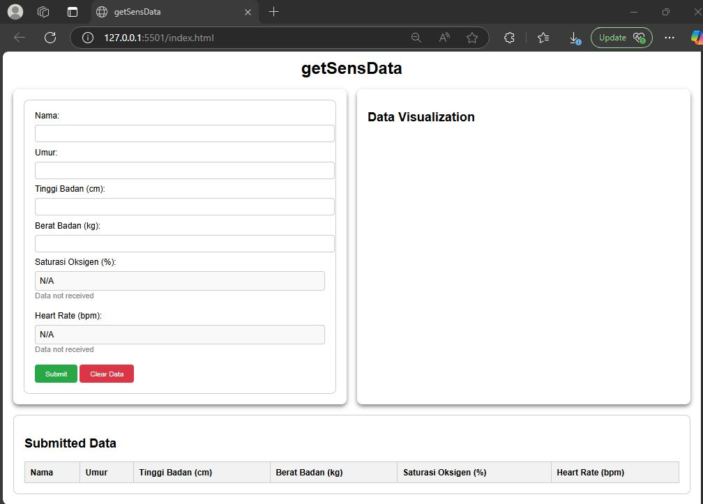

# getSensData

## Overview

A real-time web application for collecting, displaying, and visualizing medical sensor data including oxygen saturation and heart rate measurements.

## Key Features

- **Real-time Monitoring**: Live data visualization
- **Medical Sensors**: Oxygen saturation (SpO2) and heart rate tracking
- **Data Storage**: MongoDB database for historical data
- **Web Dashboard**: Interactive visualization interface
- **Alert System**: Notifications for abnormal readings

## Technologies

- **Backend**: Node.js
- **Database**: MongoDB
- **Frontend**: HTML, CSS, JavaScript
- **Real-time**: WebSockets for live data
- **Sensors**: Medical-grade sensors integration

## Applications

- Patient monitoring systems
- Health tracking applications
- Medical research data collection
- Telemedicine support

**[← Back to Projects](index.md)**
