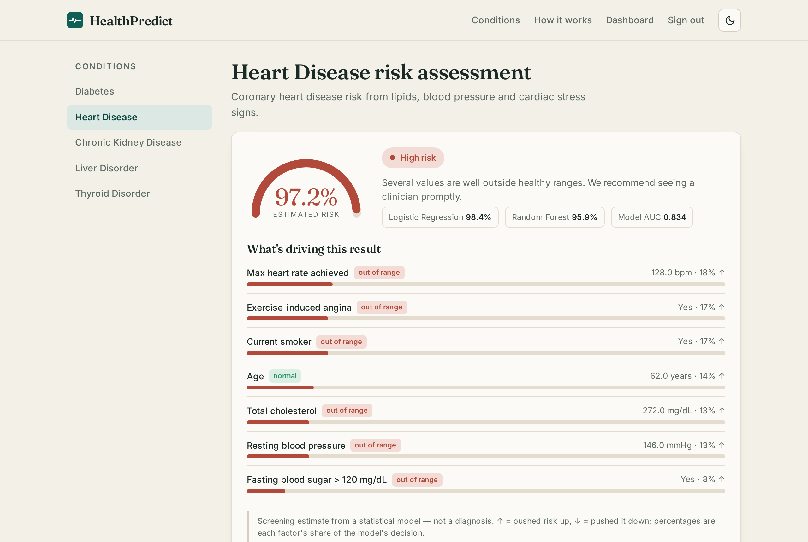

# HealthPredict -- Clinical Risk Prediction Web App

**Status:** Live demo
**Demo:** [health.robiriu-dev.my.id](https://health.robiriu-dev.my.id) (demo login: `demo@healthpredict.demo` / `demo1234`)



## Executive Summary

A self-hostable web app that turns a handful of routine clinical values into an
instant, **explained** risk estimate for common conditions. Each condition is
scored by a Logistic Regression and a Random Forest, ensembled, and every result
breaks down exactly which values drove the score up or down -- so it reads as a
screening aid, not a black box.

Built in a clean, separated architecture (clinical config, ML training,
prediction layer and web layer are independent), with email/password auth, a
results-history dashboard, an admin console, and a light/dark interface.

## Conditions

Diabetes, Heart Disease, Chronic Kidney Disease, Liver Disorder and Thyroid
Disorder, each with its own clinically-realistic feature set. The same framework
extends to additional conditions (Parkinson's, cancers) by adding a model.

## How it works

```
clinical values ─► Logistic Regression ┐
                                        ├─ ensemble probability ─► risk band + explained factors
                   Random Forest ───────┘
```

- **Two models per condition** -- a Logistic Regression and a Random Forest, trained per condition; their probabilities are averaged for a steadier estimate.
- **Explainable** -- the Logistic Regression's coefficients rank each input's contribution; the result page shows the share each factor took and flags values outside the healthy range.
- **Trustworthy** -- the app never invents numbers; the score comes from the trained models on the values you enter.

## Key Features

- Per-condition input forms with healthy-range hints
- Risk gauge, model-agreement panel (LogReg / RF / AUC) and ranked factor breakdown
- Results-history dashboard with trend and distribution charts
- Email/password authentication; admin view of all users and predictions
- Light / dark theme
- SQLite for development via SQLAlchemy ORM -- one environment variable switches it to MySQL for production

## Technology Stack

| Layer | Technology |
|-------|-----------|
| **Backend** | Python, Flask, SQLAlchemy, Flask-Login |
| **Machine learning** | scikit-learn -- Logistic Regression + Random Forest, joblib-persisted |
| **Frontend** | Server-rendered Jinja templates, bespoke CSS design system, light/dark |
| **Database** | SQLite (dev) / MySQL (prod) via the same ORM |
| **Deployment** | gunicorn + nginx, Let's Encrypt SSL on a Linux VPS |

## Skills Demonstrated

- End-to-end ML web application in a clean, layered architecture
- Training, ensembling and explaining scikit-learn classifiers
- Authentication, persistence and an admin workflow
- Production deployment (gunicorn + nginx + SSL) with a portable SQLite→MySQL data layer

!!! note "Disclaimer"
    HealthPredict provides statistical risk estimates for screening and education only. It is not a medical device and does not provide a diagnosis.

[← Back to Projects](index.md)
