# HR & Face-Attendance Platform (Mobile, Kiosk, Web)

**Status:** Ongoing | Staging live on the company VPS with the real workforce imported, Android app and store tablets in pilot

## Executive Summary

A company-owned HR platform for a multi-entity food and beverage group that runs roughly 45 outlets and a central kitchen across Jakarta, Tangerang, Bandung and Surabaya. It replaces a fingerprint machine plus a stack of spreadsheets with three surfaces on one backend:

- an **Android app for employees**, where attendance is a face verification inside a geofence, plus schedule, leave, incidents and payslip;
- the **same app in kiosk mode on a store tablet**, a shared clock-in station for one outlet where staff clock by face with no login at all;
- a **web dashboard for HR**, covering the employee master, attendance and corrections, contracts and renewal recommendations, incidents and warnings, salary progression, payroll, and a read-only AI assistant.

The interesting engineering is not the CRUD. It is that **biometric attendance is money data and sensitive personal data at the same time**: every clock-in feeds payroll, and every face template falls under Indonesia's personal data law (UU PDP No. 27/2022). That pair of constraints drove the whole design, from where the face embedding is computed to how long a photograph is allowed to exist.

!!! note "Where it came from"
    An earlier prototype, the [Agentic HR Intelligence Platform](agentic-hr-platform.md), established the feature set from imported PDF and spreadsheet exports. This platform re-implements all of it on a native data model, where attendance is captured at the source instead of imported, and adds kiosk tablets, payroll and the compliance work below.

---

## Key Results

| Metric | Value |
|--------|-------|
| Surfaces | 3 (employee phone, outlet kiosk tablet, HR web dashboard) |
| Backend | ~12,500 lines of Python (FastAPI) |
| Web dashboard | ~4,600 lines of TypeScript (Next.js), 24 pages |
| Mobile app | ~4,000 lines of Dart (Flutter, Android) |
| REST endpoints | 136 across 14 routers |
| Database | 42 tables, PostgreSQL + PostGIS, 15 Alembic migrations |
| Read-only AI tools | 9 (MCP), permission-scoped per user |
| Workforce on staging | 326 employees, 45 work sites, 5 legal entities |
| Backend test suite | 18 test modules, run on PostGIS in CI |
| Delivery | 92 commits from the first commit on 8 September 2026, single engineer |

---

## The Problem

Attendance ran on shared fingerprint machines and monthly exports. Everything downstream of it was manual:

- The monthly recap arrived as spreadsheets that HR re-keyed before payroll.
- Contract renewals were tracked by hand, so PKWT contracts routinely ran past their end date before anyone decided. On the first import, **50 contracts were already past their end date** with no decision recorded.
- Incidents, warnings and salary raises lived in separate files, so nobody could see one employee's story in one place.
- There was no audit trail. Who edited a clock-in, and why, was not a question the old setup could answer.

A fingerprint machine also fails exactly where this company operates: wet hands in a kitchen, high turnover, and staff who move between outlets.

---

## Three Surfaces, One Backend

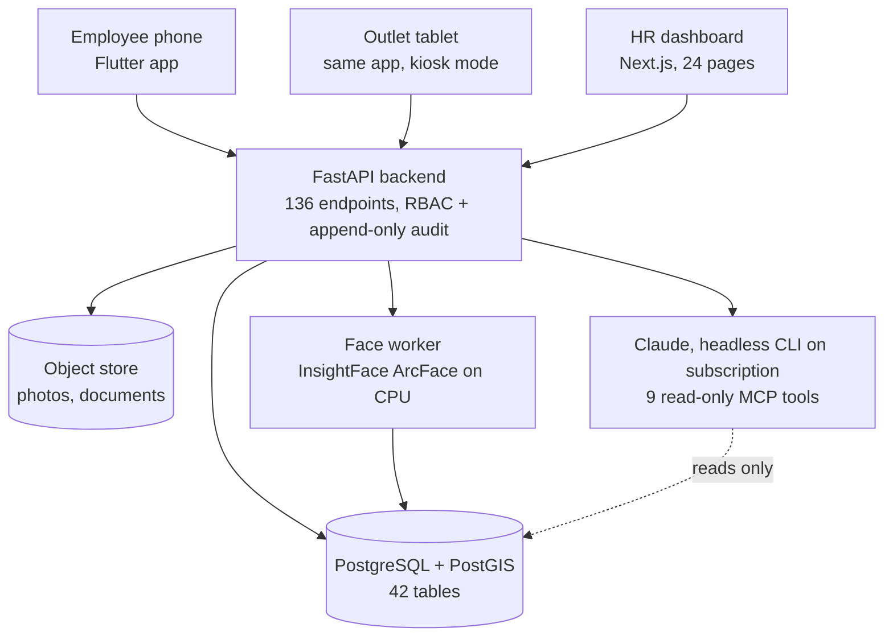

Two design rules run through all of it:

1. **The numbers never depend on the model.** Every figure on every page is computed in SQL. The AI writes narratives and answers questions; it never produces a number that a human then acts on without the query behind it.
2. **Biometrics never leave the server.** The phone detects a face and proves liveness; it never computes an embedding. Templates are encrypted at rest and have no export endpoint at all.

---

## The HR Dashboard

The home page is a single operational answer to "what needs me today": attendance now, the queue of things awaiting a decision, headcount per unit, contracts about to expire, and a written briefing that names the specific employees behind each item.

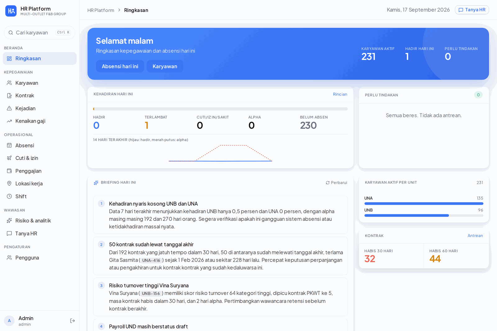

Attendance today lists the full scheduled roster, not only the people who clocked, so an absence is visible as an absence rather than as a missing row. Anything HR changes here goes through a correction with a reason and lands in the audit log.

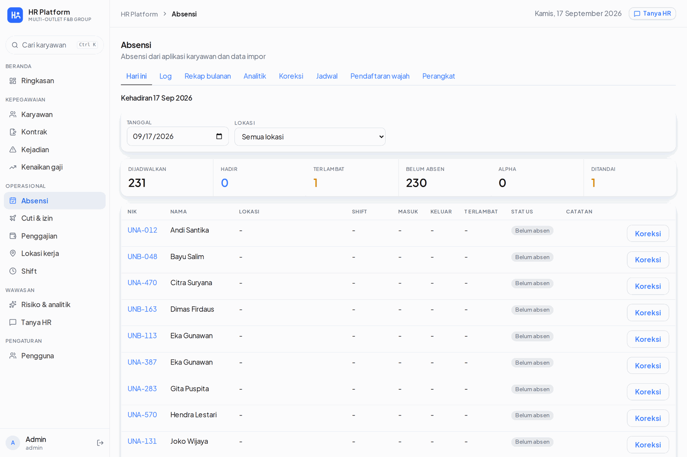

The employee master carries the contract stage (PKWT 1 to 6, then permanent), placement, and the contract end date with how far past due it is.

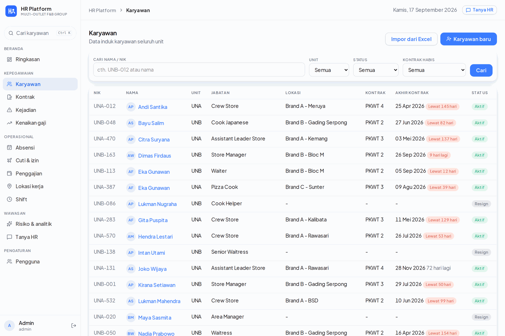

---

## Attendance: Face Verification Inside a Geofence

A clock-in has to satisfy four independent checks before it becomes a record.

**1. Liveness, on the device.** The app runs an active challenge issued by the server (blink, smile or turn) with ML Kit face detection, and uploads a three-frame burst rather than a single still. Replay hashes and a texture score are checked server-side, so a burst that was captured once cannot be replayed later.

**2. Face verification, on the server.** InsightFace ArcFace (buffalo_l) runs through onnxruntime on CPU inside the worker container, because the company has no GPU and 1:1 verification costs tens of milliseconds. Cosine similarity against the employee's stored template accepts at 0.55 or above, rejects below 0.40, and **flags the band in between for HR review** instead of guessing. Keeping the embedding server-side means thresholds can be retuned without shipping an app release.

**3. Geofence.** Each work site has a point and a radius in PostGIS, and the clock carries its distance. Sites are placed by pasting a Google Maps link, searching the name, or clicking the map, and a site supervisor can set it from the phone while standing in the outlet.

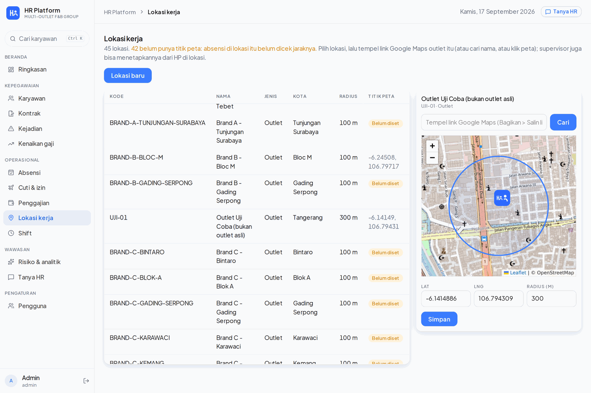

**4. Device and metadata.** Accounts are bound to a device, and mock location, rooted devices and clock skew are checked. Bad signal in a kitchen is expected, so an offline clock is queued locally and accepted on sync, flagged as late-synced and without a live challenge, which is a state HR can see rather than a silent equivalence.

---

## The Store Tablet: Kiosk Mode

Not every employee has a phone they want to use for work, and crew turnover is high. The same Flutter binary therefore also runs as a **shared outlet clock**: one tablet, pinned to one work site, no login and no session.

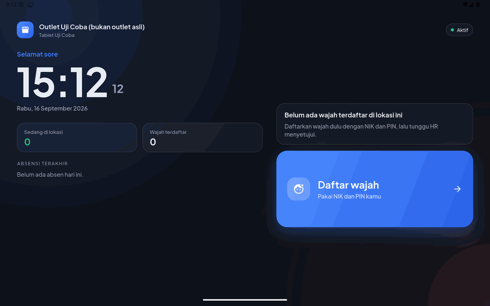

HR registers a tablet in the dashboard and gets a six-character pairing code. The tablet takes the code once and stores a long-lived kiosk token. From then on it only ever shows the kiosk screens.

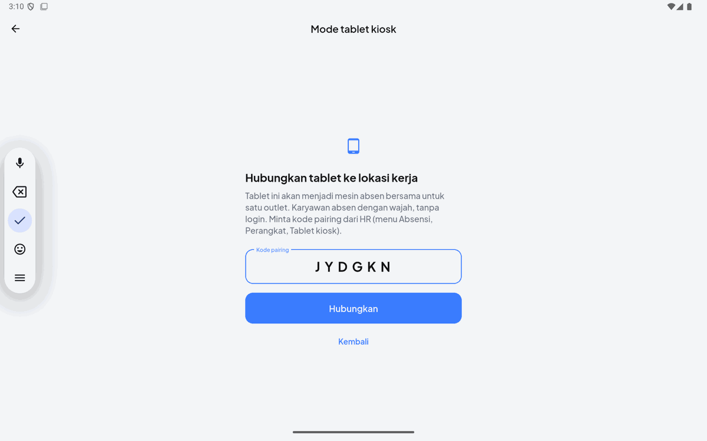

Three properties make the kiosk safe rather than merely convenient:

- **The roster is the scope.** A kiosk compares a face only against approved templates of employees placed or scheduled at that tablet's site that day, never company-wide. That is a privacy control and an accuracy control at once, since the candidate set is dozens of people rather than hundreds.
- **Ambiguity falls back to a name.** One-to-many matching accepts at 0.60, reviews at 0.50, and the best match must beat the runner-up by a configured margin. If it does not, the tablet asks for the employee's NIK and re-checks one to one.
- **Revocation is instant.** HR can issue a fresh pairing code or revoke the tablet, and the old token dies immediately. Codes are single-use and expire.

HR manages the fleet from the dashboard, with pairing codes generated for every outlet at once at rollout time.

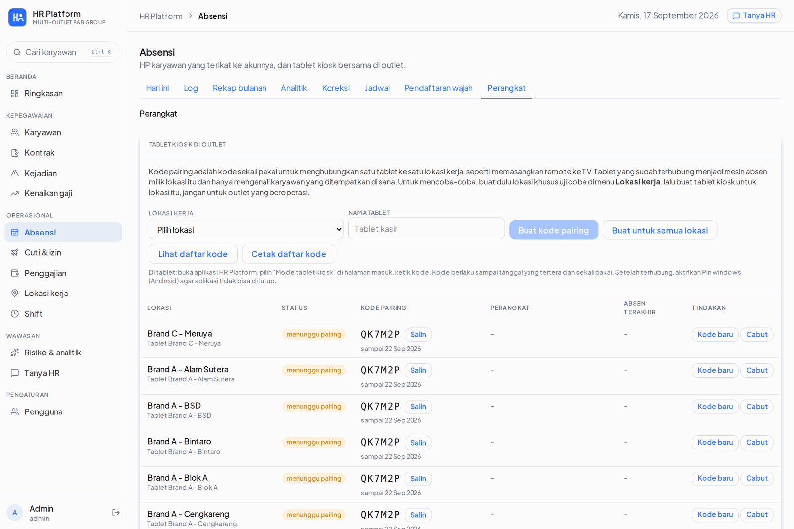

---

## The Employee App

The phone app is the employee's own copy of their record: today's shift and clock state, attendance history, leave requests, incident notes, payslips, and face enrollment with an explicit consent step.

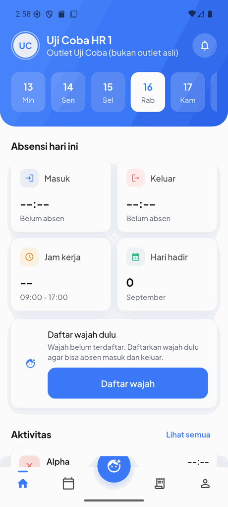
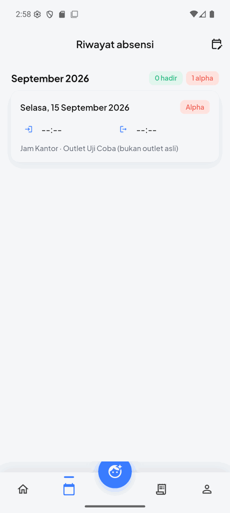

Enrollment does not trust itself: an employee submits photos, the server builds the template, and **HR approves it** before it can verify anything. Raw enrollment photos are deleted once the template is approved.

---

## People Records: Contracts, Incidents, Salary

With 326 employees on rolling fixed-term contracts, the expensive mistake is a contract that quietly lapses.

A rule engine scans contracts 90, 60 and 30 days out and produces a recommendation (extend, make permanent, do not extend, review) from attendance rate, lateness, alpha days, active warnings, incidents, tenure and the statutory five-year PKWT cap. **The rules decide; the model only writes the sentence.** HR sees the recommendation next to the raw numbers that produced it, makes the call, and the next contract is created in the same step.

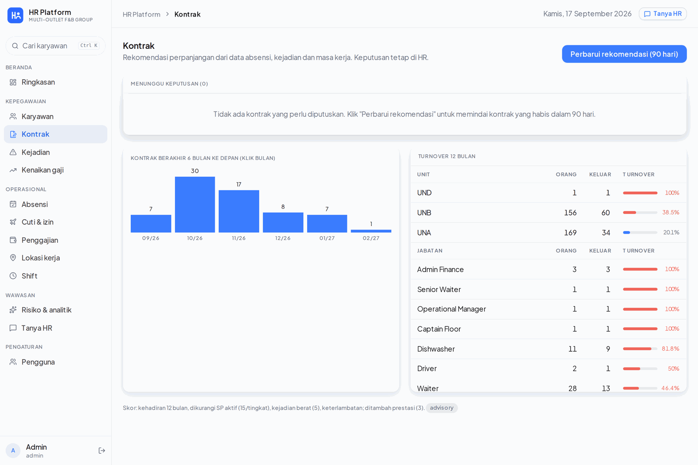

Alongside it sits a turnover risk score, 0 to 100, built from contract stage, lateness and alpha over 90 days, active warnings, serious incidents, and time since the last raise. Every row shows the factors that produced the score, so it reads as evidence rather than as an oracle.

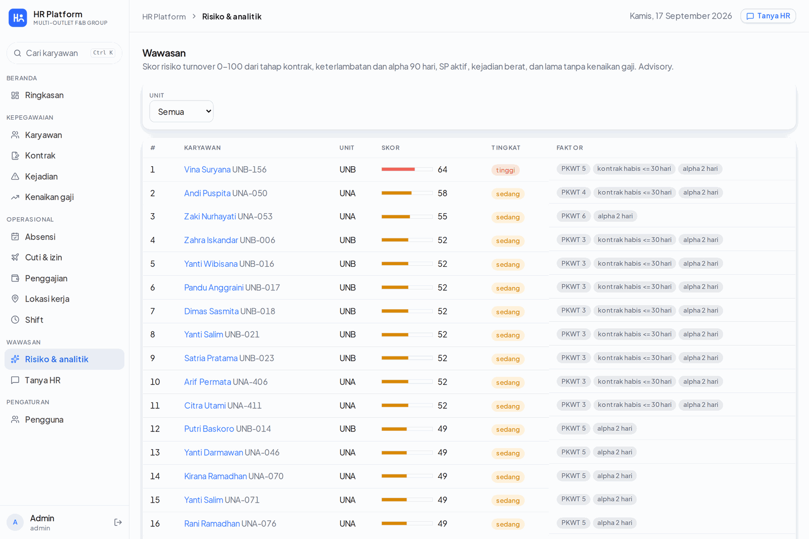

Incidents carry SP1 to SP3 warning validity windows and a manager sign-off. Salary raises run through two gates, with the proposer never approving their own proposal and direksi approval required above a percentage or rupiah threshold. Everything an employee has been through is also rendered as one timeline on their record.

---

## Payroll

The payroll engine computes per entity, per month, on a 26th-to-25th cut-off matching the attendance recap: effective salary, pro-rata for joiners and leavers, alpha deductions, overtime under PP 35/2021, incident deductions, BPJS Kesehatan and Ketenagakerjaan with their caps, and PPh 21 by the TER method with a December annual reconciliation. It produces payslip PDFs, a multi-bank transfer spreadsheet and a journal CSV, behind a compute, approve and pay workflow with separation of duties.

It is deliberately **not live yet**. The TER tables were transcribed by hand and are pending verification against PMK 168/2023, and the plan is a parallel run against the current payroll for one month before anything is paid from it. Payroll that is merely probably right is worse than payroll that is honest about being unverified.

---

## The AI Layer

Two uses, both narrow.

**A daily briefing** on the home page, written from figures the backend already computed, naming the employees and contracts behind each point so it can be acted on directly.

**A read-only assistant** over nine MCP tools: employees, employee detail, attendance, contract alerts, pattern analysis, incidents, salary status, payroll summary and turnover risk. Every tool is read-only and scoped to the asking user's permissions and entity, so salary and payroll tools simply refuse for a user without that right. Each answer shows the tool calls that produced it, and every exchange is logged.

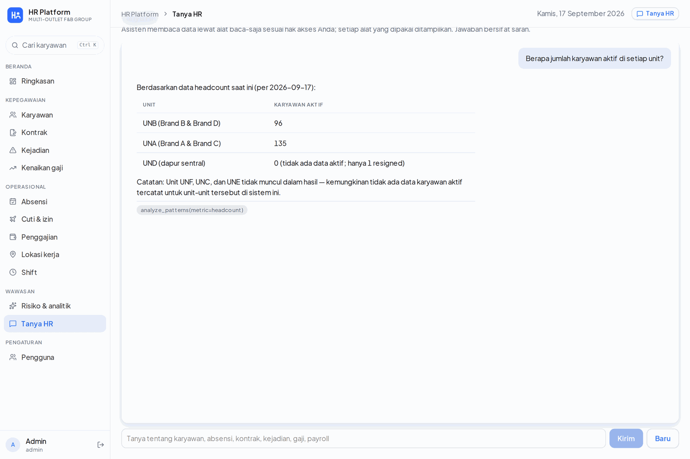

It runs the **headless Claude CLI on the company's existing subscription**, with `ANTHROPIC_API_KEY` stripped from the child environment so it can never silently fall back to metered billing, and with every built-in agent tool disallowed. The only tools that exist in that process are the HR data tools. One subscription is one slot, so calls are serialised behind a process lock and the dashboard polls an async job.

When the model is unavailable, the platform degrades rather than invents: the briefing falls back to rule-written text, recommendation narratives are left empty instead of faked, and every number on every page stays correct because none of them came from the model in the first place.

---

## Privacy and Compliance

Biometric templates and precise location are specific personal data under UU PDP No. 27/2022, so the platform carries a working data protection note as part of the repository, not as an afterthought.

| Control | Implementation |
|---------|----------------|
| Consent | Collected in the app at first login, versioned Indonesian text, stored with a timestamp; withdrawal switches the employee to supervisor-witnessed clock-in |
| Template storage | 512-dimension vector, encrypted at rest with an application key, **no export endpoint**, readable only by the backend worker |
| Retention | Enrollment photos deleted 30 days after approval; clock-in photos kept 90 days, then only the score; templates deleted 30 days after exit |
| Minimisation | A kiosk matches against one site's roster for one day, never the whole company |
| Access | RBAC by role, entity and site, so HR for one entity cannot see another |
| Accountability | Append-only audit log of every correction, approval, decision and device action |

---

## Reliability and Operations

- **Append-only audit log** across attendance corrections, approvals, contract decisions, salary gates and device actions: who, when, from which device, and why.
- **RBAC by role, entity and site**, with an in-app user administration page and mandatory contact details.
- **Rotating refresh tokens** with device binding, and phone plus OTP login for employees.
- **Isolated staging on the company VPS** behind its own TLS listener, with its own database and object store, running with the real imported workforce.
- **CI on GitHub Actions**: backend tests against a PostGIS service container, web lint and build.
- Docker Compose on a single VPS, chosen over Kubernetes for a team of one and recorded as an architecture decision record.
- An Indonesian user manual for HR, outlet supervisors and employees, built and served alongside the platform, because a system this team cannot operate without asking is not finished.

---

## Technology Stack

| Layer | Technology |
|-------|-----------|
| Backend | Python, FastAPI, SQLAlchemy, Alembic, Pydantic |
| Database | PostgreSQL with PostGIS (geofencing), 42 tables |
| Web | Next.js, React, TypeScript, Leaflet |
| Mobile | Flutter (Android), ML Kit face detection, offline queue |
| Face | InsightFace ArcFace (buffalo_l) via onnxruntime on CPU, passive anti-spoof, active liveness challenge |
| AI | Claude via headless CLI on a subscription, custom MCP stdio server, 9 read-only tools |
| Storage | Object store for photos and documents, private buckets with signed URLs |
| Infrastructure | Docker Compose, Nginx, Ubuntu VPS, isolated staging, GitHub Actions CI |

---

## Current Status and Roadmap

**Working on staging with the real workforce imported:**

- Attendance end to end: enrollment with HR approval, face verification, geofence, liveness, offline queue, corrections, schedules, monthly recap and analytics
- Kiosk tablets: pairing, roster-scoped one-to-many matching, NIK fallback, revocation
- People records: contracts and recommendations, incidents with warning validity, salary gates, employee timeline, turnover risk
- The read-only assistant and the daily briefing, verified against real data
- Payroll engine, computed but not yet paid from

**Next:**

- WhatsApp gateway credentials so employee OTP login leaves the manual path
- TER table verification against PMK 168/2023 and a one-month parallel payroll run
- Threshold tuning from pilot data at the first outlets, before a wider rollout

---

*Built for a private client. Company name, brands, outlets and employee data are omitted or replaced throughout: the screenshots are taken from the running system with brands rendered as "Brand A" to "Brand D", entity codes as "UNA" to "UNF", and every personal name replaced with a generated one. Architecture, engineering decisions and metrics are described as built.*
