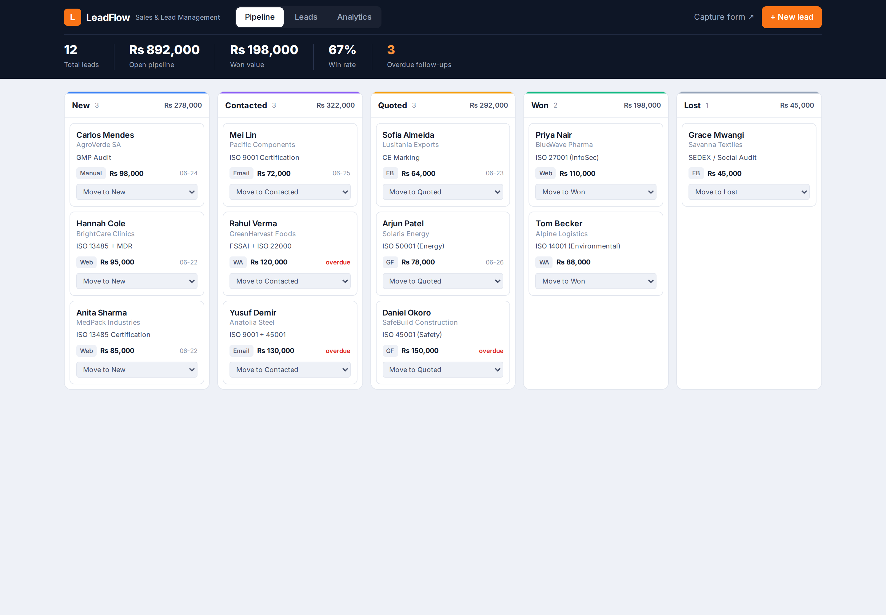

# LeadFlow -- Sales & Lead Management System

**Status:** Live demo
**Demo:** [crm.robiriu-dev.my.id](https://crm.robiriu-dev.my.id) (capture form at `/capture`)



## Executive Summary

A full-stack sales pipeline and lead-management system (CRM) for a services
business. It captures leads from multiple sources, tracks every deal through a
visual pipeline, flags overdue follow-ups, and reports conversion analytics.
Built as a clean, single-screen web app with a REST API and a swappable data
store, it is the kind of system a sales team uses daily to stop losing leads.

## How It Works

```
Lead sources (website form / WhatsApp / Facebook / Google Forms / email / manual)
        │  POST /api/leads
        ▼
   Lead database  ──►  Pipeline board (New ▸ Contacted ▸ Quoted ▸ Won / Lost)
        │                    │ move stage (PATCH)
        ▼                    ▼
  Follow-up reminders   Conversion analytics (funnel, value by stage, by source)
```

A public capture form (`/capture`) simulates leads arriving from any channel and
posts them into the same pipeline a sales rep works from.

## Key Features

- **Multi-source lead capture** - a shareable/embeddable capture form tags each
  lead by source (website, WhatsApp, Facebook lead ads, Google Forms, email,
  manual); every submission lands in the pipeline instantly.
- **Visual deal pipeline** - a Kanban board (New, Contacted, Quoted, Won, Lost)
  with per-stage lead counts and value totals; move a lead between stages in one
  click.
- **Lead database** - a searchable, filterable table (by stage and source) with
  contact, service, deal value, and follow-up date.
- **Follow-up reminders** - each lead carries a next-follow-up date; overdue
  follow-ups are flagged red and counted on the dashboard, so nothing slips.
- **Conversion analytics** - pipeline funnel, pipeline value by stage, leads by
  source, win rate, and open-pipeline value.

## Technology Stack

| Layer | Technology |
|-------|-----------|
| **Frontend** | Next.js 15 (App Router), TypeScript, Tailwind CSS |
| **Charts** | Recharts |
| **API** | REST routes (`/api/leads`) for create / read / update / delete |
| **Data store** | File-based JSON, swappable for Airtable / Supabase / Google Sheets / MySQL |
| **Deployment** | pm2 + nginx, Let's Encrypt SSL on a VPS |

## From MVP to delivery

- Swap the JSON store for the client's CRM database (Airtable / Supabase / MySQL).
- Wire real lead sources: WhatsApp Business API, Facebook Lead Ads, website and
  Google Forms webhooks (or an n8n workflow posting into `/api/leads`).
- Add automated follow-up sequences (WhatsApp / email), quotation generation, and
  renewal reminders on the same data model.

## Skills Demonstrated

- Full-stack web application development (Next.js, REST API, CRUD)
- Data modelling for a sales pipeline / CRM
- Dashboard and analytics UI (funnel, value-by-stage, source breakdown)
- Practical UX: Kanban pipeline, filtering, follow-up reminders
- Production deployment (pm2, nginx, automatic HTTPS)

[← Back to Projects](index.md)
