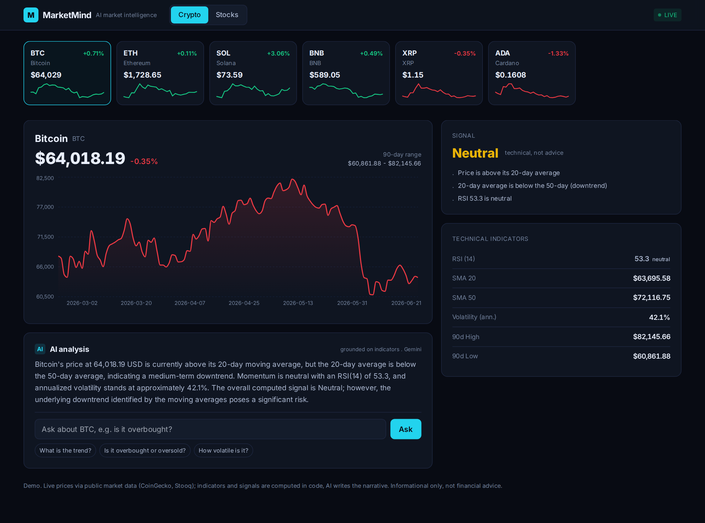

# MarketMind -- AI Crypto & Stock Market Intelligence

**Status:** Live demo
**Demo:** [market.robiriu-dev.my.id](https://market.robiriu-dev.my.id)



## Executive Summary

A market-intelligence SaaS for crypto and stocks. It pulls live market data,
computes technical indicators, derives a Bullish / Bearish / Neutral signal, and
has an AI layer that writes a balanced analysis for any asset and answers
questions about it. The AI is grounded strictly on the computed indicators, so it
never invents prices or statistics. Built as a polished dark trading terminal.

## How It Works

```
Live data (CoinGecko crypto / pluggable stock feed) ─► 120-day price series
        │
        ▼
  Indicators (computed in code):  SMA 20/50 · RSI(14) · volatility · 90d range
        │                                   │
        ▼                                   ▼
  Signal (SMA crossover + RSI)        "data facts" context
   Bullish / Bearish / Neutral             │
                                           ├─► AI analysis (Gemini)
                                           └─► Ask-the-market Q&A (grounded)
```

Every number (price, RSI, moving averages, volatility, signal) is computed
deterministically in TypeScript. Gemini only writes the narrative and answers
questions, grounded on those facts, so the analysis is trustworthy.

## Key Features

- **Live crypto data** - real prices and 120-day history for major coins
  (CoinGecko, keyless, cached); a Stocks tab with the same engine.
- **Technical indicators** - SMA 20 / 50, RSI(14) with overbought/oversold state,
  annualized volatility, and the 90-day high/low.
- **Signal** - a Bullish / Bearish / Neutral call from SMA crossover and RSI, with
  the reasons listed out.
- **AI analysis** - Gemini writes a concise, balanced read (trend, momentum,
  volatility, what the signal implies, and a risk caveat), using only the
  computed indicators.
- **Ask the market** - a chat that answers questions like "is it overbought?" or
  "how volatile is it?" from the real numbers.
- **Resilient data layer** - a deterministic fallback keeps the demo working even
  if a live feed is unavailable.

## Technology Stack

| Layer | Technology |
|-------|-----------|
| **Frontend** | Next.js 15 (App Router), TypeScript, Tailwind CSS (dark terminal UI) |
| **Charts** | Recharts (price area chart + sparklines) |
| **Indicators** | TypeScript (SMA, RSI, volatility, signal) -- deterministic, no LLM |
| **LLM** | Gemini 2.5 Flash via Vertex AI (analysis + grounded Q&A) |
| **Data** | CoinGecko (crypto, keyless); pluggable keyed feed for live stocks |
| **Deployment** | pm2 + nginx, Let's Encrypt SSL on a VPS |

## To a market-ready SaaS

Add Stripe / PayPal subscriptions, user accounts with saved watchlists, a keyed
live stock feed (Finnhub / Twelve Data), price alerts, and more assets. The
indicator + signal + grounded-AI core stays the same.

Informational only, not financial advice.

## Skills Demonstrated

- Integrating live financial data with a clean, resilient data layer
- Technical analysis in code (SMA, RSI, volatility, signal generation)
- Grounded LLM analysis and Q&A (no hallucinated numbers)
- Polished product UX (trading-terminal design, live indicators)
- Vertex AI integration and production deployment

[← Back to Projects](index.md)
