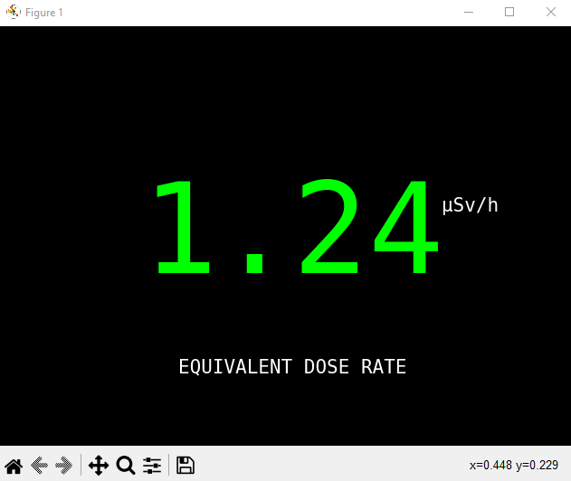

# OCR - IT09 Data Panel

## Overview

An automated system using Optical Character Recognition (OCR) technology to read and record radiation dose data from IT-09 Data Panel displays in real-time.

## Key Features

- **OCR Technology**: Tesseract OCR engine
- **Real-time Processing**: Live webcam feed analysis
- **Automated Recording**: Continuous data logging
- **Radiation Monitoring**: Dose rate measurements
- **Data Export**: CSV and database storage

## Technologies

- **OCR**: Tesseract OCR
- **Computer Vision**: OpenCV
- **Python**: Core processing
- **Camera Integration**: Webcam/IP camera support
- **Data Storage**: CSV and database logging

## Applications

- Radiation safety monitoring
- Laboratory data collection
- Automated instrumentation reading
- Safety compliance recording

**[← Back to Projects](index.md)**
