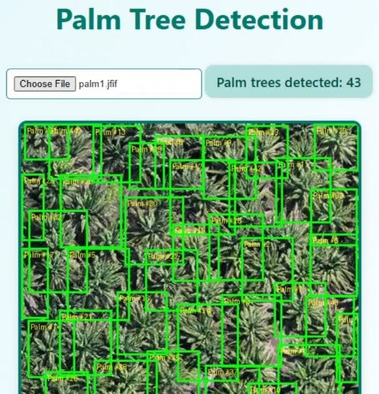

# Palm Tree Detection Web App

## Overview

A web application that automatically detects and counts palm trees in uploaded images using a custom-trained object detection model. This project demonstrates the application of computer vision for agricultural and environmental monitoring purposes.

## Problem Statement

Manual counting and tracking of palm trees across large plantations is time-consuming and prone to errors. This application automates the process, making it faster, more accurate, and scalable.

## Solution

The application uses a custom-trained object detection model hosted on Roboflow, integrated with a FastAPI backend to provide a user-friendly web interface for image upload and analysis.

## Key Features

- **Image Upload**: Simple interface for uploading images containing palm trees
- **Real-time Detection**: Fast processing and visualization of detection results
- **Accurate Counting**: Automated counting of detected palm trees
- **Bounding Box Visualization**: Clear visual feedback showing detected trees
- **API Integration**: RESTful API for easy integration with other systems

## Technologies Used

### Machine Learning
- **Object Detection Model**: Custom-trained YOLOv8 or similar
- **Training Platform**: Roboflow for model training and hosting
- **Computer Vision**: OpenCV for image processing

### Backend
- **Framework**: FastAPI for high-performance API
- **Python**: Core programming language
- **Image Processing**: PIL/Pillow for image manipulation

### Frontend
- **Web Interface**: HTML, CSS, JavaScript
- **Responsive Design**: Mobile-friendly interface

## Technical Details

### Model Training
1. Dataset collection and annotation
2. Data augmentation for improved robustness
3. Model training on Roboflow platform
4. Model optimization and validation

### API Workflow
1. User uploads image through web interface
2. Backend receives image and sends to Roboflow API
3. Model performs inference and returns detections
4. Results are processed and visualized
5. Count and annotated image returned to user

## Use Cases

- **Plantation Management**: Monitor palm tree populations
- **Agricultural Planning**: Assess plantation density
- **Environmental Monitoring**: Track deforestation or reforestation
- **Research**: Study palm tree distribution patterns

## Results

The system achieves high accuracy in detecting and counting palm trees across various image conditions, including:

- Different lighting conditions
- Various angles and perspectives
- Different tree sizes and growth stages
- Partial occlusions

## Future Enhancements

- [ ] Batch processing for multiple images
- [ ] Tree health assessment
- [ ] Historical tracking and analytics
- [ ] Mobile app version
- [ ] Integration with drone imagery

---

## Project Links

!!! info "Implementation Details"
    This project showcases practical application of computer vision for real-world agricultural challenges.

**[← Back to Projects](index.md)**
