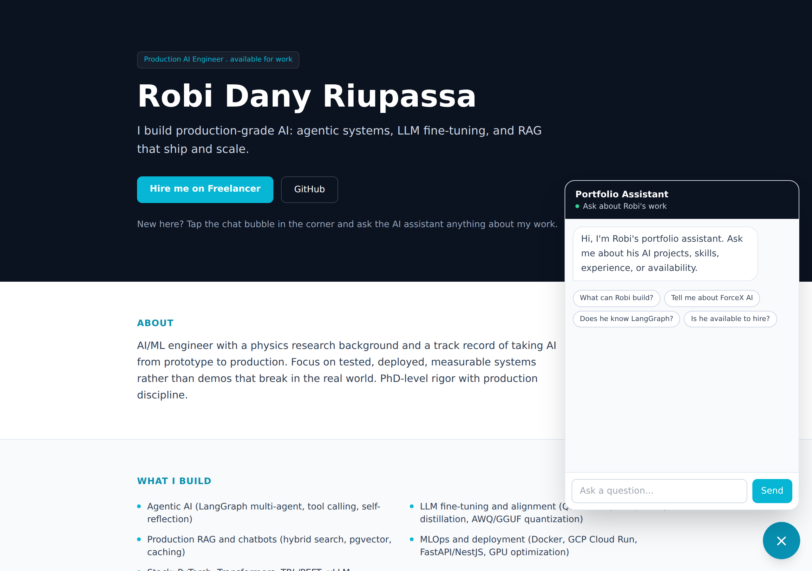

# AI Assistant Embedded on a Portfolio Site

**Status:** Live demo
**Demo:** [portfolio.robiriu-dev.my.id](https://portfolio.robiriu-dev.my.id)

## Executive Summary

An AI chatbot embedded on a personal portfolio website that answers visitors' free-form questions about the owner — skills, projects, experience, and availability — grounded only in the site content so it never invents facts, and gently nudges interested visitors (recruiters, potential clients) toward making contact. The assistant is a floating widget that appears on every page and drops into any existing site.

## How It Works

1. The portfolio content (about, skills, projects with metrics, experience, contact, availability) is compiled into a knowledge base.
2. A system prompt constrains the assistant to answer only from those facts, in the third person, concisely, and to direct hiring intent to the contact channels.
3. A floating chat widget (bottom-right, on every page) sends the conversation to a Gemini-backed endpoint and renders the reply, with suggestion chips to start the conversation.

## Key Features

- **Grounded, no hallucination** — answers come only from the profile knowledge base; if something is not covered, the assistant says so and offers to connect the visitor directly.
- **Hire-intent aware** — when a visitor shows interest, it surfaces availability and the contact route.
- **Embeds anywhere** — a self-contained widget that overlays an existing portfolio or marketing site.
- **Configurable per person** — swap the knowledge base for any individual's CV/site content, or auto-ingest existing pages into a small vector store for retrieval.

## Technology Stack

| Layer | Technology |
|-------|-----------|
| **LLM** | Gemini 2.5 Flash via Vertex AI |
| **Grounding** | Profile knowledge base injected into the system prompt |
| **Frontend / API** | Next.js 15 (App Router), TypeScript, Tailwind CSS |
| **Widget** | Floating, page-wide chat component with suggestion chips |
| **Deployment** | pm2 + nginx, Let's Encrypt SSL on a VPS |

## Skills Demonstrated

- Grounded conversational AI with strict anti-hallucination constraints
- Embeddable widget UX design
- Knowledge-base modelling from unstructured profile content
- Vertex AI integration via a GCP service account

[← Back to Projects](index.md)
