# Recommendation Systems Research & Exploration

**Status:** Completed | Research & Implementation
**Repository:** [github.com/robiriu/AdCP-media-platform-v2](https://github.com/robiriu/AdCP-media-platform-v2) (services/recommendation/research)

## Executive Summary

A comprehensive research and hands-on exploration of recommendation system architectures used by YouTube and Netflix. This project implements three interactive exploration apps to test and compare different approaches, culminating in a systematic Grid Search optimization to find optimal hyperparameters for precision, diversity, and balanced recommendations.

### Key Achievements

- **3 Fully Functional Recommendation Systems** built from scratch
- **108 Hyperparameter Configurations** tested via Grid Search
- **0.744 Best Combined Score** achieved with YouTube Two-Tower model
- **100% Diversity Score** achieved with Hybrid system
- **Enterprise-Grade Data Models** aligned with real OTT platforms

---

## Research Overview

### Systems Studied

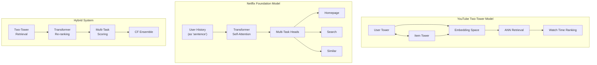

### Architecture Comparison

| Aspect | YouTube | Netflix | Hybrid |
|--------|---------|---------|--------|
| **Retrieval** | Two-Tower + ANN | Foundation Model | Two-Tower |
| **User Model** | History avg + MLP | Transformer | Transformer + MLP |
| **Ranking** | Watch time prediction | Multi-task heads | Multi-task scoring |
| **CF Training** | - | Yes (trainable) | Yes (trainable) |
| **Ensemble** | - | CF blend | CF blend |
| **Best For** | Scale (billions) | Personalization | Both |

---

## System Architectures

### YouTube Two-Tower Model

The Two-Tower architecture is designed for massive scale, processing billions of videos efficiently.

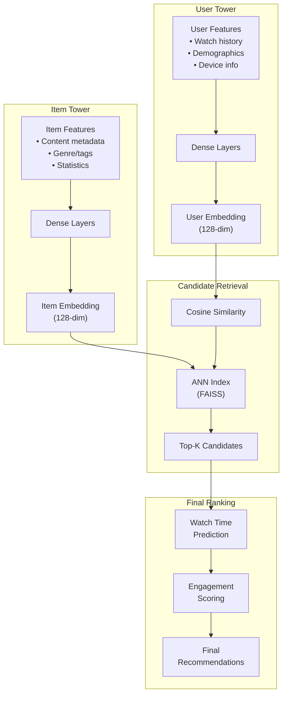

**Key Characteristics:**
- Pre-computed item embeddings for fast retrieval
- Approximate Nearest Neighbor (ANN) search for O(log n) complexity
- Separate training for towers enables offline updates
- Optimized for watch time prediction

### Netflix Foundation Model

Netflix treats user history as a "sentence" where interactions are "tokens", applying LLM-inspired architectures.

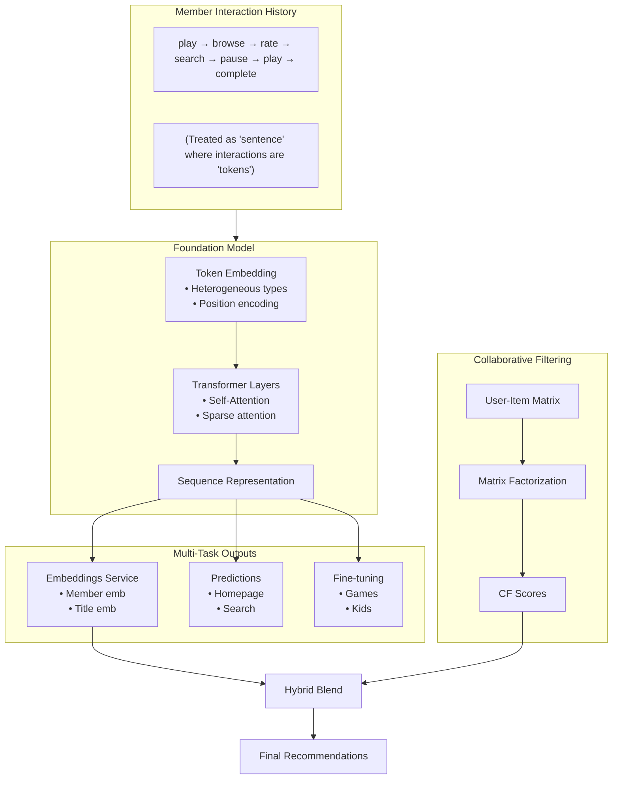

**Key Characteristics:**
- Sequential modeling captures temporal patterns
- Multi-task learning shares representations across surfaces
- Embeddings-as-a-Service enables organization-wide reuse
- Hybrid approach combines Foundation with CF

### Hybrid System

Combines the best of both approaches for optimal results.

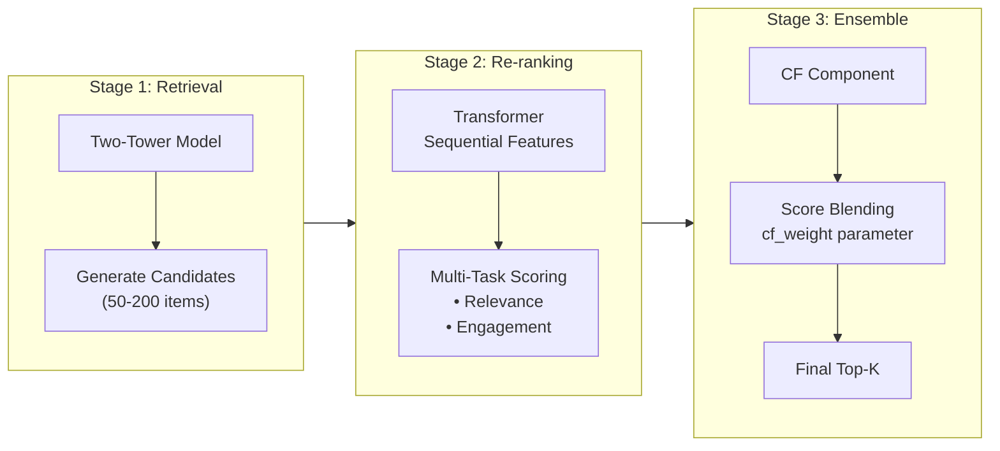

---

## Interactive Exploration Apps

Three Gradio-based web applications for hands-on testing:

| App | Port | Model | Key Features |
|-----|------|-------|--------------|
| YouTube | 7860 | Two-Tower | Embedding dims, ANN retrieval, candidate tuning |
| Netflix | 7861 | Foundation + CF | Sequential modeling, Foundation weight tuning |
| Hybrid | 7862 | Combined | Full pipeline, CF weight tuning |

### App Workflow

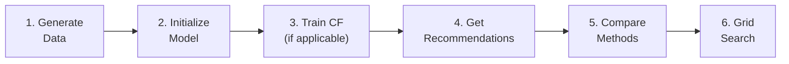

### Data Generation Features

All apps include enterprise-grade synthetic data generation:

| Feature Category | Fields | Description |
|------------------|--------|-------------|
| **User Segments** | `lifecycle`, `engagement_tier`, `subscription_type` | new/active/at_risk/churned users |
| **Device Context** | `device_type`, `platform`, `primary_device` | Mobile/tablet/TV/web patterns |
| **Content Availability** | `content_tier`, `available_regions` | Regional licensing support |
| **Series Relationships** | `series_id`, `season`, `episode` | Episode-level binge tracking |
| **A/B Testing** | `experiment_id`, `variant` | Built-in experimentation |
| **Playback Quality** | `bitrate`, `buffering`, `quality_switches` | QoE metrics |

---

## Grid Search Optimization

### Methodology

Systematic hyperparameter optimization across all three systems to find optimal configurations.

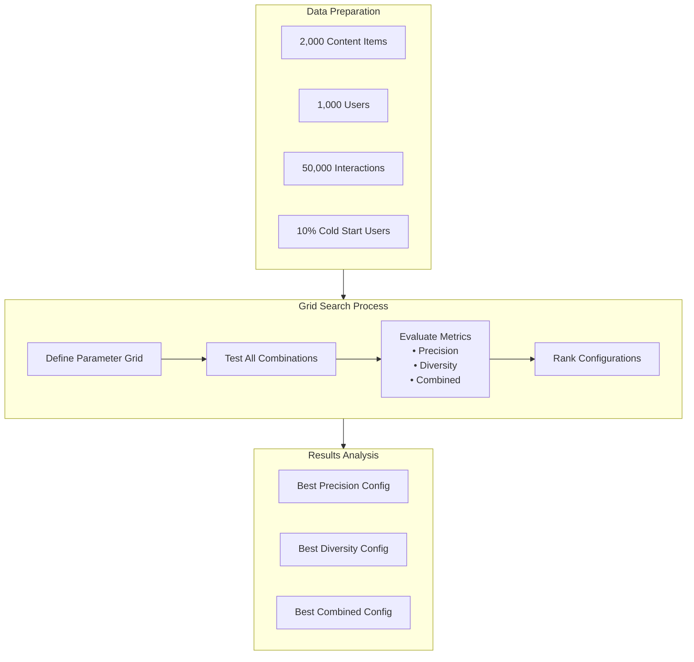

### Metrics Definition

| Metric | Formula | Description |
|--------|---------|-------------|
| **Precision** | `matched_genres / total_recs` | Relevance - genre match rate |
| **Diversity** | `unique_genres / possible_genres` | Variety - genre spread |
| **Combined** | `2 × (P × D) / (P + D)` | Harmonic mean for balance |

### Test Parameters

#### YouTube Two-Tower
| Parameter | Values Tested |
|-----------|---------------|
| Embedding Dimensions | 32, 64, 128, 256 |
| Candidate Pool Size | 50, 100, 200 |
| K (Final Results) | 5, 10, 20 |
| **Total Configurations** | **36** |

#### Netflix Foundation
| Parameter | Values Tested |
|-----------|---------------|
| Embedding Dimensions | 64, 128 |
| K (Final Results) | 5, 10, 20 |
| Foundation Weight | 0.3, 0.5, 0.7, 0.9, 1.0 |
| **Total Configurations** | **36** |

#### Hybrid System
| Parameter | Values Tested |
|-----------|---------------|
| Embedding Dimensions | 64, 128 |
| Candidate Pool Size | 50, 100, 200 |
| K (Final Results) | 5, 10, 20 |
| CF Weight | 0.2, 0.4, 0.6, 0.8 |
| **Total Configurations** | **36** |

---

## Results

### Best Configurations Summary

| System | Combined | Precision | Diversity | Configuration |
|--------|----------|-----------|-----------|---------------|
| **YouTube** | **0.744** | 0.860 | 0.655 | Emb: 128, Candidates: 100, K: 5 |
| Hybrid | 0.688 | 0.524 | **1.000** | Candidates: 50, K: 5, CF: 0.2 |
| Netflix | 0.625 | 0.542 | 0.738 | Emb: 64, K: 5, Foundation: 0.3 |

### Performance Visualization

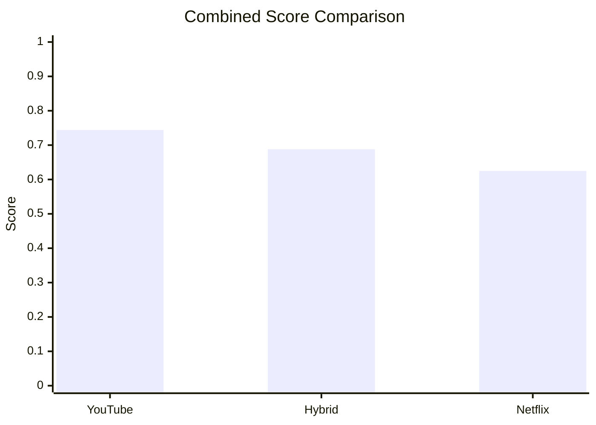

### Detailed Results by System

#### YouTube Two-Tower Results

| Rank | Emb Dim | Candidates | K | Precision | Diversity | Combined |
|------|---------|------------|---|-----------|-----------|----------|
| 1 | 128 | 100 | 5 | 0.860 | 0.655 | **0.744** |
| 2 | 64 | 50 | 5 | 0.671 | 0.802 | 0.731 |
| 3 | 256 | 100 | 5 | **0.931** | 0.600 | 0.730 |
| 4 | 32 | 50 | 5 | 0.485 | **0.892** | 0.628 |

**YouTube Insights:**
- **256-dim achieves highest precision (0.931)** - captures nuanced preferences
- **32-dim achieves highest diversity (0.892)** - fuzzier matches explore more
- **128-dim is the sweet spot** - best balance of both
- **Candidate pool size has NO impact** - 50 = 100 = 200 when K is fixed

#### Netflix Foundation Results

| Rank | Emb Dim | K | Foundation Wt | Precision | Diversity | Combined |
|------|---------|---|---------------|-----------|-----------|----------|
| 1 | 64 | 5 | 0.3 | **0.542** | 0.738 | **0.625** |
| 2 | 128 | 5 | 0.5 | 0.492 | 0.834 | 0.619 |
| 3 | 64 | 5 | 0.7 | 0.458 | **0.852** | 0.596 |

**Netflix Insights:**
- **Lower Foundation weight (0.3) wins** - CF improves precision
- **Higher Foundation weight increases diversity** - explores more
- **Embedding dimension has minimal impact** - transformer compresses well
- **Hybrid approach beats pure Foundation**

#### Hybrid System Results

| Rank | Candidates | K | CF Weight | Precision | Diversity | Combined |
|------|------------|---|-----------|-----------|-----------|----------|
| 1 | 50 | 5 | 0.2 | 0.524 | **1.000** | **0.688** |
| 2 | 100 | 10 | 0.2 | **0.528** | 0.835 | 0.647 |
| 3 | 50 | 20 | 0.2 | 0.502 | 0.611 | 0.551 |

**Hybrid Insights:**
- **Achieves PERFECT diversity (1.000)** at K=5
- **CF weight has NO impact at K=5** - Two-Tower dominates small K
- **K is the ONLY parameter that matters**
- **50 candidates is sufficient**

---

## Key Findings

### Universal Insights

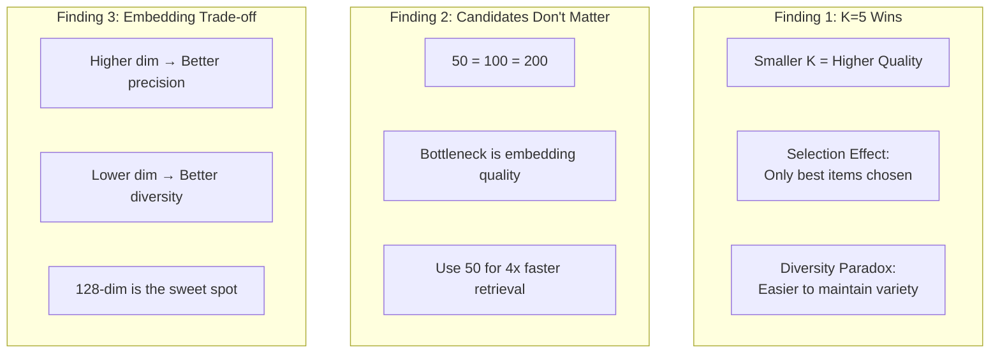

### Precision vs Diversity Trade-off

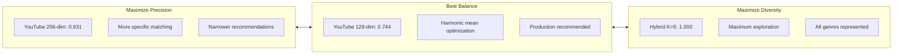

### System Selection Guide

| Use Case | Recommended | Configuration | Why |
|----------|-------------|---------------|-----|
| Maximum Relevance | YouTube | Emb: 256, K: 5 | Highest precision (0.931) |
| Maximum Variety | Hybrid | K: 5 | Perfect diversity (1.000) |
| Best Balance | YouTube | Emb: 128, K: 5 | Highest combined (0.744) |
| Sequential Patterns | Netflix | Foundation: 0.3 | Captures temporal behavior |
| New Users (Cold Start) | Hybrid | K: 5, CF: 0.2 | Leverages both approaches |

---

## Production Recommendations

### Recommended Configurations

```python
# YouTube Two-Tower (Best Overall)
youtube_config = {
    "embedding_dim": 128,      # Best balance
    "num_candidates": 100,     # Sufficient for quality
    "k": 5,                    # Critical parameter
}

# Netflix Foundation
netflix_config = {
    "embedding_dim": 64,       # Efficient
    "k": 5,                    # Critical
    "foundation_weight": 0.3,  # More CF influence
}

# Hybrid System (Maximum Diversity)
hybrid_config = {
    "num_candidates": 50,      # Sufficient
    "k": 5,                    # Critical
    "cf_weight": 0.2,          # Two-Tower dominant
}
```

### Implementation Priority

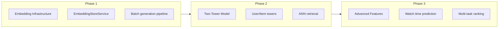

---

## Technologies Used

### Core Stack

| Category | Technology |
|----------|------------|
| **Language** | Python 3.12 |
| **Deep Learning** | PyTorch |
| **Vector Search** | FAISS |
| **Embeddings** | Sentence Transformers |
| **Web UI** | Gradio |
| **Data Processing** | Pandas, NumPy |

### Architecture Components

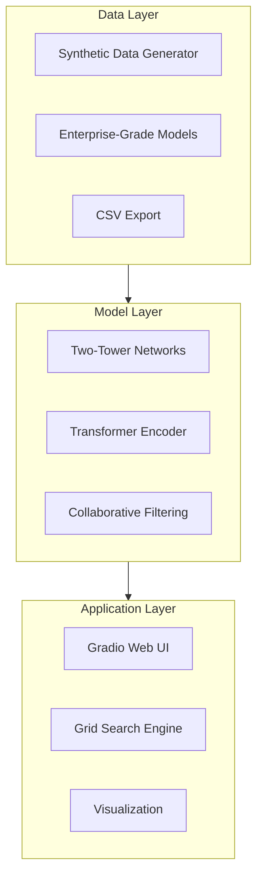

---

## Project Structure

```
research/
├── docs/                        # Documentation
│   ├── youtube/                 # YouTube research notes
│   │   └── code-examples/       # TypeScript implementations
│   ├── netflix/                 # Netflix research notes
│   │   └── code-examples/       # TypeScript implementations
│   ├── comparison/              # Side-by-side analysis
│   ├── implementation/          # Production recommendations
│   └── testing-results/         # Grid Search results
│
└── explorations/                # Interactive apps
    ├── youtube/                 # Port 7860
    │   ├── app.py              # Gradio interface
    │   ├── data.py             # Data generation
    │   └── models.py           # Two-Tower model
    ├── netflix/                 # Port 7861
    │   ├── app.py              # Gradio interface
    │   ├── data.py             # Data generation
    │   └── models.py           # Foundation + CF
    ├── hybrid/                  # Port 7862
    │   ├── app.py              # Gradio interface
    │   ├── data.py             # Data generation
    │   └── models.py           # Combined approach
    ├── run_grid_search_tests.py # Automated testing
    └── grid_search_results.json # Raw results
```

---

## Running the Project

### Prerequisites

```bash
# Python 3.10+
python --version

# Create virtual environment
python -m venv venv
source venv/bin/activate  # Linux/Mac
# or
.\venv\Scripts\activate   # Windows
```

### Installation

```bash
cd services/recommendation/research/explorations
pip install -r requirements.txt
```

### Running Apps

```bash
# YouTube Two-Tower (Port 7860)
cd youtube && python app.py

# Netflix Foundation (Port 7861)
cd netflix && python app.py

# Hybrid System (Port 7862)
cd hybrid && python app.py
```

### Running Grid Search

```bash
cd explorations
python run_grid_search_tests.py
# Results saved to grid_search_results.json
```

---

## Future Enhancements

- [ ] Real-time A/B testing integration
- [ ] Contextual bandits for exploration
- [ ] Deep learning ranking models
- [ ] User embedding clustering analysis
- [ ] Cold start strategy comparison
- [ ] Multi-objective optimization
- [ ] Production deployment guides

---

## References

### Research Papers
- YouTube: "Deep Neural Networks for YouTube Recommendations" (2016)
- Netflix: "Foundation Models for Recommendations" (2024)
- Two-Tower: "Sampling-Bias-Corrected Neural Modeling" (2019)

### Documentation
- [YouTube Research Notes](https://github.com/robiriu/AdCP-media-platform-v2/tree/main/services/recommendation/research/docs/youtube)
- [Netflix Research Notes](https://github.com/robiriu/AdCP-media-platform-v2/tree/main/services/recommendation/research/docs/netflix)
- [Grid Search Results](https://github.com/robiriu/AdCP-media-platform-v2/tree/main/services/recommendation/research/docs/testing-results)

---

*Created: January 2026*

[← Back to Projects](index.md) | [View Repository →](https://github.com/robiriu/AdCP-media-platform-v2)
