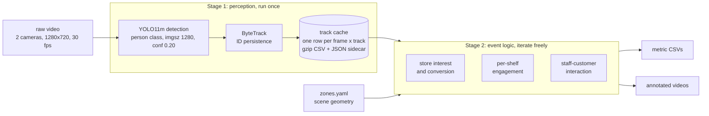
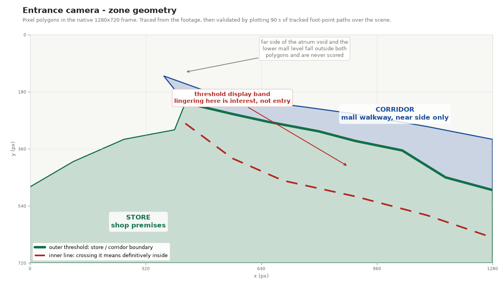
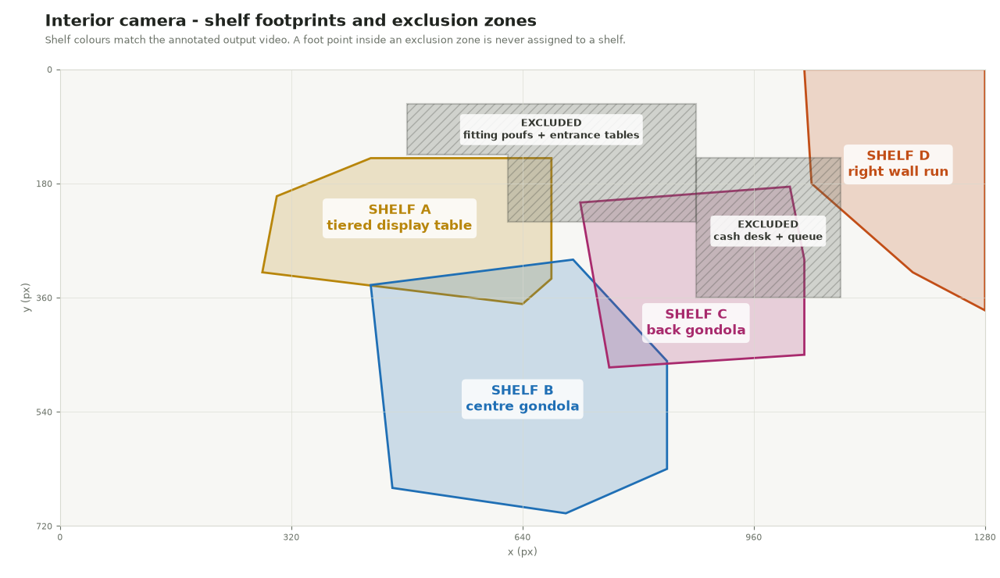

# Retail Video Analytics: Customer Behaviour from CCTV

**Status:** Completed | **Repository:** Private | **Runtime:** CPU-only, Dockerised

## Overview

An end-to-end video analytics pipeline that turns two retail CCTV cameras into
behavioural metrics: how many passers-by show interest in a store and how many
of them actually walk in, which shelves customers engage with and how often, and
how many genuine staff-to-customer interactions take place.

Everything runs locally on CPU. No cloud inference, no footage leaving the
machine, and the whole pipeline reproduces from a single Docker command.

The interesting part of this project is not the detector. It is everything
between a bounding box and a defensible number: what counts as interest, where
the store actually begins, which detections must be thrown away, and how to tell
a customer browsing a shelf apart from a customer walking past one.

## The Problem

Person detection on retail CCTV is close to solved. Turning detections into
business metrics is not, because every metric hides a definition question:

- A shopper slows down at the window and walks on. Interested, or just walking?
- A shopper steps into the display band at the entrance, picks up a sandal, and
  leaves. Entered, or not?
- A customer stands between two gondolas. Which shelf are they engaging with?
- A staff member and a customer are two metres apart for ten seconds. Service
  interaction, or coincidence?

Each of these was resolved against the footage and then written down, because a
number without its definition cannot be audited.

## Architecture

The pipeline splits at the expensive boundary:

Stage 1 costs roughly 80 to 90 CPU-minutes across both videos. Stage 2 costs
seconds. That split exists for one reason: behavioural thresholds need dozens of
tuning iterations against the footage, and re-running inference for each one
would have made the tuning impossible on CPU. Caching perception turned a
multi-hour loop into a multi-second one.

### Model selection

Person detection was spot-checked across the YOLO11 family on frames from both
cameras, COCO-pretrained, person class only, `imgsz=1280`:

| Model   | ms/frame (CPU) | Scene behaviour                                    |
|---------|----------------|----------------------------------------------------|
| yolo11n | ~107           | Misses partially occluded and back-turned people   |
| yolo11s | ~225           | Missed a clearly visible back-turned customer      |
| yolo11m | ~520 to 600    | Detected everyone in spot-checks, including occluded |

**yolo11m** was chosen as the smallest model with adequate recall on this
footage. An OpenVINO export was benchmarked as a potential CPU speedup and came
out **slower** than PyTorch on the development CPU, 660 versus 521 ms/frame, so
PyTorch inference was kept. Detection confidence sits at **0.20**, deliberately
low, because ByteTrack's two-stage association handles low-confidence boxes well
and the hard cases (back-turned browsers) scored 0.3 to 0.5 in spot-checks.

### Temporal sampling

Video is 30 fps; every third frame is processed, for 10 fps effective. A mall
walker takes at least four seconds to cross the view, so a crossing still yields
40 or more tracked samples. This keeps tracking reliable while cutting CPU cost
by 3x. Cache frame indices stay native (0, 3, 6, ...) so the output videos still
render at full 30 fps with annotations interpolated between processed frames.

## Scene Geometry

All zones are pixel polygons in the native 1280x720 frame, drawn against
reference frames and then validated by plotting 90 seconds of real tracked
foot-point paths over the scene.

The entrance camera looks from inside the store, across the open storefront,
onto a mall corridor that rings an atrium void. Three decisions matter here:

- **The corridor polygon is the near side only.** Its upper edge follows the
  atrium balustrade, which removes two confounders that are plainly visible in
  frame: people walking the far side of the void, and the lower mall level seen
  through it. Attention from across a void is not store interest.
- **The threshold was traced from the footage, not from the furniture.**
  Pedestrians squeeze tightly behind the threshold displays, so the line follows
  the observed walk-lane lower envelope. A naive furniture-based line
  misclassified through-walkers as entering.
- **A second inner line** sits past the threshold display band. The band between
  the two lines is exactly where corridor browsers linger without meaningfully
  entering, which is what makes "interested but did not enter" measurable.

The interior camera covers four fixtures. The exclusion zones are the
interesting part: a first full-video pass showed the fitting poufs, the entrance
display tables, and the cash-desk surroundings generating false shelf events,
because seated customers, checkout queues, and counter staff all snap to the
nearest shelf footprint otherwise.

## Store Interest and Walk-In Conversion

Only a track that appears in the corridor before any store presence is scored
as a passer-by, so people already inside, staff, and store-to-corridor exits
never enter the count. Staff tracks are excluded entirely.

**Interest** fires on any of three cues, all normalised by bounding-box height
so that mall perspective cancels out. Normal walking measures 1.5 to 2.5 body
heights per second in this footage:

1. **Slowdown**: speed below 0.45 h/s sustained 1.5 s within 140 px of the
   threshold.
2. **Approach**: distance to the threshold drops by at least 0.6 body heights
   over 1.5 s, ending inside the 140 px band, with the person in the corridor
   for most of the window.
3. **Threshold browsing**: lingering below 0.45 h/s for at least 1.2 s inside
   the display band. The speed condition is what stops a walker whose path
   merely clips the band from counting.

**Entered** means crossing past the inner boundary for a sustained 0.6 s, or
spending 8 s or more inside the store polygon. Entering implies interest.
**Passed by** means interested and never entered.

| Metric                  | Count |
|-------------------------|-------|
| Total interested        | 8     |
| Interested, entered     | 3     |
| Interested, passed by   | 5     |

<video class="clip" controls muted playsinline preload="metadata"
       poster="../../videos/retail-entrance-poster.jpg">
  <source src="../../videos/retail-entrance-clip.mp4" type="video/mp4">
  Your browser does not support embedded video.
</video>

Entrance camera, 25 s excerpt of the annotated output. Green boxes mark
people classified as having entered, the coloured lines are tracked trajectories, and the running
counters top-left update as events fire. Every detected person is pixelated; the boxes, labels and
trajectories are the pipeline's own output and are untouched.

## Per-Shelf Engagement

**Assignment uses the torso point, not the feet.** Each customer is assigned to
the nearest shelf by bounding-box centre-x at 25% height, within a
reach of 0.35 body heights. The torso point replaced the foot point after a
visual audit: a browsing customer's feet stay in the shared aisle while their
upper body leans into the fixture they are actually engaged with. In one
verified case, two customers shifted from browsing shelf B to shelf C without
their feet ever leaving B's reach. This is also the working answer to "which
shelf does a customer standing between two shelves belong to".

**Events** open when one shelf's assignment persists for 2.0 s with median speed
below 0.35 h/s, which is well under walking pace. An event continues while the
shelf stays assigned at any speed, bridging dropouts of up to 3.0 s for
occlusion or a step back to look. Absence beyond 3.0 s closes it, and a later
return to the same shelf is a new event. Dwell on a new shelf accumulates during
the previous event's grace window, so quick shelf switches are not lost.

| Shelf | Fixture                | Interest events |
|-------|------------------------|-----------------|
| A     | Tiered display table   | 3               |
| B     | Centre gondola         | 5               |
| C     | Back gondola           | 5               |
| D     | Right wall shelf run   | 4               |

<video class="clip" controls muted playsinline preload="metadata"
       poster="../../videos/retail-interior-poster.jpg">
  <source src="../../videos/retail-interior-clip.mp4" type="video/mp4">
  Your browser does not support embedded video.
</video>

Interior camera, 25 s excerpt. Shelf footprints are drawn in the same
colours as the geometry diagram above; a customer's box turns that shelf's colour once an
engagement event opens, with the running dwell time beside it.

## Staff-Customer Interaction

### Staff identification: the approach that was measured and discarded

An apron-colour classifier using torso HSV voting was built first, then retired
after measurement. Under this footage's warm lighting, customer clothing and
skin tones overlap the apron hue range, so colour could not separate the classes
reliably. Building it was not wasted: it established that the obvious signal
does not work here, which is what justified the spatial rule that replaced it.

**The deployed rule is spatial.** Only staff go behind the cash desk, and the
desk clips their feet to the bottom frame edge, which gives a clean separation:
staff foot y sits at 656 to 720, while customers approaching the desk front sit
at 490 to 650. Two seconds or more in the anchor zone means staff. A small
auditable override file covers documented exceptions, such as an apron-wearing
server who appears for 1.4 s at the end of the video and never reaches the desk.

Because the desk also occludes staff entirely for stretches, a second
track-stitching tier merges deep-store stationary reappearances. Without it, one
staff member fragmented into seven separate instances.

### Sessions

A session is mutual proximity below 1.3 mean body heights, both parties inside
the store, sustained for 4 s or more. Dropouts up to 4 s bridge into the same
session, longer separation closes it, and a reunion counts as a new session.
Sessions are per (staff, customer) pair, so one staff member serving two
customers at once holds two concurrent sessions.

Positions are compared on a common 10 Hz grid, and **interpolation never bridges
a dropout longer than 1 s**. That guard exists because interpolating across a
40 s dropout was observed to fabricate a phantom session before it was added.

| Staff instance | Interaction sessions |
|----------------|----------------------|
| Staff 2        | 0                    |
| Staff 1409     | 2                    |
| Staff 1830     | 0                    |
| Staff 3670     | 0                    |
| **Average**    | **0.50**             |

The two counted sessions are a verified shoe-fitting episode at the sofa area,
visible in the entrance clip above, where the session counters sit under the
store-interest block.
One known miss is documented rather than papered over: the family's checkout at
the desk is uncounted because the staff member was fully occluded below the
frame edge for that window, so there is no visual evidence to score.

## Technology

| Component     | Choice                      | Why                                            |
|---------------|-----------------------------|------------------------------------------------|
| Detection     | YOLO11m (Ultralytics 8.4)   | Smallest model with adequate recall here       |
| Tracking      | ByteTrack (via Ultralytics) | Strong ID persistence, handles low-conf boxes  |
| Inference     | PyTorch CPU                 | Faster than OpenVINO on this CPU (measured)    |
| Video I/O     | OpenCV                      | Bundled codecs, no system ffmpeg dependency    |
| Data handling | pandas + gzip CSV caches    | ~100k rows, portable, diffable schema          |
| Config        | YAML                        | Human-editable scene geometry                  |
| Packaging     | Docker                      | Containerised run reproduces the CSVs exactly  |

The Docker image was build- and run-verified on Docker Engine 29.1 under
WSL2/Ubuntu 24.04: the containerised pipeline reproduces the committed metric
CSVs byte for byte, and model weights download inside the container on first run.

## Assumptions and Limitations

Stated plainly, because a behavioural metric without its failure modes is not a
measurement:

- Identity persistence is per-video and per-appearance. Re-entry after leaving
  the view creates a new track.
- Head pose and gaze are not estimated. At CCTV distance and resolution, gaze
  estimation is unreliable, so interest is inferred from trajectory evidence
  (dwell, slowdown, approach, position relative to the storefront), which is
  both robust and explainable. This was a scope decision, not an omission.
- Effective detection runs at 10 fps, so sub-100 ms events are not resolvable.
- Heavy occlusion can fragment tracks; event logic uses debounce gaps to bridge
  short fragmentation, but a long fragmentation is a real miss.
- ByteTrack identity switches can blend two adjacent people into one track. One
  such case was observed and documented. Counts are per-track, so an undetected
  switch merges two people's behaviour.
- Staff-customer interactions are only countable while both parties are
  detectable. The cash desk fully occludes crouching staff, and one real
  interaction is missed for exactly that reason.

## Skills Demonstrated

- **Detection and tracking under real conditions**: model family benchmarking on
  the actual footage rather than on a public benchmark, low-confidence detection
  paired with two-stage association, occlusion-aware track stitching
- **Behavioural event modelling**: turning trajectories into auditable events
  with explicit thresholds, debounce windows, and open/close semantics
- **Scene geometry design**: polygon ROIs validated against plotted real tracks,
  exclusion zones derived from observed false positives
- **Perspective normalisation**: speeds and distances in body-height units so a
  single threshold holds across the depth of the frame
- **Measuring before committing**: the apron-colour classifier and the OpenVINO
  export were both built, benchmarked, and rejected on evidence
- **Reproducible CPU pipelines**: cached perception stage, Dockerised execution,
  byte-identical outputs, no GPU required

## Key Takeaways

1. **Cache the expensive stage.** Separating perception from event logic turned
   an impossible tuning loop into an interactive one. The architecture decision
   mattered more than any model choice.

2. **Trace boundaries from behaviour, not from furniture.** The storefront line
   that matched where people actually walk beat the line that matched where the
   shop physically starts.

3. **Normalise by body height.** One threshold then works across the whole frame
   depth, with no per-region tuning and no camera calibration.

4. **The torso leads the feet.** Assigning shelf engagement by foot position is
   the obvious choice and the wrong one, and only a frame-by-frame audit surfaces
   that.

5. **Guard your interpolation.** Filling a 40-second tracking gap invented an
   interaction that never happened. Interpolation is a claim about unobserved
   time and needs a limit.

6. **Document the misses.** The one uncounted checkout is in the write-up
   because a metric you cannot challenge is not a metric.

---

*The clips above are short excerpts published with the footage owner's
permission. Because the source is retail CCTV containing members of the public,
every detected person is pixelated before encoding, using the bounding boxes
already held in the pipeline's own track cache: each box is inset first so the
rectangle, its label and the trajectory lines survive intact, and what the clip
shows is the analytics output rather than the people it was computed from. The
full recordings are not published and remain excluded from version control. The
geometry diagrams are rendered from the project's configuration alone and
contain no frames from the footage.*

[← Back to Projects](index.md)
