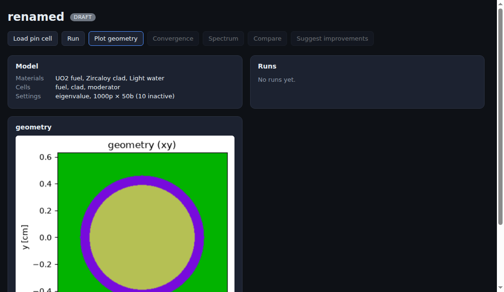
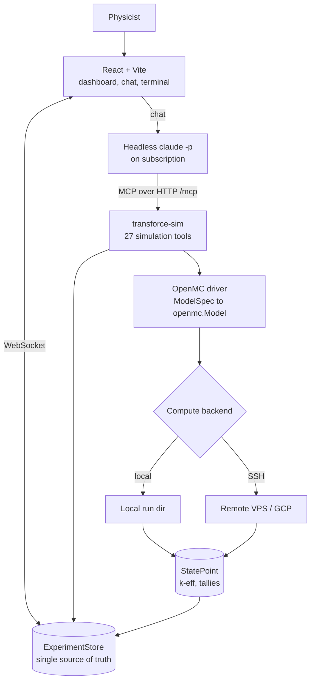
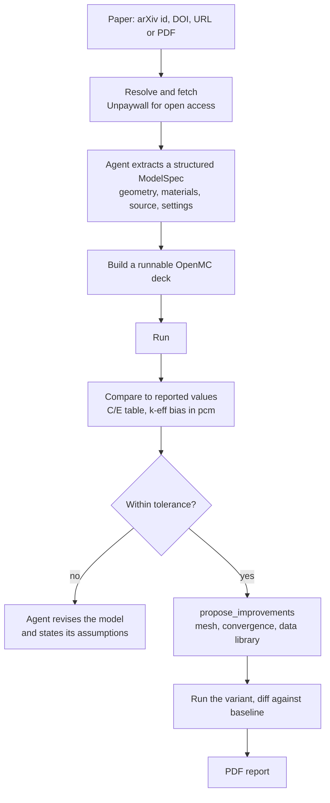

# TransForce - AI-Native Particle Transport

**Status:** Ongoing | Deployed and token-gated at transforce.forcex-ai.com

## Executive Summary

A web application where you describe a nuclear physics problem in plain language and a headless Claude Code agent builds, runs, analyses, and improves the Monte Carlo radiation-transport simulation behind it, on top of [OpenMC](https://github.com/openmc-dev/openmc).

Type *"model this LWR pin cell and give me k-eff"* and the agent constructs the CSG geometry, defines the materials, sets the source and tallies, runs the transport calculation, and reports the multiplication factor with its uncertainty. Point it at a paper and it will ingest the PDF, extract a structured model specification, generate a runnable deck, run it, and produce a computed-versus-experiment table with the k-eff bias in pcm.

The browser and the agent edit **one shared experiment store**, synced live over WebSocket, so a tool call from the agent updates the dashboard as it happens.

*The dashboard after building a pin cell: the model summary (UO2 fuel, Zircaloy clad, light water; eigenvalue mode, 1000 particles by 50 batches) and the generated OpenMC geometry slice.*

---

## Key Results

| Metric | Value |
|--------|-------|
| Simulation MCP tools | 27 |
| Backend | ~4,900 lines of Python (FastAPI + FastMCP + openmc) |
| Frontend | React + Vite, live WebSocket sync |
| Benchmark presets | 4 (pin cell, Godiva bare sphere, fuel assembly, shielding) |
| Compute backends | 3 (local, remote VPS, GCP) over one transport interface |
| Agent skills | 4 authored Claude skills |
| Paper ingestion | arXiv id, DOI (via Unpaywall), URL, or local PDF |
| Cost model | Runs on a Claude subscription, no Anthropic API key |
| Deployment | Live, token-gated, Docker + nginx + certbot |

---

## Why This Is Hard

Monte Carlo transport is not a domain where you can let a language model improvise. A reactor physics model is a precise object: surfaces, regions, cell fills, universes, lattices, nuclide fractions, thermal scattering laws, source distributions, tally filters. Get one boundary condition wrong and the answer is quietly, confidently incorrect.

So the design question is not "can the model write OpenMC code" but **"what is the smallest, most constrained surface through which an agent can drive a physics code correctly?"**

The answer here is a typed intermediate representation plus a tool layer, not code generation.

---

## Architecture

### The typed intermediate representation

Nothing in the agent's path writes Python. The agent manipulates a **provider-agnostic `ModelSpec`** built from Pydantic models, and a separate driver translates that spec into live `openmc` objects. The spec layer imports nothing from OpenMC at all.

That separation is the core safety property. The agent can only express things the schema permits, the translation is deterministic and testable, and an invalid model fails at validation rather than deep inside a physics run.

The spec covers what real problems need:

- **Materials** with nuclide or element fractions (atom or weight), density in four unit systems, thermal scattering tables (`c_H_in_H2O`), and per-material temperature
- **Geometry** as CSG: surfaces with boundary conditions, cells with region expressions (`-fuel_or & +clad_or`), universes, rectangular and hexagonal lattices, plus a DAGMC path for CAD-based geometry
- **Sources** with independent space, energy, and angle distributions (Watt, Maxwell, discrete, tabular, power law, Muir) and sampling constraints
- **Tallies** with filters for energy, outgoing energy, time, mu, polar and azimuthal angle, particle type, delayed group, and mesh (regular, rectilinear, cylindrical, spherical)
- **Settings** for eigenvalue, fixed source, volume, and plot run modes, with temperature interpolation methods

### The two-layer MCP insight

OpenMC ships official "agentic tools", and the important discovery was that **they are not simulation tools at all**. They are a local RAG index over OpenMC's own C++ and Python source, built to help an agent contribute to OpenMC.

TransForce therefore runs two distinct MCP layers:

| Layer | Purpose | Origin |
|---|---|---|
| `transforce-sim` | Build, run, tally, plot, deplete, benchmark, reproduce | Built here, 27 tools |
| OpenMC code RAG | Semantic search over the ~2M-token OpenMC source when the agent needs to reason about transport internals rather than call the public API | Reused, vendored as a git submodule |

The simulation layer is where the product lives. The RAG layer is what lets the agent answer "why does this method behave this way" instead of guessing.

---

## The 27 Simulation Tools

| Group | Tools |
|---|---|
| Experiment | `create_experiment`, `get_experiment`, `load_preset`, `set_spec` |
| Execute | `build`, `run`, `run_depletion`, `run_volume` |
| Results | `get_keff`, `get_tally`, `diff_runs` |
| Visualise | `plot_geometry`, `plot_convergence`, `plot_spectrum`, `plot_compare`, `plot_mesh_tally` |
| Advanced physics | `generate_weight_windows`, `generate_mgxs` |
| Literature | `web_search`, `web_fetch`, `ingest_paper`, `get_paper` |
| Benchmarking | `set_reference`, `compare_to_reference`, `list_benchmarks` |
| Improvement | `propose_improvements` |
| Reporting | `generate_report` |

This is not a thin wrapper over "run OpenMC". It includes **variance reduction** (weight-window generation for deep-penetration shielding), **multi-group cross-section generation**, **stochastic volume calculation**, and **depletion** with a resolved decay chain, which are the parts of a transport workflow that actually take expertise.

---

## Paper Reproduction: the pipeline that makes it a research tool

Ingestion accepts an arXiv identifier, a bare DOI (resolved to an open-access PDF through Unpaywall before falling back to doi.org), a URL, or a local file.

Comparison is quantitative rather than narrative. `compare_to_reference` builds a computed-versus-experiment table, computes the k-eff bias in **pcm**, combines the uncertainties of both sides, and returns a pass or fail against a configurable tolerance (200 pcm by default). `diff_runs` then quantifies a change between two runs in pcm, so an "improvement" has to prove itself numerically against the baseline.

`propose_improvements` reads the comparison and the model together and suggests targeted changes, for example flagging thermal scattering treatment when the moderator looks like water and the bias points that way.

Everything lands in a **reportlab-generated PDF** with the model, runs, comparison table, and plots. Pure Python, no system dependencies, so the report generates anywhere the app runs.

---

## Agent Design: a blocklist, and why

The chat agent runs as headless `claude -p` on a **Claude subscription**, with `ANTHROPIC_API_KEY` explicitly removed from the child environment so it can never silently fall back to metered API billing.

The interesting decision is how it is constrained. The agent runs with `--dangerously-skip-permissions` (there is no human to approve each call in a chat loop), so something has to bound it. It is restricted to only the `mcp__transforce-sim__*` tools by **disallowing** the entire built-in Claude Code toolset: Bash, Read, Write, Edit, Glob, Grep, WebFetch, WebSearch, and the task and monitor tools.

A blocklist rather than an allowlist, and the reason is specific: the spawned `claude` inherits the user's `settings.json`, and `--allowedTools` only *adds* approvals, while `--disallowedTools` takes precedence and removes a tool outright. An allowlist would have left the inherited tools reachable.

Without that boundary the agent wandered, running the pytest suite through Bash or opening plot PNGs with Read instead of calling the plotting tool. Constraining it to the simulation surface is what makes it behave like a physics copilot rather than a coding agent that happens to be pointed at a physics repo.

The chat is also given a **lean MCP config** (`.mcp.chat.json`, simulation tools only). The heavier OpenMC code-RAG server stays wired for the embedded terminal, where deep source navigation is the point, because loading it into chat slowed startup and pulled the agent off task.

---

## Compute Tiers

Transport runs are expensive and a laptop is not always the right machine, so execution sits behind a small `Transport` interface with two implementations:

- **`LocalTransport`** runs in a local working directory and exercises the exact same export, run, and retrieve pipeline as the remote path, so the whole flow is testable without SSH
- **`SSHTransport`** targets a VPS or a GCP instance

The pipeline is identical either way: export the model to XML locally, push the inputs to the execution host, run OpenMC there, then pull the statepoint file back into the persistent run directory and read k-eff and tallies from it. The cross-section library path is resolved per host.

Making the local backend implement the same interface rather than short-circuiting it is what keeps the remote path honest, since every test of the local path is also a test of the staging and retrieval logic.

---

## Access and Deployment

Deployed behind host nginx with certbot, in a resource-capped Docker container.

Data routes (`/api`, `/ws*`, `/plots`) are gated by a shared `APP_TOKEN`. A visitor exchanges the token **once** for an HttpOnly cookie, so the secret never rides in a URL or a log line. This is deliberately a single shared secret for trusted operators rather than multi-user accounts: anyone holding it gets full access including the server terminal, and shares one workspace.

That boundary is a licensing one as much as a technical one. Driving the agent from a Claude subscription is appropriate for operator-scale use; a public multi-tenant service would need an API key under commercial terms. The deployment is scoped to match.

---

## Technology Stack

| Layer | Technology |
|-------|-----------|
| Physics | OpenMC (continuous-energy Monte Carlo), ENDF/B-VIII.0 data, depletion chains |
| Backend | Python, FastAPI, FastMCP, Pydantic v2, websockets |
| AI | Claude Code headless CLI on subscription, MCP over HTTP, 4 authored skills |
| Frontend | React, Vite, xterm.js, live WebSocket state sync |
| Analysis | matplotlib, reportlab, numpy |
| Compute | Local and SSH transports (VPS, GCP), ptyprocess |
| Infrastructure | Docker, nginx, certbot, token gate with HttpOnly cookie |

---

## Current Status and Direction

**Working:** the full build, run, tally, plot, and compare loop; four benchmark presets including the Godiva bare-sphere criticality benchmark; paper ingestion and C/E comparison; depletion; weight windows and MGXS; PDF reporting; live dashboard sync; embedded terminal; deployed and gated.

**In progress:** broadening the reproduced-benchmark set and tightening the agent's spec extraction from papers, which is the step where a wrong assumption is most expensive and most worth surfacing explicitly.

*Private repository. Screenshots are from the running application.*
